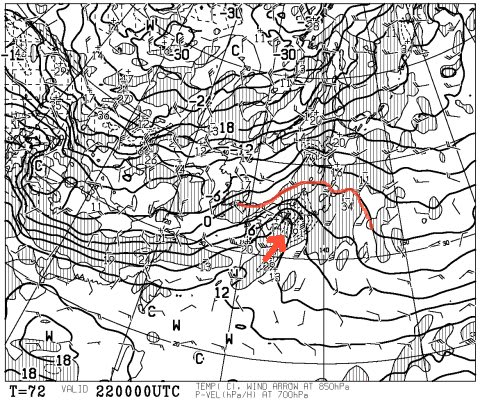
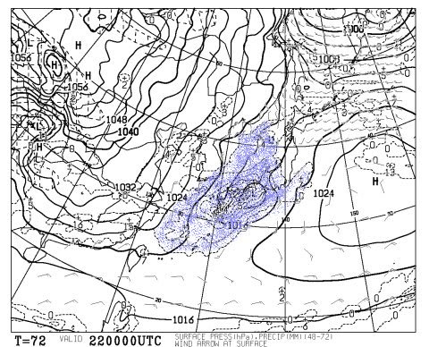
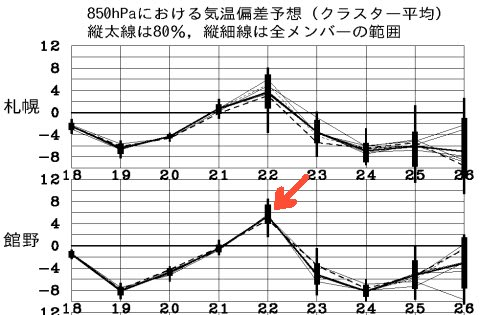
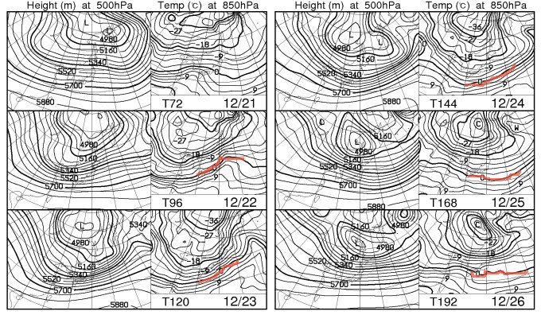
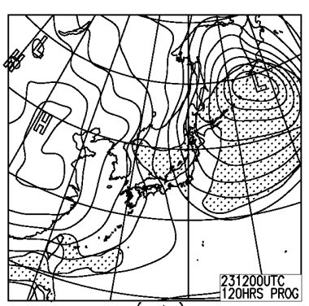
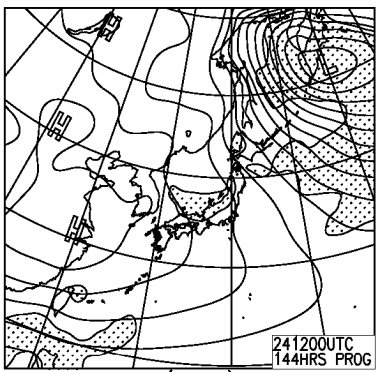

# この3連休のスキー場の天気は…初日は残念な感じ（涙)．

📅 投稿日時: 2012-12-20 00:58:19

🏷️ カテゴリ: [スキー天気予想](c6554f5c3c106093b511a8daae23757e8.md)

…今日は．

冷えてるんですけどね．

この土日はひどかったのが．

この水，木でかなりいい雪になったんですけどね．

…せっかく，コンディション回復したというのにっ！

だのに～

なーぜ～

この3連休初日は，こんな残念な感じなの～．

…

はい．

解説しましょう．

22日，3連休初日，朝9時の850hpa気温予想図．

雪になる目安の0度線が…

東北まで北上してます(涙)．

矢印の方向に，強烈な南風が吹き込み．

気温がぐんぐん上がって．

志賀高原でも，昼間にはプラス3度～6度に上がりそうなんだけど…

んで．

この色を塗った降水量がある部分が…

新潟から信州を覆ってますね．

…気温がプラスで，降るってことは…

それは，雨．雨．雨…

…残念ながら，朝から午後まで雨が降り．

ゲレンデはびしょびしょの重い雪になるでしょう…(涙)．

なぜ．

なぜ．

週末過ぎてゲレンデ状況回復して．

また週末が来たらコンディション悪化するの…

自分の日ごろの行いが悪いのかっ！？

でも．

でも．

ここにあるように．

気温が上がるのは，矢印をつけた22日のみなのだ．

23日からは．

23日からは．

冷えますよ～．

ここの赤線で記したように．

23日以降は．

850hpaの0度線は日本よりずっと南に下がりますっ！

冷えますっ！

クリスマス寒波ですっ！

ビバ！クリスマス寒波っ！

んで．

23日の地上予想天気図は…

こんな感じで．

見事な冬型に入りますね～．

等圧線が縦縞になってるので，志賀高原まできっちり雪雲が流れ込みますよ～．

志賀も大雪ですっ！！

22日の夜から，雨がだんだん雪に変わり．

23日は一日降り積もりますっ！

…とりあえず．

3連休の中日は，前日溶けたバーンが凍った，固い下地の上に，

がんがん新雪が積もっていく状況になります．

うまくいけば，アイスバーンは新雪で隠れてくれるかも．

…でも．

吹雪で大荒れで，動かないリフトがけっこうあるかも…

24日も…

こんな感じなので，雪がちらつく一日になるかな～．

雪質は，急斜面以外は固い雪は隠れてくれて，コンディション改善するんじゃないかな～．

ってことで．

3連休は，3日目の24日が一番コンディションよさそうなのだ．
