# 3月15，16日の週末の志賀高原スキー場の天気は…土曜は晴れのち曇り，日曜は終日湿った雪．そして特派員によると3/12の志賀は午後に雨(泣)

📅 投稿日時: 2025-03-13 02:46:54

🏷️ カテゴリ: [スキー天気予想](c6554f5c3c106093b511a8daae23757e8.md)

なぜ人間は眠たくなるのか…

人間は，眠らなくても食べなくても

良くなれば楽なのに…

と，終わらない仕事を前にして

危ないことを思ってしまう，Skier_Sです．

いや．

ホントに．

人間，寝る必要が無くなればもっと

楽に仕事が終わるのに…←だからそれ，かなりヤバい発想だから

ってなことで．

今日もいつも通りの夜中更新ですが．

今日の特派員からの報告によると…

朝はいい感じの晴れ！！

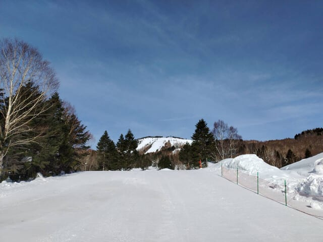

とはいえ気温が高く，

朝から0℃近くて，昼間は+10℃近くまで

上がったようで…

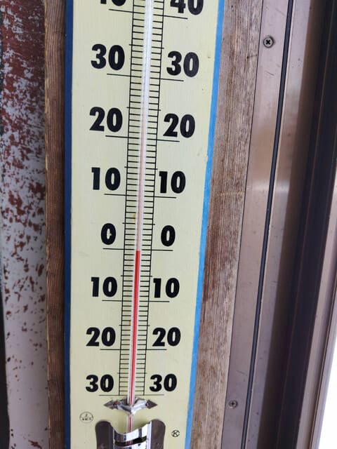

朝イチはいい感じのシマシマだったよう

ですが．

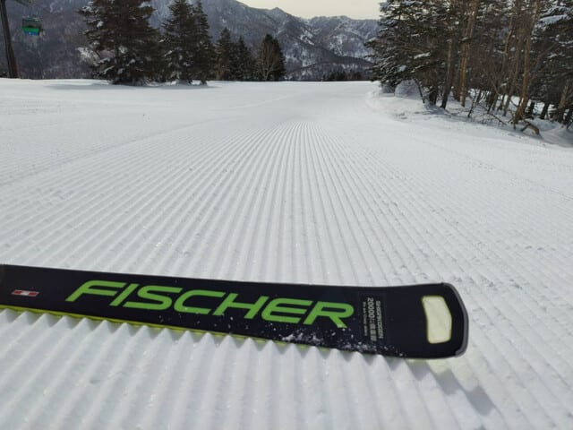

昼間は雪が緩み，さらに緩斜面では

ついに今シーズン，妖怪板つかみが

現れるようになってきたようです…(泣)

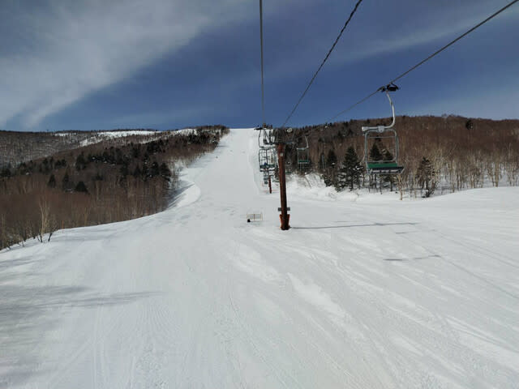

さらに，日差しで緩んだ雪に追い打ちを

かけるように，午後2時ごろから雨になり，

一時かなり強く降ったようで…（涙）

午後の雪は，水を吸ってしっとりした，

4月の雪になっちゃったみたいです…

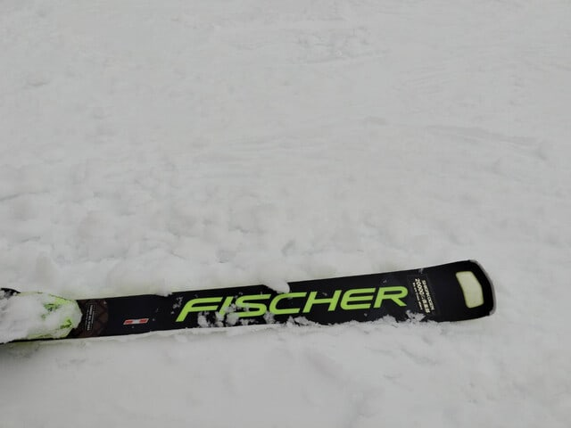

あぁ…

日曜までは雪が良かったんだけどな…

ってなことで．

本日の高温＆雨でやられたゲレンデ．

果たして週末までに回復するのか？？

そして，週末の志賀高原はいい天気で

滑れるのか？？？

水曜深夜恒例，志賀高原の天気予想です！！

まず，13日(木)の850hPa気温を見てみますが．

うーん．志賀高原にはぎりぎり-3℃線が

かかる程度かな？

雨の心配はないけど，この時期にしては

気温が高め．

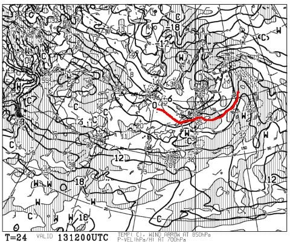

この日の地上天気図を見ると，この日は

降水域が志賀にかかっていないので．

朝は曇ってるかもしれないけど，

おおむね晴れで積雪がなさそうな一日（涙）

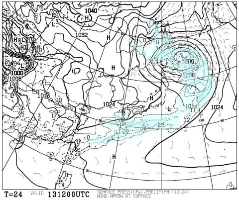

そして，続く14日(金)の850hPa気温は…

この日は-6℃線がぎりぎり志賀に近づいて

いる感じですか…

まあ，平年並みに近づいてきたかな．

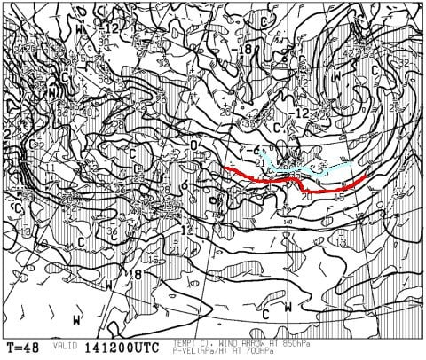

この日の稚樹天気図は，降水域が

志賀にはかかっていないので，晴れそう

だけど…

うーん．北風が入って山に降るパターン

にも見えるんだよな…

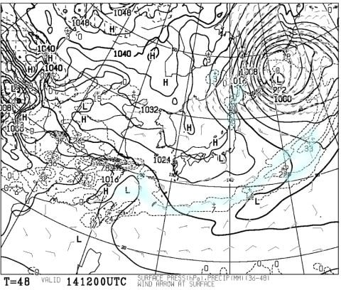

で．

肝心な週末，15日(土)の850hPa気温は…

うーん．

この日も赤い0℃線は結構志賀に近づくので．

いつものこの時期に比べると，気温は高め．

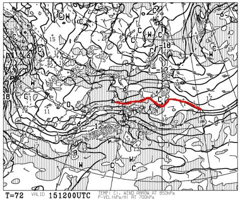

そして地上天気図を見ると…

西から怪しげな降水域が近づいて

来ています！！

まだギリギリ志賀高原に降水域はかかって

いないので…

15日の夜9時ごろまでは降らずに済んでくれそう．

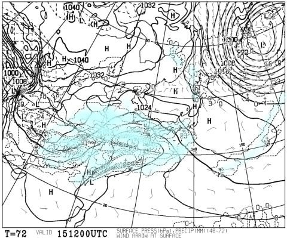

さらに，16日(日)の850hPa気温ですが．

以前の予想に比べ，気温が落ちる方向に

ズレてくれたので…

赤い0℃線はぎりぎり志賀に残ってます！

これなら，以前よりは雨になる確率は

落ちましたね…

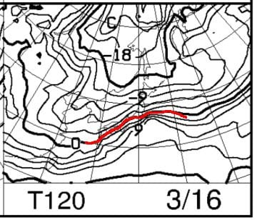

で．この日の地上天気図は…

うううううーーーん．

発達した低気圧で，本格的な降水域に

日本が覆われてます．

ただ，気温が当初予想より低くなったので…

雨にならず雪になってくれるだけ，まだ

かなりマシかな…？

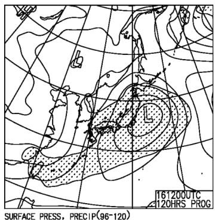

塔い感じで．

まとめると．

13日(木)：朝は曇っているか？基本的に晴れ

　そうな一日．

　朝イチの気温は-2℃程度とちょい高め．

　朝はバーンが硬そう．午前中はかなり硬い

　バーンかな．

　昼間は，日差しが出れば日差しが強い

　ところでは雪が緩むけど，それ以外は

　終日硬い下地に悩まされるかも…

14日(金)：晴れ～曇りの天気が一日続く．

　もしかしたら，一瞬雪が降るかも？

　昼間ちょっと風も出そうだけど，

　普通に天気図を読むと一日晴れ．

　気温はそこまで上がらず，終日

　バーンは硬そう．

15日(土）朝までの積雪は無し．

　朝イチの気温は-8℃程度と冷える．

　午前中は晴れ→午後に雲が増えていく．

　朝イチは硬めのシマシマ．

　ところどころカリカリした，4月の

　冷えた朝のバーンみたいな雪．

　この日も昼間はちょい気温が上がり，

　日差しが当たるバーンは雪が緩みそう

16日(日）：終日雪．朝から雪．

　朝までの積雪は10～20cm？

　まだ正確に読めない．

　朝はカリカリ下地の上に重めの

　新雪が乗った雪が圧雪された

　感じで，土曜までのカリカリは

　隠れて，結構滑り良くなってそう．

　昼間の気温は0℃近くまで上がり，

　雪はかなり重い湿った雪．

　昼間もひたすら降り続け，昼間だけ

　でも10-20cmは積もるか．

といった感じでしょうか…

皆さんの冷え冷え踊りが効いたのか，

16日は雨じゃなく雪になってくれたので，

ちょっと風が強かったり荒れたりする

可能性も否定できないけど，

終日雨よりはずっと良く，カリカリが

隠れていいバーンになっていきそう…！

ちなみに，16日に降り始めた雪は，

17日まで降りつづけそうですね…

そのあと，21日ごろまではそこまで

気温が上がらず，20日前後にまた

雪が降りそうなので…

次の週末は，結構いいコンディションで

滑れるかも…！

## 💬 コメント一覧

### 💬 コメント by (ながのんちゅー)
**タイトル**: Unknown
**投稿日**: 2025-03-13 16:43:08

ご存じかもしれませんが、志賀中野有料道路が16日の日曜日の午前0時から無料になります。

100円を惜しんで、市内を回らなくてもよくなりますが、渋滞が心配です。

### 💬 コメント by (Skier_S)
**タイトル**: ＞ながのんちゅーさま
**投稿日**: 2025-03-14 01:56:02

情報ありがとうございます～！

これ，去年の年末あたりからヤケビメンバーでは話題になってました…

帰りはおそらく信州中野インター手前の信号でかなり詰まりそうな予感がします(笑)

