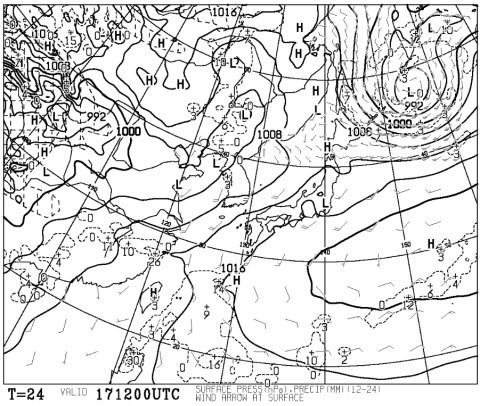

# 4月26，27日の週末の志賀高原スキー場の天気は…土曜は晴れ！でも気温が高く雪はザブザブ．日曜は晴れのち曇りのち雨，この日も気温は高い…

📅 投稿日時: 2025-04-17 03:56:55

🏷️ カテゴリ: [スキー天気予想](c6554f5c3c106093b511a8daae23757e8.md)

えー．

そろそろ4月も下旬に突入する頃になり．

スキーをやらない人から，

「え？まだスキーできるんですか？？」

と言われる時期になってきましたが．

…というか，スキーをやる人でも，かなり

深くはまっている，終わりかけた人じゃ

なければ，この時期にスキーできることに

驚かれそうな気がするけど…

まだ6月いっぱいまでは月山が滑れるし，

今シーズンは雪が多いから7月までもつかも

しれないので．

まだ2か月以上スキーシーズンが続きますよ

と，声を大にして言いたい，Skier_Sです．

…ってな感じの時期になってきたので．

そろそろこのスキー場の天気予想を見る人も

かなり減ってきたと思うのですが…

でも，私の経験上，このBlogの読者は，いろいろ

終わった人が多いのだ．

なので，このBlog読者には，まだまだスキー場の

天気予想を気にする人がいっぱいいるはずなのだ…！

…ということで．

いつも通りに水曜深夜恒例の，志賀高原の

天気予想です！！

まず，17日(木)の850hPa気温から見ると…

うげげげげ．

赤い0℃線は北海道の北の方まで北上して，

志賀高原には水色の+12℃線がっ！！！

これ…6月くらいの気温じゃなかろうか（涙）

かなりの高温になりそう…

そして，木曜の地上天気図は．

低気圧マーク（L）が，微妙に関東あたりに

ありますが…

まぁ，降水量は予想されてないし．

おそらく昼間はずっと晴れでしょう．

…でも，晴れ+高温なので，雪はかなり

緩みそう…（泣）

続いて，18日(金)の850hPa気温図ですが．

うううううーーーーーん．

この日も志賀高原は水色の+12℃線が

かかってます…

引き続き6月並みの，暑さを感じる

気温になりそう…（泣）

この日の地上天気図を見ると，日本海に

降水域がかかっているけど，志賀高原には

かかってないから，たぶん志賀は晴れ~曇り．

この日も高温＆直射日光で雪はかなり

ダメっぽい感じ…（泣）

そして肝心な週末，19日(土)の850hPa気温は…

ダメですね．3日連続，志賀高原には6月並みの

+12℃線がかかってます…(激泣)

この日の地上天気図は，ぎりぎり志賀高原に

降水域がかかるかどうかという感じ．

ただ，これはおそらく18日の夜中から

19日の早朝に降る雨．

リフト営業中は雨が上がり，昼間は

晴れそうな感じ…

うーん．土曜も高温＆日差しで雪は

ムチャクチャ緩むなぁ…（涙）

そして，20日(日)の850hPa気温は…

ダメです．志賀にかかるのは+9℃線．

これまでの日々に比べるとちょっと気温が

下がったけど，これも5月下旬くらいの

気温…（泣）

で，この日の地上天気図を見ると…

うぎゃーー！！

低気圧が本州をすっぽり覆っている！！

…でも，この天気図は夜9時の予想図．

おそらくリフト営業中は低気圧は

もう少し西にあり，雨の降り始めも

昼過ぎから夕方のどこかで，運が良ければ

リフト営業中は降らないなず…！！

ってなことで，まとめると．

17日(木)：朝から晴れ．終日晴れ．

　朝イチから気温は+5℃程度と高く，

　早朝はわずかに締まっているかもしれない

　けど，朝早くから雪は緩む．

　暑いほどの気温と日差しで午前中には

　ザブザブ雪に．

　暑いよ！

18日(金)：朝から晴れ~午後は雲が増える

　この日も朝イチから+5℃程度で，

　昼間は+15℃を越え，暑さを感じる

　一日．

　雪は朝から緩く，午前中にザブザブ雪に

　なる．

　夜に雨が降り始める

19日(土)：前日の夜から明け方にかけて

　雨が降るけど，早朝営業のころには

　止んでいるか…

　雨が止めば空は晴れていき，昼間は

　暑い日差しが降りそそぐ．

　朝イチは山頂での気温は+2℃程度と

　低いものの，夜中の雨で早朝から雪は

　緩み気味．

　通常営業のころには日差しと高温で

　雪はユルユルになり，

　人が多いコースはあっという間に

　荒れた斜面になる．

　この日も暑さを感じる一日．

20日(日)：まだ予想精度は低いけど，

　朝は晴れてるかもしれないけど，

　じき曇りだし，夕方から雨．

　運が悪ければ昼過ぎから雨．

　朝イチの気温は+5℃以上と高く，

　昼間も　日差しはないものの

　+15℃近くまで上がる．

　雪は朝から緩く，人が多いバーンは

　昼には荒れる

という感じでしょうか…

まぁ，土日とも暴風雨に見舞われるような

ことはなく，久しぶりの落ち着いた週末に

なりそうですが…

でも，5-6月並みの気温になってしまい，

締まったバーンが楽しめなさそうで，

すぐ雪が荒れそう…(涙)

あぁ…春だなぁ…（泣）

## 💬 コメント一覧

### 💬 コメント by (大阪のK)
**タイトル**: Unknown
**投稿日**: 2025-04-17 08:53:17

この時期のグサ雪には、どんな板を履けば楽しく１日滑れるのでしょうか？

Sさんはフォルクルdiconでしたか？

私は昨年elan ripstick96を履いたその日にこけて、シーズン終わっちゃったし😱

今週末の悩みです。

### 💬 コメント by (愛知のＮ)
**タイトル**: Unknown
**投稿日**: 2025-04-17 20:07:50

いつもブログ楽しく読ませていただいています。

今週土曜に友人と滑りに行くのですが、焼額山が候補にあがりました。

もし焼額山に行けて、お会いできるタイミングがあれば、お話しさせていただきたいのですがよろしいですか？

よろしければウェアや帽子の色や特徴を教えていただけると嬉しいです。

ちなみに私はスノーボーダーのため、スキー板の特徴だとたぶんわからないです。

不躾なご相談ですが、よろしくお願いします。

### 💬 コメント by (Skier_S)
**タイトル**: Unknown
**投稿日**: 2025-04-18 02:56:54

＞大阪のKさま

春の雪では，私はVOLKLのDeacon84を履いてます～！

これは春雪では無敵の板です．

楽しくなかった春のグサ雪が楽しくなります！！

＞愛知のNさま

基本的に，私は何着かウェアを変えて滑っていて，さらにどんなウェアかは

Blogに晒さないのですが…

お会いしたいというありがたいコメントなのでお応えすると，今週末は上下オレンジです．

スキー板は黒いFISCHERか緑のVOLKLです．

…ゴンドラに乗り降りする際の板の脱ぎ履きが手馴れてるので見たらわかるそうですので，

それを目印に探してみてください（笑）．

見かけたら，ぜひ一言かけてください！！

