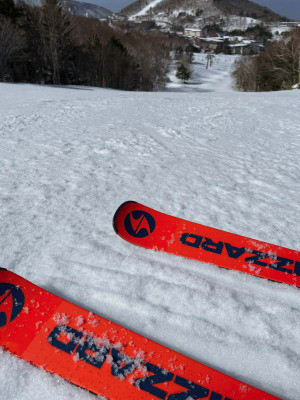

# 2021/3/20(土)の志賀高原スキー場は晴天！気温が上がったけど良かったみたい

📅 投稿日時: 2021-03-21 03:34:26

ということで．

寂しく家で仕事をして過ごすことになった

この週末ですが．

…スキーに行けない私の呪いのせいか，

やはり明日は終日荒れ荒れ強風の

雨が降り続ける一日になりそうです…

深夜3時現在，志賀高原ではぽつぽつと

雨が降り始めているようで…

（[北信建設事務所道路気象状況カメラ](http://hokushin.pref-nagano-roadcamera.jp/)より）

気温も7.5℃と異常に高いので，

雪が降る可能性は0%です．

諦めてください．

降るのは液体です．

明日日曜は，激しい南風が吹き付け，

さらに雨が時折強く降り，

時折止むタイミングもありそうだけど，

そしてリフト営業時まで雪になることなく，

雨のままひたすら降り続けそう…

予告通り，

明日のスキーは修行の一日

になりそうですので，

明日滑りに行く人は，覚悟のほどを…

ただ，21日日曜の夜には，雨が

雪に変わり．

22日月曜の朝までに，10cmくらい

雪が積もるかも…？？

22日は終日冷えまくりなので．

意外と22日がいい一日になるかも！？

あと，特派員から

奥志賀早朝営業の情報

が入ってきました～！

…奥志賀の早朝って，かつては第2，第3

ペアリフトが動いて，GWはゴンドラも

動いていたはずですが…

今シーズンは，早朝は第2ペアのみに

縮小されるようです(涙）

ゴンドラはともかく，第3ペアすら

動かないのか…！

時間もこれまでは6:00からじゃなかったっけ？

…とりあえず，今週からすでに早朝営業が

始まっていて．

4月の毎週末と，5月の１，２日はやるようですが．

4月の29日の祭日と，5連休後半の３，４，５日は

営業してくれないの！？？

うーん．かなりの縮小ですね（泣）

ってな情報のあとは．

いつもの特派員レポートです…！

えー．

本日も，すっきり晴天の朝で始まったようで．

いい天気に，おこみんも嬉しそうです

…って，いつもと表情は変わり

ありませんが(笑)

予想通り昨日よりは気温が高く，

朝の営業開始時点で，すでに

奥志賀山麓はプラス気温．

だもんで．

あさイチのゲレンデは固めながら，

ガチガチアイスバーンってほどではなく．

あさイチは締まったいい感じのバーン状況

だったようです！

奥志賀エキスパートも．

第3も，午前中は比較的

いいコンディションで．

焼額や西館方面は，どうやら午前

早いうちに緩み始めたようですが．

高天ヶ原や一の瀬方面は，

昼近くまではそれほどひどく

緩まず，

昼間の気温が+6℃くらいまで上がった

ことを考えれば，晴天の割に雪が

張り付いたるすることもなく，

悪くないコンディションだった

みたいです…

ただ，今日は緊急事態宣言解除も

近づき，やってくる人が増えたのか．

焼額第1ゴンドラも…

第2ゴンドラもすごい列で．

一の瀬ファミリーも結構

リフト待ちがあったようです…

焼額第1ゴンドラは，昼ごろには

一旦列が短くなったようですが…

結局ラストまでかなりの待ち行列

だったようで．

15:30営業終了前に，早めに列の後ろに

並ぶのを止めたみたいです…

でも，ゲレンデは見たところ

そんなに激込みってわけでは

なさそうだし．

夕方にはは雲もふえたものの，

終日晴れてくれて．

雪もひどいザブザブになるほどでは

無かったようなので．

春スキーと割り切れば，いい一日だった

ようです…！

…あぁ．

今日みたいに穏やかな一日．

ちょっと混んだみたいだけど，

滑りたかったなぁ…

まぁ，明日は暴風雨．

優秀な志賀高原特派員のうち，

リフト営業終了まで生き残る人が

果たして何人いるのか．

楽しみに見守ってましょう…！←完全他人ごとモードで，楽しんでいるな

## 💬 コメント一覧

### 💬 コメント by (レインボー73)
**タイトル**: Unknown
**投稿日**: 2021-03-21 07:31:07

土曜日の志賀高原情報

今シーズン100日目。朝一からパノラマ、カラマツは、気持ちいい食い込みバーン。ＧＳもオリンピックも同上。

奥志賀への連絡路はすでにゆるゆる。エキスパートがもう荒れてるとの情報を得て、三高回し。

カラマツで３歳と６歳の女の子と合流。

一の瀬に行くと、ファミリーの景色が異様。斜面に大量のアリがへばりついているよう。行きたくない。

この時期、寺子屋はやはりベストな場所。次が奥志賀第３かなあ。高天原回りでタンネのチウホテル。この一年でこんなに過密な場所に入った記憶がない。早々に退散したらタンネを３本も楽しめました。午後なのにそんなに荒れていない。

天狗のぐちゅぐちゅを、番号探ししながらのプルーク。しっかり膝にきました。あれだけ真剣に探したのに見つけたのは、1 2 5 6 9 10 13 16 19 だけ。なんか規則的な番号みたい。再点検して欲しいな。

13時40分頃に2ゴンに戻ると、なんと長蛇の列。あんなにズクズクなのに。瞬時に根性なしスキーヤーはふるい落とされました。

### 💬 コメント by (レインボー73)
**タイトル**: Unknown
**投稿日**: 2021-03-21 14:09:10

南風強風予報なので、日曜日は休場して、山菜の下見のあと、長岡市のエキップさんに来てしまいました。

そして、ヘッドのブーツを、お買い上げです。いつお迎えが来るかもしれないので、物欲全開です。あーあ！

### 💬 コメント by (アツシ)
**タイトル**: Unknown
**投稿日**: 2021-03-21 20:36:40

日曜日の志賀高原情報

朝イチ、Sさま予想通り気温は高いものの、雨は降ってませんよ！おおラッキー、と喜んだのも束の間。強風のためゴンドラ運休ガビーン、というわけで一ノ瀬へ。フラットで柔らかめで滑りやすい！でも強風で進まない！隣のタンネはどうかな？おお、風の影響も少なく滑りやすい！しかし緩いのでじきに飽きる。高天ヶ原を通過して西館へ。これまたフラットで柔らかめの滑りやすいバーン。しかも晴れ間も出てきてゴキゲン。暑いくらい。しかし西館も混み始め、11時頃にはフーディ5分待ちに嫌気がさして今度は高天ヶ原へ。しかし高天ヶ原クワッドも5分ほど並ぶようになり、小雨もパラパラし始め、どうしたもんかと思ってふと頂上からダイヤの方を見るとクワッドに搬器が取り付けられて、運転の準備に入っているではないですか！急ぎダイヤモンドクワッド乗り場に駆けつけましたがまだクローズ。5分待ちましたがゲート開かないのでファミリー１本滑ってこようと思ってファミリークワッドに乗って振り返るとダイヤモンドクワッド営業開始。しまったーもうちょい待てば良かった⤵︎でも待つのは5分が限界ですねん。慌ててファミリー一気降りでダイヤへ。おお、圧雪荒めやけどシマシマ！12時でシマシマ！とウハウハしてたらだんだん雨が強くなってきました。が、まだ本降りというほどでもありません。そうこうしてると西館が空いているとの情報！じゃあ西館行きますか、と移動開始。途中高天ヶ原から西館に渡る橋が閉鎖。仕方なしに板を外して道を渡ろうとしたら１台の車がスタックして動けない。何人かで押そうという流れになってるので助太刀。しかし脱出できない。するとスコップを持った猛者が現れたので後は大丈夫だろうと思い離脱(既に5分くらい過ぎてまして...)。西館はどうかな？おお、空いてる！これは快適！というわけでフーディ回し。雨の日のフード付きはええもんですな、と一人ご満悦。時計を見ると2時。雨はだんだんと本降りになってきました。まーこんな日は早上がりでも仕方ないかな、と思いましたがふと「ヤケビの第３高速もフード付きやな、今日はヤケビ行ってないし、もしかしたら仕事ほったらかして滑りに来たSさんに会えるかも」と思い雨の中移動開始。ヤケビ２高降り場の表示で３高運休を知りがっかり。気を取り直してサウスを１本。多少荒れてますがよく滑る雪で楽しい！なのにガラガラ。いつものオールスターな皆様の姿もなし。でも4ロマは相変わらず遅いし寒いからもう帰ろうと思い、一ノ瀬へ向かう途中の唐松がこれまたガラガラ。いやー気持ちいいんでないの？とつい２高おかわり。何回かおかわりして時計を見ると３時過ぎ。もう帰ろうと山の神リフトに乗り、ダイヤを１本滑ったら雨でよく滑るしゲレンデは全然荒れてないし、こりゃーたまらんとダイヤモンドクワッドもおかわり。リフトから見ると誰も滑っていない。リフトに乗ってるのも自分だけ。リフト係の女の子に「ごめんねーもうちょっとだけ遊ばせてね」と話しかけると「どうぞー♫」ええ子やな、とおっさん一人ご満悦。結局3時15分頃から4時20分のリフト終了まで私一人でダイヤモンド貸し切り。本降りずぶ濡れ強風で大変でしたが、大変楽しい１日となりました。

無駄な長文失礼しました。Sさままた今度お会いしたら特派員として採用していただけますか？帰りに道の駅山内でおこみん人形もゲットしましたので👍

### 💬 コメント by (アツシ)
**タイトル**: Unknown
**投稿日**: 2021-03-21 21:09:13

ちなみに本日の滑走本数は57本でした(アプリ調べ)

### 💬 コメント by (西舘)
**タイトル**: 本日一番頑張った大勝はアツシさんですね！
**投稿日**: 2021-03-21 22:57:07

最近、西舘.JRが板メンテにはまっているので、夕食後はメンテ、ワックスの粉にまみれるので再度入浴、すると眠くて眠くて、なかなかコメントを書くに至らず、申し訳ありません。

実は、土曜日の夜8時には本降りになり、ずっと降り続けて、朝6時頃にはやんだのです。おかげで壊滅は免れたのでした。

そうなると雪があるから帰れない、折角の週末なのに滑れないＳさまの分も滑るのだ！。

風が強く、ゴンドラは全滅、動いていないリフトも多く、西舘山頂から見たところ、タンネですら長蛇の列でしたので、地元の西舘を周回し、お昼を過ぎた頃、いよいよ本降りとなったので撤退。公共交通機関での往復でウェアを着て帰るので、びしょ濡れでは帰れないので。

レインコートを本格的に探さねばなるまい。これは物欲では無い、必要経費なのだ（断言）。

>アツシさん

凄いですね、本日一番頑張った大勝間違い無しですね！。

オールスターの皆様、最近はゴンドラ激混みで他ゲレンデに出張していることが多く、お会いするのが難しくなってしまいました。

もしかしたら、寺小屋で待ち受けるのが一番確実かも。

先週ご一緒いただいて、アツシさんなら間違いなく、オールスターの皆様のお仲間に加われると思いました。

### 💬 コメント by (Skier_S)
**タイトル**: 今日は悪天候の中お疲れ様でした
**投稿日**: 2021-03-22 02:53:50

＞レインボー73さま

遅れての土曜レポートありがとうございます．

昨日はレポートが無かったので，ファンの方が悲しんだと思いますよ（笑）．

日曜は…お休みだったんですね．

そして，物欲に敗れましたか…

またニューブーツがどんなだったかレポートお待ちしてます！

＞アツシさま

史上最長クラスのコメント，ありがとうございます（笑）．

そして，この天気の中ラスリフまでお疲れ様でした！

こんな天気でラストまで滑るとは…スキー○カの称号を与えられそうですね（笑）．

＞西舘さま

レインコートは，ホームセンターの2980円のレインウェアで十分ですよ～！

ホームセンター最強説．

ただ，ブーツが入るように，パンツの裾が広がるタイプをおススメします．

私は雨の日はホームセンターのレインウェアをスキーウェアの上に

着こんでます．

### 💬 コメント by (レインボー73)
**タイトル**: Unknown
**投稿日**: 2021-03-22 06:11:14

アツシ様、ありがとうございます。週末は特派員アツシ様の詳細レポートのおかげで、ゆっくりと宴会に打ち込めそうです。私も４月10日くらいで消えますので、今後ともお願い申し上げます。

それと、『にしたて』と『にしかん』ですが、どうも『西舘にしたて』『西館にしかん』のようですね。紛らわしいので最近は『西たて』と書くようにしてましたが。

