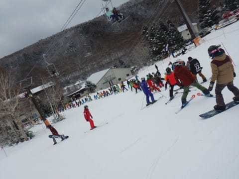

# 2020/12/13(日)の志賀高原，焼額山スキー場の詳細レポート…午前中は4ロマ15分待ちの修行だったけど，地獄の午前に対して午後は天国のガラガラ雪質最高！

📅 投稿日時: 2020-12-15 06:22:11

🏷️ カテゴリ: [2021スキー滑走日記](c2b0fc073d6357d3b786f6ca655147f7d.md)

ということで．

冷え冷え祭りが始まった本日月曜日．

予想通り，志賀高原も結構雪が積もって

くれたようで…

朝の志賀高原，横手山は積雪30cm！

やったーー！！

（[横手山ホームページ](https://yokoteyama2307.com/news/12586/)より）

さらに昼間も降り続けたようで…

この積雪のおかげで，日曜の段階では

18日まで4ロマのみ営業予定とアナウンス

していた焼額も，

16日に第2高速（唐松コース），

18日に第2ゴンドラ（パノラマコース）の

オープンと，予定を変更しているようです…！

（[焼額山スキー場Facebook](https://www.facebook.com/yakebitaiyama/posts/3499136563514998)より）

このほかにも，八方を初めとする白馬

山麓もオープンを決めたようで．

八方は70cmの積雪があり，

15日からパノラマが，

16日からは兎平＆黒菱がオープン

するようです…！

（[白馬八方尾根ホームページ](https://www.happo-one.jp/news/17881/)より）

この雪は．

15日から17日まではむっちゃ積もります！

17日までの3日間に，日本海側は1mほど

積もりそうな勢いだし．

志賀高原も50cmを余裕で超える積雪に

なるはず…！

15日，16日，17日，18日と，

朝は新雪パフパフデーが続きます！！

…そうです．

冷え冷え祭りです！

盛大な冷え冷え祭りが始まりました！

…大雪は17日までだけど，その後も

土日までずっと雪が降り続け，

今週末はおそらくほとんどのスキー場が，

一気に全面オープンしそうな勢いです…！

いやーー．

やっと効いてきましたね．

私の冷え冷え踊りが…！←効くのが遅すぎる

ということで．

本題．日曜13日の焼額山の詳細レポートです…

えー．

まず．

昨晩からの降雪は，わずか1cm程度だった

志賀高原ですが．

朝の登りの道路は，スキー場近くに来ると

積雪が結構残っています…

本格積雪路を登って焼額へ到着して，

朝イチリフトに並びますが…

今日も焼額は4ロマのみの営業．

だもんで．このリフトにお客さんが

集中するわけですが…

…それにしても，オープンを待って並んでいる

人が，昨日よりかなり多い気が…

1本目のリフトに乗って振り返ると．

うーむ．

1本目から，かなりの列の長さですね…（涙）

…でも．

リフトから見えるゲレンデ状況は

良さそう…っ！！！！

ってなことで．

1本目の山頂に到着すると…

シマシマっ！！

昨日は人工雪100％で固かったけど…

今日は1cmながらも上に天然雪が乗って

くれて，表面が優しい柔らかさの

ゴキゲンなバーンコンディション！

ってなことで，シマシマ，いただきまーーーす！

…と，最初のリフト1本は気持ちよくシマシマを

いただきましたが…

1本滑り終わると…

…なにこれ．

リフト待ちの列！？？

1本滑り終わった朝イチの時点でこんなすごい

待ち時間が…！？？

そして，2本目には…

もっと伸びてるよ（泣）

で．

9時を過ぎるころになると…

…なんじゃこりゃ（涙）

この上にも，さらに列は続いていて…

これで15分待ち（泣）

まあ，一列に並んでいるので列は

長いですが，2週間前の熊の湯より

待ち時間は短いですが…

とはいえ．

このコースを滑ったことがある人は，

列の最後尾がここまで来ていることに

驚きを感じられるはず…

この，おそらく焼額の歴史始まって

最高に長い待ち行列が，これから

午前11時頃まで続きました…（涙）

まぁ，これだけのリフト待ちはあるものの．

ゲレンデ自体は，ペアリフトの輸送力で

運ばれる人数しか滑ってないわけなので．

そんなに混雑しておらず…

まだ救われるかな，と思っていたところ．

なんだか，10時ごろに雪がぱらつき始め．

11時ごろには，なんだかかなりの勢いで

雪が降りはじめたんですけど！？？

リフト待ちがある上に，

結構な勢いで雪が降り，前が見にくくなり．

あぁ…

今日はダメな日だ（泣）

…と思っていたら…

「パラパラと降る程度で，積もらない」

と，誰かが予想をしていたはずなのに．

なんだか，積もり始めてきましたよ！？？

ゲレンデの上も，朝イチの新雪がはがれて

硬くなりかけてきたゲレンデに，

うっすらと積雪が覆いはじめ…

なんだか，雪質もよくなってきましたよ！？？

そして，11時過ぎには，

リフト待ちもグングン短くなりはじめ…

昼を過ぎると，列はせいぜいこの程度．

最大2分待ち，せいぜい1分待ち程度まで

短くなり…

さらに，午後1時過ぎには雪も止んで．

雪が積もったおかげで，雪質が

劇的に改善してくれましたよ！！

そして，午後2時ごろには晴れ始めて，

ゲレンデも見やすくなり…

そして，リフトも飛び乗りに

なってきましたよ！？？

おかげで，ゲレンデもガラガラになり．

下地のしっかりした雪の上に，積もりたての

柔らか雪が全面を覆って，

フラットなのに表面がカリカリじゃない，

絶妙な雪質を，太陽のもと思う存分

飛ばせるようになってきましたよ！？？

…素晴らしい！！

激込みで視界が悪い午前中を耐え，

それでも生き残ったスキーヤーに，

神様はガラガラ最高ゲレンデという，

ご褒美をくれたようです！！

神様，ありがとう～！！！

…ということで．

本日も，日が暮れかける16時のラスト

リフトまで．

この時期としては最高に近いコンディションを，

たっぷり楽しんだのでした…

駐車場に戻ってみると…

車の上に，5cmほど積もってたので．

…昼間の積雪，結構あったんだなぁ…

いやー．

激烈なリフト待ち＆雪で視界が悪くて，

最低の午前中だったのに．

我慢して午後まで滑ったら，

こんな最高なゲレンデ状態が

待っているとは…

午前中に帰っちゃった人，ゴメンナサイ

という感じの一日だったのでした．

## 💬 コメント一覧

### 💬 コメント by (ゆーき)
**タイトル**: Unknown
**投稿日**: 2020-12-15 07:31:04

お疲れ様でした。

私も意外と早く振りはじめて、あれ？って感じだったんですが、

2時くらいは良かったですね。

その後はやはりカリカリが出てきて、ヘタレな私は微妙でしたが、

最後まで滑りました。

Sさんについては、実はこの土日、その前の土日も、

姿は確認はしてて、

最も近いときは1mくらいのところにいたんですが、

大勢の取り巻きwが見えるので、

なかなか話しかけられず、、、

そのうちお声がけします。。。

### 💬 コメント by (かず)
**タイトル**: Unknown
**投稿日**: 2020-12-15 09:50:28

遅いですが医療の方の心が折れる前でとりあえずホットしてます 

1ゴンが動きそうな26日から9連チャンスタートします！

昨シーズンは初日に怪我で滑れなくなったので安全第一です笑

2時さんは年末年始は自宅ですか？

### 💬 コメント by (レインボー73)
**タイトル**: Unknown
**投稿日**: 2020-12-15 17:09:37

火曜日の志賀高原情報

昨日の25cm新雪が圧雪された上に、終日ぱらぱら小雪が舞い、気温もマイナス10度あたりを維持。婚期、じゃない、今季17日間でベスト。いつもはレインボー（2時）になる前に『やめようか？』と誰かが言い出すのに、今日は全員一心不乱に滑り続けました。板をぬいだのは２時きっかり。

明日は『安全が確認できれば唐松が滑れます』との従業員情報を、信じるしかありません。

エス様の週末にもきっと幸が訪れることでしょう。

紙面をお借りします。かずさん、私は家庭第一主義なので、年末年始だけは孫と遊びます。今季もよろしくお願いいたします。

### 💬 コメント by (レインボー73)
**タイトル**: Unknown
**投稿日**: 2020-12-15 21:18:25

明日のカラマツは九時オープンの予定だそうです。

### 💬 コメント by (Skier_S)
**タイトル**: スキー場は積もってるよ！冷えてるよ！
**投稿日**: 2020-12-16 03:28:59

＞ゆーきさま

えええ？？

そんなに近くにいらしたのですか？？

全く気付かず…

いや，周りにいる人たちはみなさんBlogつながりで，

ゆーきさんと同じような方々なので．

声をかけてくれれば，周りの皆さんともども「ようこそ！」

という感じで歓迎しますよ！

今私の周りにいる方も，みんな最初は同じように声をかけて

くれた人なので，みんな「また仲間が増えた！」って感じです（笑）．

＞かずさま

26日からシーズンインですか！

そしていきなりの9連チャン．

身体に厳しいと思いますが，無理せず滑ってください…！

では，26日にお会いしましょう！

＞レインボー73さま

今日は昼間も積もったのですよね．

冷え冷え新雪が滑れてうらやましい…

そして，明日から2高運転ですね！

明日も一日，かなり積もると思いますよ！！

…また明日もどんなだったかレポートお願いします…

### 💬 コメント by (まうちゅう)
**タイトル**: Unknown
**投稿日**: 2020-12-16 22:35:26

２週間前の熊の湯に引き続き、リフト待ちお疲れ様でした。

ここ数年は何につけ極端なことが続きますね。

### 💬 コメント by (Skier_S)
**タイトル**: ＞まうちゅうさま
**投稿日**: 2020-12-17 02:24:58

熊の湯はそれほど混まなかったみたいですね…

午前中はすごかったです（涙）

シーズン中も，焼額のゴンドラは乗車定員制限ですごい混むのかも…

