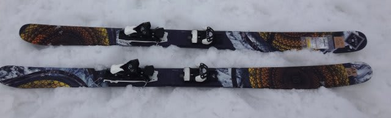
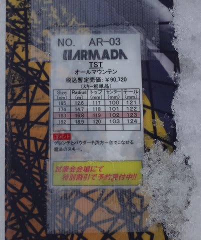
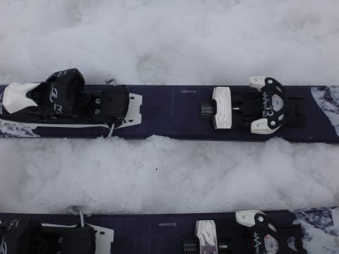
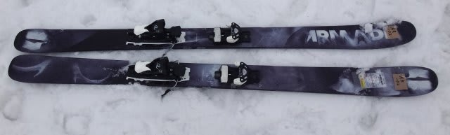
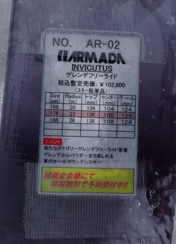
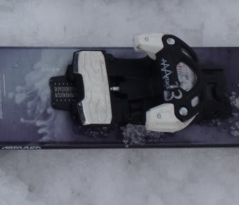

# 2016シーズンモデル，スキー試乗レポート第22回…ARMADA編

📅 投稿日時: 2015-06-09 00:27:47

えー．

昨日は更新がなく．

「あれ？Skier_Sは死んだかな？」

と，思った人もいるかもしれませんが．

残念ながら（笑），死んでません．

久々にスキーに行かなかった週末ということで．

子供と遊びまくって，子供と一緒に

夜9時過ぎに，寝てしまってました…

ということで．

本題へ．

なんだか今シーズン，[魅力的に思えてきた
パウダー用のファットな板](eb0e101f2acac4e405b8f9fa032f16f10.md)．

ざぶざぶ春雪で，パウダー用の板の性能が分かるのか？？

…と，思いつつも．

ちょっと惹かれるところがあったので，試しに乗ってみました…

ってことで．

2016シーズンスキー板の試乗インプレッション，今度は

アルマダ編です．

では，どうぞ～！

○ARMADA TST 183cm

パウダー用．

こーゆー太い板は良くわからないので．

いきなりセンター幅100mm越え，ほとんどサイドカーブがなく，

ロッカーの強い過激な板に行ってしまいました…

リフトを降りて滑り出すと…

…

…

普通の板のように，エッジで滑るってことができないのか！！

なんだか．

普通の板よりエッジグリップが弱く，ロッカーが強いからか，

ズルズルずれて，クルクル回せます．

エッジに乗って滑るということができないので，

ズルズルとずれずれで降りていく感じ…

「気持ちよく飛ばして滑る」というより，とりあえず

ズルズルとずらしながら下へ降りていく…という感じ（涙）．

スタッフの方は「ゲレンデも行ける」と言ってたけど…

…たしかに，行けなくはないけど，

決して，圧雪を滑って楽しい板じゃないですね．これ．

やっぱり，こういう板は，パウダーメインですか．

ゲレンデは，普通の板の方が楽しいです…

うーん．こういう板はゲレンデでは厳しいなぁ…

パウダーで試してみたいところ．

○ARMADA INVICTUS 178cm

パウダー用．

さっきほど過激じゃない板…

ということで，次に出てきたのがこの板で．

さっきのTSTよりは，サイドカットが強めに感じますね．

…でも．

センター幅，106mmですか…

とりあえず滑ってみましたが．

あー．

やっぱり，この板も．

ゲレンデで評価する板じゃないや…

カービングでゲレンデを気持ちよく滑れる板じゃないわな…

TSTよりは張りが強いのか．

トップとテールのエッジ感が多少あり，普通の板に近い感じで

滑れるけど．

やはり私が普段履いているような板に比べると，

エッジグリップは弱めで，スピードを出して圧雪を

気持ちよく切っていって滑る板じゃないです．

まぁ．

やっぱり．

こういう板は，パウダーで履いて試してみたいものですね…．

…私には，このような板を評価する能力がないようで…

役立たないレポートで，すいません．

## 💬 コメント一覧

### 💬 コメント by (いか)
**タイトル**: Unknown
**投稿日**: 2015-06-09 22:45:58

パウダー専用機に割り切るならば、振り切った性能のほうがいいとおもいます！

この道に来ると、パウダー斜面まではターンしないので、整地での性能は関係ないです笑

八方で言うと、アルペン降りたらうさぎ正面までは一瞬です(o'д`o)ゝ

### 💬 コメント by (Skier_S)
**タイトル**: いかさま
**投稿日**: 2015-06-10 03:14:59

…なるほど．

やはり，パウダー専用機に特化した

とんがった性能の板が，ぱふぱふを

楽しむには必須なわけですね…

…年間，何回パウダーに会うんだろう…

来シーズンは，ショート板とブーツとウェアと

グローブを買わないといけないのに．

…これにおデブ板を買うと，スキーに

行けなくなっちゃう気が…

### 💬 コメント by (ペティター乗り)
**タイトル**: デブ板は慣れが必要
**投稿日**: 2015-11-01 18:21:05

シーズンインの前にレポートを徘徊してましたf^_^;

デブ板、特にロッカーが強めの板の場合思いっきり踵に乗る感じで圧雪を滑らないと、やたらとクルクル回ってツマラナイ板に思えちゃいます。

乗る場所さえ判ってしまえば、ガチガチのレーシングバーン以外はエッジに乗ったターンも出来ちゃいますよ。

春のザクザク雪はデブ板が楽しめるバーンの一つです。エッジでターンするのではなくって、面を使ってターンが出来ます^ ^

パウダーと似た感覚の楽しさがそこには有りますよー

### 💬 コメント by (Skier_S)
**タイトル**: ペティター乗りさま
**投稿日**: 2015-11-02 02:38:58

ようこそ，駄文置き場へ（笑）．

センター80～90mm程度のキャンバー板くらい

だったら，春のグサ雪での良さが分かるのですが，

いや，もうこんな強烈ロッカーの激太板，

どう滑ってよいやら全く分からず…

とりあえず，私はこういう板の評価をする

能力が無い…ってのは，本文で述べた通りで（汗）．

今度乗る機会があったら，ちょっとテール荷重で

行ってみます…

コメントありがとうございました！

