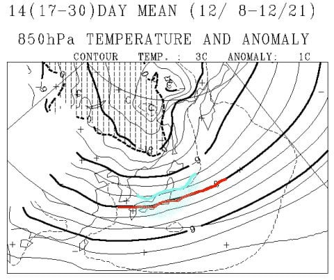

# 一か月予想図を見てみたけど…これから12月中旬までは厳しい日々が続きそう…（涙）

📅 投稿日時: 2018-11-23 04:09:23

🏷️ カテゴリ: [日記](cc4b5682fb7b8b144980957a978653fb0.md)

ってなわけで．

残念ながらかぐらは23日のオープンを

諦めたようですね…

（[かぐらFB](https://www.facebook.com/snowkagura/posts/1796123270514985)より）

オープン日は未定ですか…．

結局，数多くの23日オープン予定のスキー場で，

予定通りにオープンを決めたのは，

熊の湯だけという結果でしたね…

でも．

かぐらは22日の深夜から人工降雪を

開始しましたし．

（[かぐらライブカメラ](https://www.princehotels.co.jp/ski/kagura/livecamera/?__utma=1.590953270.1526916109.1542817026.1542904436.97&__utmb=1.2.10.1542904436&__utmc=1&__utmx=-&__utmz=1.1535996538.42.2.utmcsr=anotherski.skr.jp|utmccn=(referral)|utmcmd=referral|utmcct=/skireport/early-ski2018.html&__utmv=-&__utmk=97656351#main_g)より）

深夜3時の段階で，志賀高原にも雪が積もり始めてます！

（[北信建設事務所HP](http://www.q0.ws302.smilestart.ne.jp/index.htm)より）

…この雪は，明日の朝まで続きそうで．

明日の熊の湯は，人工雪＋天然雪のミックスで

滑れそうですね！

まぁ，明日，明後日と，人工雪が打てる気温なので．

この3連休の熊の湯．

後半になればなるほど状況が良くなっていくでしょう！

で．

3連休の後ですが…

3連休最終日の25日の夜の850hpa気温図を見ると．

うむ…

赤く印した0度線が東北まで上がっちゃってるよ（涙）

…これは．25日の夜は，人工雪が打てませんね…（泣）

その後の26，27日を見ても…

どちらも0℃線は東北まで北上していて．

志賀高原は夜もプラス気温．

しばらく人工雪が打てない日々が続きそう…（泣）．

そのあとの28，29日も微妙な感じ…

ううーむ．

12月1日の焼額オープン，大丈夫かな！？？

ってな感じで．

ここしばらくの雪の状態が心配になったので．

一か月予想図を見て．

これから12月下旬にかけて，雪が

積もりそうかどうかを，

期待できないながらも

見てみましょうか…←すでにあきらめモード発動中

ってなわけで．

専門天気図，FCVX14の850hpa気温傾向から

見てみますが…

うん．

この時点でもうダメな感じ…．

青く囲った部分が，今回の雪を降らせた

22～23日前後の冷え込み．

平年比1℃程度という，このわずかな冷え込み

を最後に．

そのあとは，赤く囲ったように．

27日ごろの平年比+3度をピークに．

平年比+1～2度の日が続きます（涙）

…ダメだ．

ダメだよ…

12月3連休直前まで，冷えてくれる日がぜんぜん

なさそうなんですが…（激涙）

とりあえず．FCVX12から，

11/24～11/30の一週間平均の850hpa気温図を見てみると．

うーーーーむ．

赤く印した0度線はギリギリ志賀に掛かるかどうか…

これはこの期間，0度以下に下がらない日も

多いということで．

人工降雪機が打てない日も多そう…（涙）

何にしろ，水色で記した平年比+1度の

エリアが志賀に近づいているので．

志賀高原，平年比+1度程度高い気温の

日々となりそうです…（泣）

次に，12/1～12/7の1週間ですが．

この週も，赤く印した0℃線は，ギリギリ志賀に

かかるかどうかの位置にあり．

12月に入っても，第1週は人工降雪機が打てないほどの

気温に上がる日がありそう…（泣）

そして，この時期も志賀高原は水色で示した

平年比+1度のエリアに入っているので．

…気温は高そうです…（激涙）

そして，12/8～12/21までの2週間ですが．

…さすがに12月中旬となれば，赤い0度線は

太平洋側まで下がっているので．

志賀高原では降れば雪の気温になっては

くれそうです．

ただ，この期間も，志賀高原は水色の平年比+1度の

領域に入っており．

気温は平年より高めに推移しそう…

…なんてこった！！

結局これから12/21までの一か月間，

気温が高めなので，雪がガンガン積もる

感じじゃなさそう…（あふれる涙）

とりあえず．

これは．

今シーズンも．

例の踊りを踊り続けないといけないシーズンになると

言うのか…？？（戦慄）

…いや！！

ダメだ！

そんなことは許さない！

そんなことにならないよう，努力しなくては

いけないのだっ！！！

そんな悪夢のシーズンにならないよう，

「冷え冷え踊りを踊らなくても大丈夫な冷え冷えの日々が

　続くよう，神に必死に願う踊り」

を全力で踊り続けて．

今年は冷え冷え踊りを踊らずに済むシーズンに

するのだ！！←結局踊らなくてはいけないことになっている気がするのだが…
