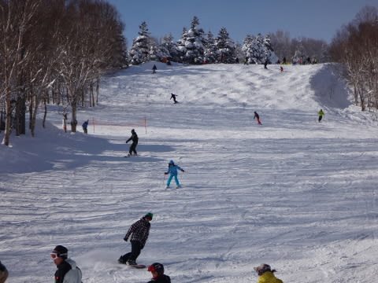

# 大晦日の志賀高原・焼額山は…晴れたよ！午後はすっきり晴天で楽しめた一日

📅 投稿日時: 2015-01-01 01:47:26

🏷️ カテゴリ: [2015スキー滑走日記](c09ea645cfc085f86dfcd80f49599dd89.md)

えー

本日は．

やはり．

予告どおり，日が差すタイミングもある午前中で…

朝イチは，予想通りのぴかぴか圧雪バーンをいただきました！

ぴかぴかシマシマですっ！！

いつもどおり，午前10時ごろからはゴンドラ待ちもあり，

結構コースにも人が多かったものの…

午前11時ごろにはゴンドラ待ちもなくなり…

そして．

昼からは，すっきり晴れ！

予想では，「晴れるかも…」

と書いてはいたものの．

ここまですっきり晴れるとは！！

いや，やはり．

私の日ごろの行いかっ！←違うって

…でも．

ちょっと人が多かったのもあって．

午後は，やっぱりゲレンデはぼこぼこになっていったものの．

でも，夕方まで雪質は最高で．

そして．

夕方から崩れる，という予想だったけど．

雪が降り始めたのは，ナイター照明がつき始める

午後4時半ごろ．

結局，今日は午前は曇ったり晴れたりだったものの．

午後はすっきりとした晴れの中滑れた一日でした！！

…で．

今日の夜は．

すごい降ってます…

明日の朝は，予想通り朝からパフパフパウダーデーだな！

ってことで．

2015年も，よろしくお願いします～

## 💬 コメント一覧

### 💬 コメント by (Goku)
**タイトル**: Unknown
**投稿日**: 2015-01-01 07:11:06

あけましておめでとうございます。

今年も宜しくお願いします。

2014滑り収めは晴れましたね。

締まったイイ雪で速そうな雪！って感じが画像から伝わってきますね～

朝一ゴンドラは最高だったことでしょう。

### 💬 コメント by (れお)
**タイトル**: 明けましておめでとうございます♪
**投稿日**: 2015-01-01 08:04:23

昨日の志賀は最高でしたね!!

ちょっとゲレンデが混んでましたが…。

年の最後に、焼額山スキーの神様(Sさん♪)を拝みたかったので、15時頃から1ゴンを回してみたのですが、叶わずでした～。

今年もよろしくお願いします～♪

### 💬 コメント by (Skier_S)
**タイトル**: Unknown
**投稿日**: 2015-01-01 08:38:31

>　Gokuさま

いや～

天気はよかったんですが…

コースの人は多かったです。

今日はバフパフですょ！

今年もよろしくお願いします！

### 💬 コメント by (Skier_S)
**タイトル**: Unknown
**投稿日**: 2015-01-01 08:40:16

>　れおさま

明けましておめでとうございます！

昨日、今日と、前回お会いしたのと

ちがう方のウェアを着ていたので、

見つけにくかったのかも…

現在ファーストトラック中。

すごい新雪です！

今日も1日ヤケビ滑ってます。

今年もよろしくお願いします！

### 💬 コメント by (すぎぃ)
**タイトル**: Unknown
**投稿日**: 2015-01-01 17:03:33

Skier_Sさんはだいたい焼額山ワンメイク

なのでしょうか

わたくしはハシゴする方です。

### 💬 コメント by (Skier_S)
**タイトル**: すぎぃさま
**投稿日**: 2015-01-01 19:59:28

私は焼額ワンメイクどころか，

焼額第1ゴンドラ専門です．

ひたすら第1ゴンドラ滑ってます．

…子供と滑っているときは，一の瀬やらいろいろ

めぐりますが…

