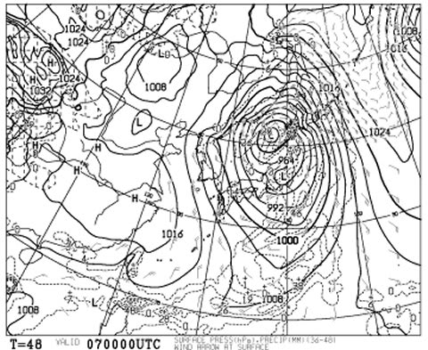
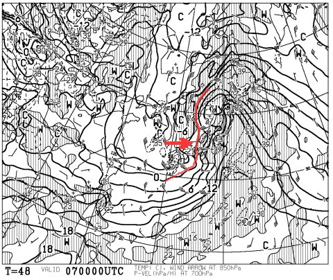

# これから志賀高原に出発するのだけど…直前天気予想はいかに？

📅 投稿日時: 2013-04-05 23:14:14

…[火曜日の段階で予告](e052f0ace3d3eba2953798daea81c927a.md)していましたが．

いろいろニュースにもなってますように．

…今週末，かなり厳しい天気になりそうな…よ・か・んっ！

…って，動揺してわけ分からん表現をしてしまうほど．

ちょっとどうよ，って動揺しています(汗)．

とりあえず，直前の天気予想詳細をば．

土曜日の志賀高原は…

前回の天気予想通り．

午前中は晴れそうです．

午前中は風もそんなに強くなく，

「あれ？ニュースで爆弾低気圧って言ってるけど，ホント？」

って感じの，比較的穏やかなコンディションですごせるかと．

…ただし．南風で，気温は高く，雪はドボドボですが…(涙)．

んで，低気圧の移動が予想より多少早まったので，

ちょうどお昼ごろから雲が増えだして，雨になりそうです．

うーん．夕方までもってくれるかと思ったんだけどな～．

そして．土曜の夕方から夜にかけて．

風が強くなり，雨も強く降ります…(涙)．

雪が…雪が解けていく…(泣）．

日曜朝は．

もう，こーゆー天気図ですから．

風が強く，ゴンドラは動かない可能性が大です．

…でも，雨は，意外と午前中早い段階で弱まりそう．

うーん．午前9時くらいからは曇りで，時々雨がサーっと降る，

って感じかな．

…まぁ，風が強いので．動くリフトは限られると思いますが．

そして．

こんな感じで，赤くマークした850hpaの0度線が西から近づいて，

昼過ぎには志賀高原は0度エリアに入っちゃうと思うので．

昼に向かって，気温が落ちて行きます．

んで．風は強いままですが，雲は去って行きそうですね～．

ってことで．日曜午後は，曇り時折日が差す．

…もしかすると，雪が時々ちらつくかも？？って感じです．

あ，でも，そんなに積もる雪じゃないので．期待しないように．

風は北向きに回るので，午後に向かって動くリフトが増えて行き．

で．冷え込み次第ですが．

夕方に向かって，ちょっとゲレンデが固くなって行くかも…

…という感じで．まとめると．

土曜：朝のうちは気温が高いけど，晴れ．意外と穏やか．

　昼から南風が強まり，雨が降り出す．

　雪質は終日悲惨．

　夜は強い風と雨．

日曜：朝のうちは南風が強く，雨．ゴンドラは動かないでしょう．

　午前中に雨はやみ始め，時々降る感じに．

　午後は冷え始め，時折晴れ間も．晴れ・曇り・霙～雪がめまぐるしく入れ替わる．

　午後からは，動き出すリフト・ゴンドラが多いでしょう…

　雪質は，朝はドボドボ．午後は，夕方に向かって固くなって行く感じ．

ってところでしょうか．

…しかし．

土曜の焼額早朝，早くも[営業中止を決めた](http://blog.princehotels.co.jp/yakebi/2013/04/05/)ようです．

…土曜の朝は，そんなに荒れないと思うんだけどなぁ…

＃…もしかすると，悪天候ニュースがこれだけ流れてて，

＃今週スキー行こうって人はほとんどいないから，

＃この天気予想，ほとんど役立たないのかもっ！？
