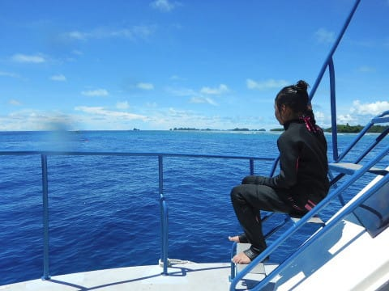
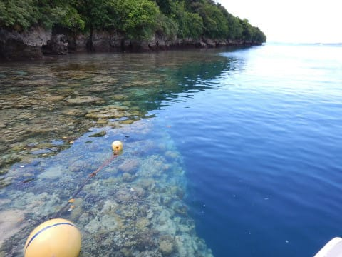

# 2017年8月，小学生の子連れでパラオ再訪！その12…3本目もお留守番（涙）

📅 投稿日時: 2018-09-27 03:16:59

ってなわけで．

気象庁からこの冬の長期予想が発表されて．

いろいろニュースでも見た方が多いと思いますが．

どうも，この冬．

東日本は平年より暖かめで，

降水量も少な目…

という予想のようで．

昨シーズンのように，11月から多くのスキー場が

先行してオープンするような

シアワセな状況は期待薄な感じですが．

とりあえず，何でも原典を当たらないと

気が済まない私ですから．

気象庁の発表資料．

[FCXX93	全般季節予報資料　３か月予報](https://www.sunny-spot.net/chart/FCXX93.pdf)

で，特に気になる12月の予想を見てみました…

…いろいろ難しいことが書いてありますが．

ぶっちゃけて言えば．

この12月，志賀高原は雪が積もりにくいパターン

になりそうな感じ…（ちょい涙）

しかし．

まだあきらめてはいけない．

[FCXX93	全般季節予報資料　３か月予報](https://www.sunny-spot.net/chart/FCXX94.pdf)

を見ると．

この冬は．

水色で示したように．

「気温が低くなる可能性が20%」

あるのだ！

0％ではないのだっ！！

そして．

赤く印したところを見ると．

「降水量が多くなる可能性も20%」

あるのだ！

そう．

まだ，暖かくて雪が降らない冬と，

完全に決まったわけでは無いのだ！

この20%ずつに当たれば．

冷えて雪が降る12月になるのだ！

…そうです．

皆さんの普段の行いで，スキー場に雪が積もるか

決まるのですっ！！！←そ，そうなのか！？？

ですので．

皆さん．

これからシーズンインまで，

普段の言動にはくれぐれもご注意ください．

って感じの長い前フリの後は←徒然スキーヤー日記としては，こちらが本題なのでは…？

昨年のパラオダイビング旅行記の続きです．

では，どうぞ～！

---

ってなわけで．

みんなが2本目のダイビングに行っている間．

ひたすら泳ぎまくっていた娘ですが…

そろそろダイバーが浮上してくる時間．

娘も船に上がり，ダイバーのピックアップへ

向かいます…

しばらくダイバーが浮上してくるのを

探しながら漂っていると…

「あ！いた！」

ダイバーの浮上を確認したキャプテンは，

ボートをダイバーのそばへ移動させて…

そして，ダイバーがボートへ戻ってきました．

さて．

かねてより，ブルーコーナーのマクロ穴で

[ヘルフリッチを見ることを楽しみにしている](ee4568b58e63cfdcd9328bb87f9f6ff6c.md)

わが妻．

2本目にマクロ穴に行くと聞いて．

「私，2本目行くっ！2本目潜りに行きたいっ！！」

と．

強烈に主張して潜りに行ったわけだけど．

…果たして，無事見れたのかな…？

妻「見れた．ちゃんと写真は撮れなかったけど…（涙）」

…確かに，写真はちょっと残念な感じだけど．

まぁ，見れたんなら良かった…

ここで見れてなければ．

「ヘルフリッチ…ヘルフリッチ…」

とつぶやき続けるという，[以前発症したジンベエ見たい病](e530e98339f87e8dc5e13de072679d584.md)と

同様の，ヘルフリッチ見たい病が発症して

いたに違いない…

ということで．

ボートは3本目のポイントへ移動します…

…そして．

やってきた3本目のポイント．

「ビッグドロップオフ」

なんだか，こういう陸地沿いにいきなり

ストンと落ち込んだドロップオフがあって…

その陸側の浅いほう．

珊瑚がきれいで，魚もいっぱい見えますね…

本日は3本終了後，一旦ショップに戻った後に．

4本目のサンセットダイブのエキストラボートが

出るということなので．

サンセットダイブやナイトダイブが結構好きな

私は，4本目を潜りに行くことして．

3本目は妻に譲りました…

だもんで．

私は3本目も続けて娘とお留守番ですね．

…って，娘．

お前，もう泳ぎに行く準備してるの！？？

早すぎ…

お前，どんだけ海が好きやねん…

## 💬 コメント一覧

### 💬 コメント by (マルハバ)
**タイトル**: 今でもあのマクロ穴には・・
**投稿日**: 2018-09-27 10:25:41

ヘルフリッチとアケボノハゼが同居してるんでしょうか？

私の知る限り

同時に両者が見られるのは世界でもここだけで

（二十年前の知識ですが・・汗）

もしや人為的に放流されたのでは？と

疑いの目を向けていたのですが・・

### 💬 コメント by (しんちゃん)
**タイトル**: 20%にかける！
**投稿日**: 2018-09-27 22:14:12

カービングスキーヤーしんちゃんとしては、Ｓ様の言う通り、20%の確率に賭けたいです。

頼むから今シーズン、平日降って土日晴れてほしい。

個人的にはこれだけ台風が夏の間に来ると、ドカ雪が何回か冬に訪れると予想しています。

### 💬 コメント by (Skier_S)
**タイトル**: 今日は寒かった…
**投稿日**: 2018-09-28 03:47:34

＞マルハバさま

私が直接見たわけでないのですが．

妻はアケボノは見なかったと言ってました．

3年前は，妻がヘルフリッチだと思って撮った何枚かが

アケボノだったという出来事があったのですが．

今回はすべてヘルフリッチの写真でした…

アケボノがいなくなっていたなら，また放流しないと（笑）．

＞しんちゃんさま

そうです！

20%に賭けるのです！

…そして，平日にのみ降って休日は晴れるように

祈り，歌い，踊るのです！！←なんじゃそりゃ

でも．

何もしなくても冷える1，2月はそんなに冷えすぎなくていいから．

3，4月がすごい冷えるとシーズンが長くて嬉しいんですけどね～．

昨シーズンのように，意味もなく1，2月に冷えて，

3，4月に暑いのは勘弁です…

