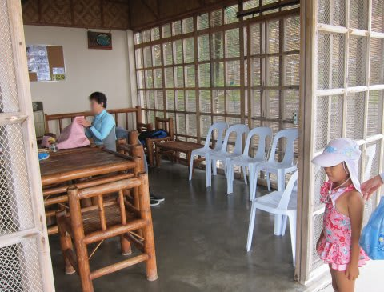

# 2013年11月　フィリピン・オスロブ　子連れでジンベエを見るぞっ！　その17

📅 投稿日時: 2014-07-29 02:07:58

🏷️ カテゴリ: [ダイビング日記](ce3a7a8d424d112fce83ee85c81a0e344.md)

…ダイビング一日目で，すでにその16を突破してしまった

オスロブ旅行記．

「飽きた」

という声が，聞こえる…っ！

でも．

聞こえなかったふりをして，続けます．

そう．

継続は，力なり！←いいかげん，しつこい…

ということで．

その17です～

--

さてさて．

ダイビング2日目．

とはいえ，中2日の旅行なので，

実質ダイビング最終日の朝ですが…

…この日．

早朝に，雨が降ったようですね～

空は曇りで．

あんまり天気がよくないなぁ…．

とりあえず，海が見えるレストランへ行って…

朝ごはんタイム！

今回のツアーは，こんな感じの朝ごはんがついてます．

…しかし．

今日は，あんまり天気が良くないようで…

残念…

で．

朝ごはんの後は．

ダイビングショップ向かい，

ブリーフィングを受けますが…

ダイブショップの壁には，こんな感じの地図が貼って

ありまして．

セブ島南端にある，ルビリゾート．

今日は，このあたりの…

ルビリゾート近辺，リロアンエリアを潜るようです．

ってことで．

ボートに乗り込んで．

沖のバンカーボートへ向かい…

曇り空の中，リロアンエリアへ向けて，出発！

うーむ．

なんだか．

熱帯低気圧が近づいてきているみたいで．

今日は一日，天気が回復しなさそうだな～．

と，この時は．

まだ，気楽に考えていたのであった…
