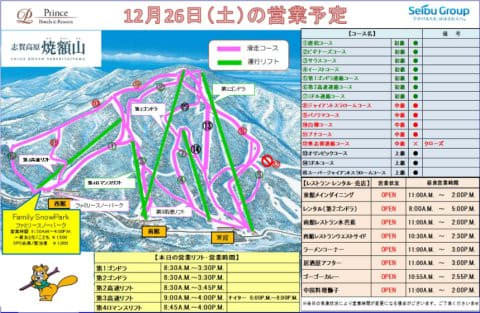

# 今週末も志賀高原…土曜は曇り，日曜は晴れそうな感じになってきたよ

📅 投稿日時: 2020-12-25 23:45:02

🏷️ カテゴリ: [日記](cc4b5682fb7b8b144980957a978653fb0.md)

ということで．

今週末も志賀高原にて滑ってきますが．

うーむ．

そろそろ感染者の拡大が危険領域に

なってきたので．

いつまで志賀高原に行ってられるか

ちょっと心配になってきました…

とりあえず，ここ数日の雪降りにて，

焼額も明日から完全に全コースオープンです！

（[焼額山スキー場Facebook](https://www.facebook.com/yakebitaiyama/photos/a.533933973368620/3526717097423611/?type=3)より）

…そして，第3高速のナイター営業も予定通り

明日26日から始まるようですね…

そのほか，金曜から

・東館山（オリンピック上部除く）

・寺子屋

がオープンし．

さらに明日土曜からは

・山の神

・蓮池

・奥志賀第4ペア

がオープンするので，

焼額から奥志賀，一の瀬方面への行き来が

できるようになります！

残るは，

・東館山オリンピックコース上部

・西館山ワールドカップ上部コース

・一の瀬ファミリーパーフェクターコース

・ジャイアントスキー場

…等の数本のコースのみ．

とりあえず，明日からはほぼ全面滑走可と

言えるかな…

ってなことで，この週末の天気ですが．

概ね昨日の予想通り．

土曜は終日曇り空で，雪がチラチラぱらつく程度の

結構冷える一日．

日曜は…曇り時々晴れ，と予想したけど．

曇りのち晴れで，晴れ間が結構広がるかも？

とりあえず．

気温が上がってヤバかったりすることは

無さそうな，いい感じで冷えた週末になりそう…

ということで．

また，今から3時間半後に出発です！

（また睡眠3時間か…（涙））

## 💬 コメント一覧

### 💬 コメント by (かず)
**タイトル**: Unknown
**投稿日**: 2020-12-26 12:38:19

明日 ヤケビ  Ftなしの8時30分スタートですか？久々過ぎて見かた忘れました笑

### 💬 コメント by (質問)
**タイトル**: Unknown
**投稿日**: 2020-12-26 18:02:34

本格的なスキーシーズン到来ですね!!

年末の寒波は凄そうです…　ところで、どこのテレビでもやってくれないのですが、年明けの天気はどうでしょうか？

### 💬 コメント by (m&t)
**タイトル**: Unknown
**投稿日**: 2020-12-26 22:01:16

行けるうちにと、突然ですが日帰りで明日参戦予定です!!

ただし、奥志賀スタートになると思います。

ピザとかビーフシチューへの連絡通路にブッシュが出ていそうなので捨て板で行きます。

東館Tか終礼でお会い出来ればと思います。

Gokuさんに新しいステッカー下さいと伝えてください。

では、明日お会いしましょう!

### 💬 コメント by (レインボー73)
**タイトル**: Unknown
**投稿日**: 2020-12-26 22:35:23

かずさん、土日はプリンス10分FTはありませんよ。

ヤケビでは、プリンスカード（無料）を見せると、平日は10分早くスタートできます。皆様、ご利用ください。

### 💬 コメント by (Skier_S)
**タイトル**: 今日は良かった！
**投稿日**: 2020-12-27 01:01:49

＞かずさま

FTは28日からです！

明日はFTなしの，8時半からですよ~！

＞質問さま

1週間先までしか予想ができないので，年明けの予想はまだです…

しばしお待ちを！

でも，年明けも降りそうかも？？

＞ｍ＆ｔさま

日帰り志賀ですか！

お待ちしてます．

焼額ラストの駐車場終礼に参加でしょうか．

板は捨て板じゃなくて大丈夫ですよ！！

＞レインボー73さま

情報ありがとうございます~！！

26，27は全員8:30スタートということで．

