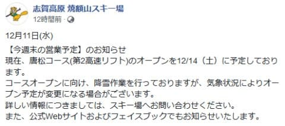
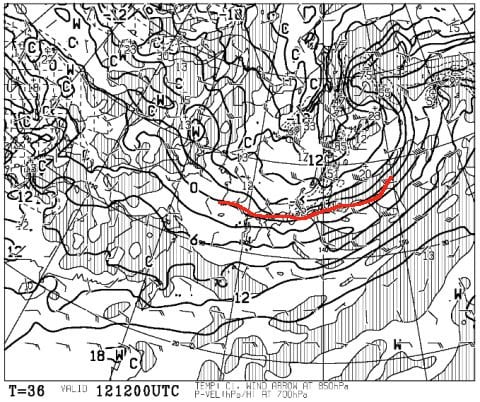
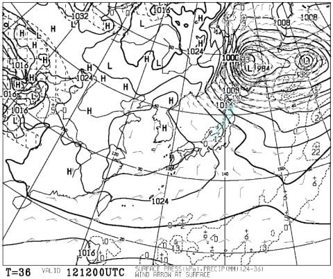
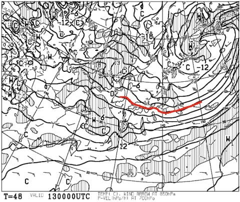
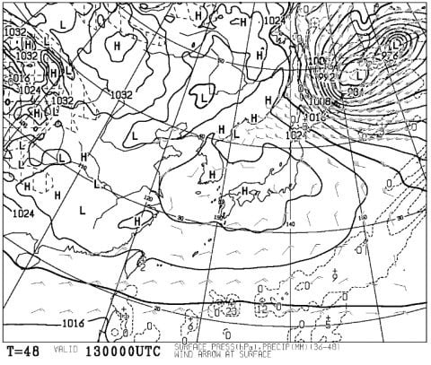
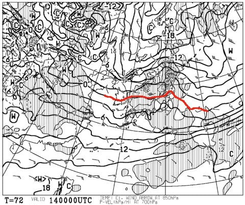
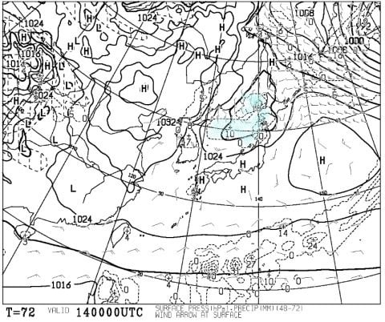
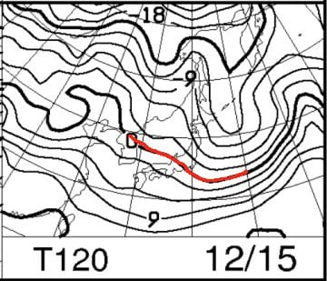
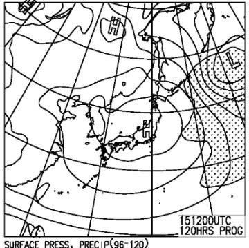
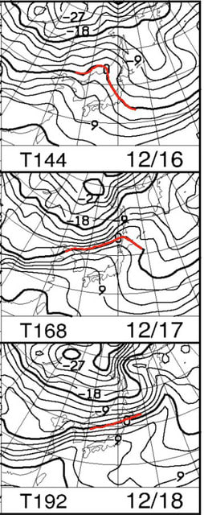

# 12月14,15日の週末の志賀高原スキー場の天気は？…曇り～晴れで積雪期待できず（涙）．でも，冷えるので人工雪積み増しできるだけマシか…

📅 投稿日時: 2019-12-12 00:21:33

🏷️ カテゴリ: [スキー天気予想](c6554f5c3c106093b511a8daae23757e8.md)

ということで．

12月に入ってからというもの．

志賀高原では天然雪がほとんど積もってない

のですが（涙）

降ってほしい雪ではなく，

液体が空から降ってくるかも…と危惧された，本日11日．

私の必死の祈りのおかげで，

気温は上がったものの，志賀高原は

雨にはならず．

雪が解けずに済みました…！！！←何度も言うけど，あなたのおかげで雨にならなかったのじゃないから

で．

これから週末にかけて，

気温はそこそこ冷えてくれるので．

人工降雪は確実に積み増し可能なため．

なんとか今週末は，焼額の第2高速リフトが

動いてくれそうです…！！

（[焼額山スキー場FB](https://www.facebook.com/yakebitaiyama/posts/2573830862712244)より）

これでやっと，第4ロマンスと第2高速，

リフト2本体制になります…

…しかし．

今週末は，12月も半分が過ぎる14，15日の

週末なので．

いくらなんでも，そろそろ人工雪だけでなく，

天然雪の積み増しが欲しいところ…

はたして，今週末までに，雪は降るのか？？

そして，週末の天気はどうなるのか…？？

…気になるこのあたりを，

いつも通り予想していきましょう．

まず．

週末の前．

12日(木）夜9時の850hpa気温図ですが．

冷えそうですね～！！

0℃線は本州太平洋岸．

志賀には，-6℃線がかかっているので．

昼間も-5℃程度しか上がらない，冷え冷えの

一日になりそうです．

…ただ．

12日(木)の地上天気図を見ると…

うーむ．

日本海側にうっすら，水色の降水域が

見えてはいますが．

西風が強いので，おそらく志賀では

ほとんど雪が積もらない感じです（涙）

冷えるのに降らない日が続く…（泣）

でも，冷え冷えで人工降雪機は

24時間フル稼働できるので．

人工降雪機，ガンバレ！！

で．

次は13日(金）の850hpa気温図ですが．

この日もかなりの冷え込みですね！

赤い0℃線は太平洋の南．

志賀高原には，この日も-6℃線が

かかっているので．

朝は-10℃近くにまで冷え込む，

いい感じの冷え冷えデーです！

…が．

地上天気図を見ると．

この日は高気圧にすっぽり覆われ，

雪が降りそうな気配は1ミクロンもありません（涙）

あぁ…

今週も，天然雪は期待できないのか…（泣）

で．

肝心な週末．

14日(土)の850hpa気温図ですが．

うーーーむ．

微妙．

微妙に，志賀高原より北にまで

0℃線が上がってます．

これは，昼間に降ると雨になりかねない

気温ですが…

この日の地上天気図を見ると，

志賀高原には降水量が予想されてないので．

雨になることは無いです．

あと，午後に向けて気温が落ちそうなので，

雪が解けるほどの気温にはならなさそうだし，

心配はなさそう…

で．

次は，15日(日)の850hpa気温図ですが．

うーむ．

まぁ，ギリギリ赤く印した0℃線は

志賀より南にありますね．

激冷えというほどではないですが，

雪が解けちゃう気温じゃないですね．

そして15日の地上天気図を見ると．

この日は完全に高気圧に覆われ，

すっきり晴れそうですね．

…いや．

晴れなくていいから，降ってほしい…（切実な願い）

ってなことで．

まとめると．

12日(木）　前日11日の高温から，

　だんだん気温が下がっていく一日．

　朝はそれほど低温じゃないけど，夜には

　-10℃近くにまで下がる．

　終日曇り～小雪がぱらつく天気なれど，

　積雪なし（涙）

13日(金)　朝は-8℃～それ以下の，冷え冷え！

　天気は終日すっきり晴れの一日！

　前日からの人工降雪の積み増しに圧雪が

　かかり，ゲレンデはいい感じの一日かも…

14日(土)　朝から気温が高めで，0℃近いかも．

　終日0℃前後の気温をキープする，ちょいと

　気温が高めの一日．

　前日からの積雪なし．

　あさイチは昨晩からの人工雪に圧雪がかかった，

　締まった圧雪バーン．

　天気は曇り～晴れ．

　完全人工雪なので，急斜面は午後に向かって

　硬くなっていき，エッジが立ててないと

　辛くなっていくか…

15日(日)　この日も朝は氷点下に落ちるものの，

　この時期としてはそれほど強い冷え込みではなく

　0℃線後を終日キープ．

　残念ながら，この日も天然雪の積み増し無し．

　天気はすっきり晴れそうなので，昼間に

　日が当たるところは暖かく感じるほど．

　あさイチは人工雪で締まったバーンだけど，

　日が当たるバーンは昼ごろには多少緩む

　かも．

　ただ，やっぱり午後になり日が傾いて

　冷えてくると，急斜面のバーンは硬く

　なっていきそう…

という感じでしょうか．

…残念ながら．

大変残念ながら．

とっても残念ながら．

この週末も，志賀高原は天然雪には

恵まれなさそうです…（涙）

うむ．

今週末は仕方がない．

来週こそ，ドカ雪を期待しようじゃない

ですか…っ！！

って．

ええええ！？？？

来週の16(月），17(火），18(水)と…

気温が上がりそうなんですが！？？

それも，17日は+6℃，

18日は+9℃線が志賀高原に

かかっているんですがっ！？？

これは，18日の志賀高原，+10℃を

超えるよ！？？もう12月下旬の志賀高原で，

+10℃は異常ですよ？？？

そして，17，18日は．

雨が降る可能性も…（恐怖）

ってなことで．

今週末より来週末の方がゲレンデ状況が厳しそう

という，恐ろしい天気図を見てしまった今．

やはり，この予想が外れるよう．

踊るしかなさそうです…っ！！

ということで．

信心深いこのBlog読者のみなさん．

もう，踊り飽きたころでしょうが，

引き続き，休まず止まらず，狂ったように，

寒いギャグを叫び続けながら，

冷え冷え降れ降れ積もれ積もれ踊りを

踊り続けましょう…っ！！←傍から見たら，完全におかしくなった人にしか見えないから，それ
