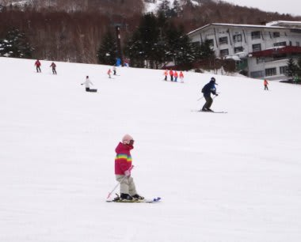
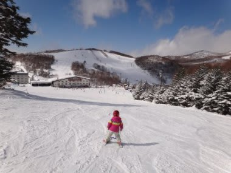

# 我が娘はスキー場で人気者なのだが

📅 投稿日時: 2012-02-15 00:52:19

えーっと．

スキー好きに育った我が娘＠4歳のことなんですけどね．

あれなんですよね．

スキー場で滑ってると．

ほら，

一の瀬スキー場とかだと，修学旅行生が多いわけですよ．

で，女子高校の修学旅行生とかが，リフト乗り場にいっぱいいたりするとね．

「なに～！あんな小っちゃい子がスキー履いてる～！」

「きゃー，かわいい！」

「ちゃんとスキー履いて立ってるよ～」

「すごい～．ちゃんと一人で滑れるのかな～？」

…とか，言われるわけなんですよ．

もう，人気者ですよ．うちの娘．

…でもね．

今シーズン滑走日数がすでに15日に達しようとしている我が娘．

生涯滑走日数が10日にも達していない皆様とは，ちょいと勝負に

ならんと思うんですよね．

リフト降り場に到着し，颯爽と一人で滑り降りていく娘…

それを見た修学旅行生たち

「…なに…あれ？ええっ？」

「…私たち，あんなちっちゃい子に負けてる…」

という感じで．

アイドルだった娘は，一瞬にして修学旅行生たちを

失意のどん底に陥れる存在と化してしまうんですね～…

…でも．

「きゃー！あの子，かわいい～！」

っていう人はたくさんいるのに．

どうしたわけだか．

「きゃー！あのお父さん，かっこいい～！」

って言ってくれる人は一人もいないんですよね…

どうしてだろう…

## 💬 コメント一覧

### 💬 コメント by (コロネ)
**タイトル**: Unknown
**投稿日**: 2012-02-15 03:20:54

お嬢さんかわいいですね！

もう志賀では有名人になりつつなるのでは？

ところで、、、

今の女子高生は結構いろいろと世の中の現実が

わかっているわけで。。。

たぶんお父さんがかっこいいとは思っている

とは思いますが、冷静にそれが、、、

ゲレンデマジック（爆）　だという事に

気がついてるのかな？　と。。。（笑）

しかし、、、

親子で、もう、、、逝ってしまっている

訳ですね。。。（大笑）

罪作りなお父さん

### 💬 コメント by (Skier_S)
**タイトル**: コロネさま
**投稿日**: 2012-02-16 03:21:48

うひゃー！

ゲレンデマジックでしたかっ…

それは想定外っ！

でも，親子でもう逝ってしまっているのは，

想定内の事実かと…（笑）．

### 💬 コメント by (KENKEN)
**タイトル**: びっくり
**投稿日**: 2012-02-18 00:28:59

娘さん本当に凄いですね。

4歳児があの滑りではスキーが初めて？の修学旅行生はショックでしょうね。

そう言う私も大学で過ごした北海道でスキーを始めた時、スキー場で道産子の子供がスイスイと自分を追い越し滑っていくのを見て情けないやら、悔しいやらでした。

今週末は西日本でもかなりの雪なので、我が家もスキー場に出かける予定です。

多分ダメだと思いますが、娘がスキーで滑ってくれるか試してみようかと。

### 💬 コメント by (Skier_S)
**タイトル**: KENKENさま
**投稿日**: 2012-02-20 01:08:33

初めてのスキーだったらしい修学旅行生たちは，

うちの娘の滑りを見てショックを受けてました…

でも，うちの娘もやっぱり雪国の地元っ子には

負けますね…

志賀高原では，ときたまうちの娘より上手い

子供を見ますよ…

今回はお子さん連れでスキーですか．

### 💬 コメント by (KENKEN)
**タイトル**: 娘初滑り
**投稿日**: 2012-02-20 22:56:13

何と今回我娘初滑りを体験しました。

私の友人と妻、娘の4名で出かけ、妻は娘とソリ遊びをしていましたが、友人と私がスキーをしているのを見て“あれ(スキー)がしたい”と。

私のスキーに乗せて一緒に滑ったところ“もっと滑る～”と楽しそう。

急遽レンタルに向かったものの、3歳児に履かせるスキーはなく、スキー場内で売っているプラスキーを買って滑ら(歩か)したところ楽しそう。

思い切ってリフトに乗せて抱っこして滑らそうとしたところ“怖い”と断念。

まあこんなもんだとは思いますが、まずは第一歩を踏み出した感じです。

しかし、娘を自分のスキーに乗せたり、抱っこして滑ってわかったことは“半端なく腿と腰に来る”ってことでした。

筋肉痛に苦しんだ翌日でした。

### 💬 コメント by (Skier_S)
**タイトル**: 初すべりおめでとうございます！
**投稿日**: 2012-02-21 02:21:58

ついに娘さん，スキーデビューですか！

ふふふ．

足腰に来るでしょ．

子供抱えて滑ると…

背負って滑った方がナンボか楽です（笑）．

でも，第一歩を踏み出しましたので，これから本格的な

スキーを履かせれば，あっという間に一人で滑るように

なっていきますよ．

子供は上手くなるの速いですよ～！

プラスキーだとまともに滑れないので，

やっぱりちゃんとしたブーツと板を

履かせた方が良いです…

と，プラスキーで時間を無駄に使った

私からのアドバイスでした．

