# 3月12，13日の志賀高原スキー場の天気は…土日とも晴れそうだけど，気温は高め．日曜は完全春の雪に

📅 投稿日時: 2022-03-10 01:52:42

本日も，いつも通り特派員から志賀高原の

写真が送られてきましたが…

うぎゃーーー！

今日も目の毒だ～っ！！

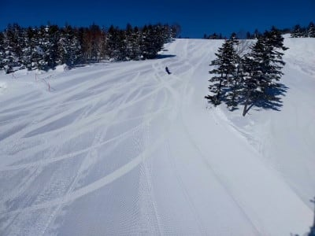

まぁ，予想通りではあるんだけど．

終日すっきりいい天気で…

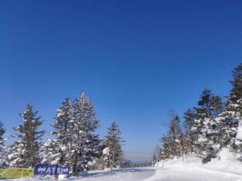

そしてあさイチは-7℃と，結構冷え込んで．

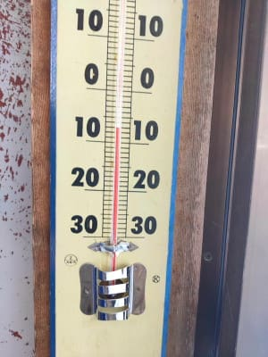

ゲレンデは締まったいい感じのシマシマバーン

だったようです…

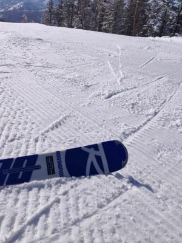

あぁ…

いいなぁ…

果たして．

このいいコンディションが続くのは

一体いつまでなのか？？

気温が上がるのはいつからなのか？

週末までの天気図を見てみるわけですが．

まずは明日木曜，10日の850hpa図を見ると…

赤い0℃線派まだ志賀の南．

志賀には-3℃線がかかっているので．

あさイチはそこそこ冷え込みそう！

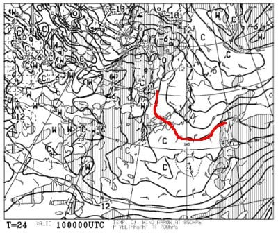

この日の地上天気図は，完全に高気圧に

覆われているので，終日晴れそうですね．

昼間は気温が微妙に0℃を越えそうなので，

日差しがあたる南東側のバーンは

昼間はちょっと雪が緩むかな…

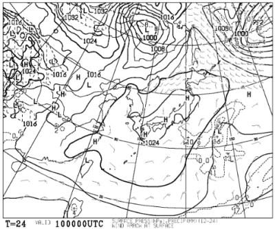

そして金曜，11日ですが．

この日の850hpa図を見ると…

うーむ．

0℃線は志賀高原より北に行っちゃってますね（涙）

この日は朝から気温が高くなりそう…（泣）

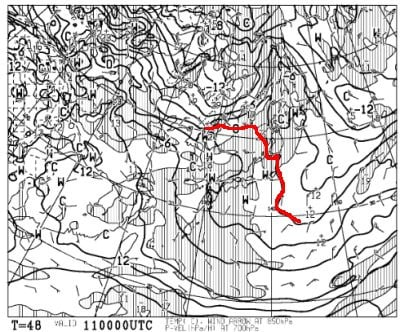

そして，地上天気図を見ると．

この日も高気圧に覆われて，志賀は

晴れそうですね…

気温が上がって晴れるので．

雪はかなり緩みそう（涙）

この日の昼間は，日差しの酔い東～南斜面の

バーンはザクザクした感じの春雪に

なります…（泣）

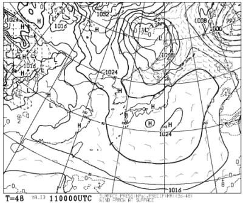

そして，肝心の土曜日の850hpa気温図ですが．

この日は朝は何とか0℃線は志賀高原に

ギリギリかかるレベル．

朝はマイナスに冷え込みますが，

午後に向かって気温が上がるので，

この日も最高気温は0℃を超えます…（涙)

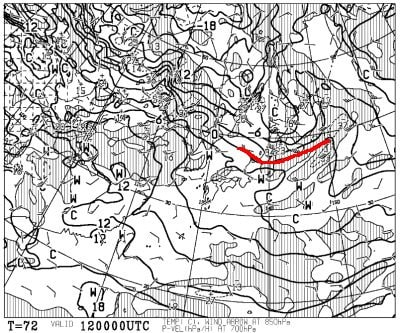

そして，この日の地上天気図は…

緩く高気圧に覆われるので

まぁ晴れそう．

…でも，気温が上がる日はすっきり晴れるより

ちょっと曇ってくれた方が雪が緩まずに

いいんだけど…

この日も日差しで雪は緩みそう（泣）

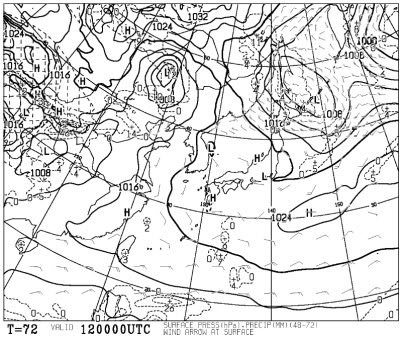

で．最後の日曜ですが．

この日の850hpa図を見ると…

がーーーん！！

やっぱり赤い0℃線は北海道まで北上し．

志賀高原には+6℃線がかかってます（激涙）

これは，昼間は+10℃くらいまで上がるという

ことか…（泣）

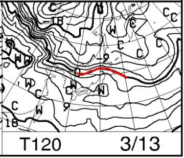

で，地上天気図を見ると．

本州はギリギリ高気圧辺縁部．

降水域の網掛けはかかってないので，

雨になる心配はなさそう．

晴れか曇りか微妙なところですが…

低気圧が志賀より北を通っていくので，

この場合は志賀高原で晴れるパターン．

おそらく晴れ，夕方にうす曇りくらいかな？

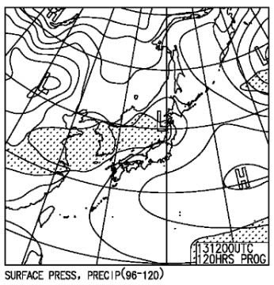

うーん．

気温が上がりそうなときは，晴れより曇りの方が

日差しで雪が融けなくていいんだけど…

とりあえず，日曜まではずっと晴れそうです．

ってなことで．

まとめると

10日(木)：朝から終日晴れ！！

　あさイチの気温は-8℃程度と

　そこそこの冷え込み！

　あさイチのバーンはかなり硬めの

　しっかりしたシマシマバーン！

　昼間は山頂で0℃，標高が低いエリアだと

　プラスまで上がり，雪が緩みそうだけど．

　ちょっと重くなる程度で，そこまで

　ひどく緩まない．

11日(金)：この日も終日晴れそう．

　あさイチの気温は-2℃程度と高め．

　昼間は+5℃以上まで上がりそう．

　あさイチバーンはカリカリした

　圧雪バーン．

　雪はすぐに緩み始め，昼間はしっとり

　重い感じの雪になっていく．

　標高が低いスキー場は雪が融けて，

　ずっしり重い雪に．

　標高が高いところは，昼ごろに

　しっとり重くなる程度で済みそう．

　

12日(土)：朝は-2℃程度．

　この日も朝から終日晴れ！

　あさイチはカリカリした硬めの

　圧雪バーン．ところどころ殺人

　コロコロも出るかも？

　昼間は最高+5℃くらいまで上がる．

　日差しの強いバーンはずっしり重い　

　雪になっていき，バーンも荒れていく

13日：朝の山頂は0℃前後．

　天気は基本的に晴れ．

　あさイチはアイスバーン気味の

　硬めのシマシマ．

　午前からグングン気温が上がり，

　雪が一気に緩む(涙)

　日差しの強いバーンは，ちょっと

　ストップ雪になるくらいかも…

　雪は4月並みの完全に重い雪に(泣)

　夕方に向けて雲が増えて

　うす曇りになっていくか…

という感じでしょうか．

明日までは比較的良さそうですが．

金曜から気温が上がり，土曜には

春の雪になっていきそうです(涙)

あぁ…

なにもちょうど週末に気温が

上がらなくても…

あと2-3日気温が高くなるのが

遅ければ，週末もいいコンディション

だったのに…

でも．

雨が降らないだけマシか…と，

自分を慰めるしかなさそう．

昨シーズンは，3月の週末の全てで

雨が降るというひどいシーズンだった

から，それに比べればマシ…

うん．それに比べればマシなはず！！

…しかし．

1-2月は平年並みで雪質は十分いいんだから，

1-2月に平年よりガンガン冷えた今シーズン．

1-2月はそこまで冷えなくて良かったから，

その冷え冷えを3月に回してほしかった…（懇願）

## 💬 コメント一覧

### 💬 コメント by (レインボー74)
**タイトル**: Unknown
**投稿日**: 2022-03-10 14:31:18

木曜日の志賀高原情報

車にはうっすらと霜が。朝の上林-2℃　蓮池-4℃。道路に雪はほとんどない。

今日も歩かなくてもいいニゴンスタートです。

白樺を快適にとばしたら、あらら、二高には某体育大学の群れが！　でもあの学校はマナーが良いので助かります。

昨日より硬めのオリンピックをちょっかったら、昨日の記録を更新しました。

元のレベルが低いからこその伸びしろです。

あとは混雑が予想されるニ高を避けて、ひたすらやけびをぐるぐる。

晴れてて空いてて滑る雪で最高なんだけど、車検のためイレブン上がりしました。

雪がだんだんと減ってきてますよ。

### 💬 コメント by (obou)
**タイトル**: Unknown
**投稿日**: 2022-03-11 01:28:31

はじめてコメントさせていただきます。

ご存知かも知れないですが、奥志賀がファーストトラックぽいのをはじめるそうですね

朝の6:30から8:00だそうです。

楽しそうですね😃

### 💬 コメント by (Skier_S)
**タイトル**: ＞レインボー74さま
**投稿日**: 2022-03-11 01:28:51

最高記録おめでとうございます．

硬い斜面はスピードが出ますが，転んだら衝撃も大きいのでお気をつけてください…

明日の朝まではコンディション良さそうです！

明日の昼から一気に雪が緩みそうです…

### 💬 コメント by (Skier_S)
**タイトル**: ＞obouさま
**投稿日**: 2022-03-11 01:49:43

コメントありがとうございます～！！

例年4月になると早朝営業を始めるのですが，今シーズンは3月26日から

第2高速リフトで早朝やるようですね！

情報ありがとうございました！

焼額は4月2日より，6:30～第1ゴンドラで早朝営業を始めます…！

