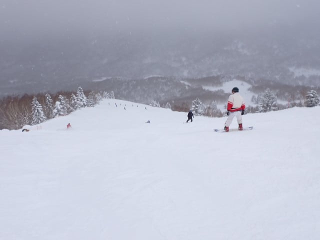

# 2025/2/10(月)，飛び石4連休の平日の志賀高原スキー場は…朝は積雪20cmで晴れ！その後降ったりやんだりだけど混んだよ…

📅 投稿日時: 2025-02-10 21:13:05

ということで．

本日は平日の月曜でしたが…

飛び石4連休の谷間の月曜日．

奇跡的に休みが取れたので，本日も

志賀高原で滑ってました～！！

いやーーー．

GWの谷間とかに休むことはあったけど…

こんなトップシーズンの平日に仕事を

休めるなんて…

実に何年ぶりの平日スキーかな…？？

と．

久しぶりの平日スキーを楽しみに志賀高原へ

向かったわけですが…

朝7時過ぎに志賀高原へ登るときには，

青空ものぞくいい天気で，除雪も行き届き

順調にスキー場まで上がれましたが…

朝も除雪車が結構除雪を続けていて，

昨晩からの積雪は20cmくらいあった感じ

でしょうか…

で．

いつも通り8:30の営業開始前に焼額の

第1ゴンドラへやってきましたが…

あれ？

平日にしては混んでる…(泣)

やっぱり飛び石4連休の谷間だから，

意外と休んでいる人が多いのかな…（涙）

朝の気温は-11℃と，金曜に予想した-12℃より

1℃高かったけど，ほぼ予想通り！

…ただ．

朝は雪降りの予想は外れ，朝から日が射す

いい天気ですよ…！！

そして…

今日は平日なので，ファーストトラックの営業が

なかったので…

通常営業の1本目は，まったく誰も滑ってない

ぴかぴかシマシマバーン！！

ぐはーーーーーー！

見よ！！

この見事なぴかぴかシマシマバーンを…っ！

ファーストトラックがないから，1本目は

ホントにスキーの跡が全くないピカピカだよ！！

雪はトップシーズンらしく柔らかめなので，

スピードは乗らないけど．

角を立てた板が楽に食い込んでいく，

自分がうまくなったんじゃないかと

思ってしまう，強烈勘違いバーンですよ！！

ううううーーーん．

シアワセ…

昨日・一昨日のパウダーもシアワセだった

けど，この晴天シマシマを滑れるシアワセ…！！

平日，かなりめちゃくちゃ無理して

休みを取ったのが，朝イチの1本だけで

報われた感じ…！！！

朝早めに圧雪がかかったバーンは，

新雪の上にうっすら新雪が乗ってて，

これはこれで楽しいし…

シマシマも思いっきり楽しめましたよ～！！

…と．

朝イチは晴れたので，今日は予想を外して

一日晴れか…？？？と思っていたら．

営業開始1時間後くらいには，やはり

雪が降り始め，視界も悪くなってきま

した…(泣）

で．

天気が悪くなってきただけじゃなく，

だんだん人も増えてきて…

10時前には第1ゴンドラの列がゲート外まで

伸びたかと思ったら…

10時過ぎに列は最長になって，このくらいの

長さになっちゃいました（激泣）

第2高速リフトは最大10分待ち，

第3高速リフトもこの写真で最大

5分待ちくらいまで列が伸び…

えええ？？今日は平日ですよね？？

せっかくの数年ぶりの平日スキー，

ガラガラだと信じていたのに…

昨日の日曜より人が多いんですけど！？？

そして，ゲレンデも結構人が多く…

せっかく平日に無理して休みを取って，

ガラガラ平日スキーを楽しもうと思って

いたのに．

飛び石連休の谷間とはいえ，まさか

平日にここまでゲレンデが混むとは…

今日は終日，ゲレンデの人口密度は

こんな感じで，夢にまで見た

平日ガラガラゲレンデを堪能することは

かなわず．

…これだったら，1月の土日のほうが

すいてたかも…？？

ただ，ゴンドラやリフトがひどく待ったのは

午前中だけで．

11時過ぎには第2高速もこの程度の待ちで…

第1ゴンドラも11時からは一気に待ちが

短くなり，昼にはこの程度．

午後はまたゲートをちょっと超えるくらいまで

混んだタイミングもあったけど，

相乗りレーンなら搬器数台待ちか待ちなしで

乗れるレベルでした～！！

ちなみに，この日の天気は終日，曇ったり

雪が降ったり日が射したりが目まぐるしく

入れ替わる天気で…

ガスって雪が降ったなと思ったら．

その数分後には日が射すという，

落ち着かない天気でしたが．

気温は寒く，雪質はずっと良かった

ですよ～！

ちなみにこの写真はオリンピックコース．

朝イチの積雪は15～20cmくらい．

午後はそれが蹴散らされた凸凹バーン

でした…

で．

昨日・一昨日は豪雪でずっとクローズだった，

条件付きオープンコースのヤケビコースト・

バレー・ウォールの3コースが，今日は

すべてオープンしてました～！！

一応，昨日までの積雪で，端っこの一部に

膝パフくらいに新雪は残ってたけど…

ただ．

どのコースも，あっという間に踏み荒らされ，

私が入った昼頃にはもう単なるコブ斜面と

化してました(泣)

ってなことで．

昨日まで，かなり恵まれた新雪バーンを

いっぱい滑っていたので．

今日は整地バーンを滑るのだ！！

と，ひたすら通常の圧雪コースを滑り

続けますが…

ゴンドラ待ちは減ったものの，午後に

なってもコース上の人口密度は比較的

高め（泣）

ただ，バーンの雪が柔らかめで，人も

多かった割には，午後になってもバーンは

そこまでひどく荒れることなく，

急斜面の一部でちょっと凸凹になった

くらいで，終日大回り板で滑れるレベル

だったのは良かったかな…！！

ってなことで．

今日もいつも通り，営業終了まで

滑り倒した…

といいたいところですが．

今日は無理して休みを取ったため，

一部仕事が整理しきれずに残ってしまい…

午後3時には切り上げて．

リフトがまだ動いてるのに…と泣きながら，

Web会議に参加していたのでした…

うーん．

ホントにゆっくり平日休めるようになりたい…

そして．

ヘタな土日より混んでる，こんな飛び石連休の

谷間じゃなく，普通のガラガラ平日スキーを

楽しめるようになりたい…

## 💬 コメント一覧

### 💬 コメント by (いか)
**タイトル**: Unknown
**投稿日**: 2025-02-10 22:05:42

ご無沙汰です…

今日はホーム八方の2日キャリーオーバーの上部新雪大戦争に参加していましたが、序盤はスカイラインしか動かなかったので、スカイラインは20分待ちでした。いちばん美味しいところを3本滑って、今日は午前休だったために、昼一番からリモートワークに勤しんでおりました…w 滑った3本は、新雪の熟成もあって、大雪の今期の中でも記憶に残るいい1本1本でした！

場内、積雪が多すぎでリフトにスキーヤーが当たりかねないところが多く、アルペンクワッドはじめ最上部は明日も終日運休のようで…、降りすぎもなかなかに大変なようです。またお伺いします！

### 💬 コメント by (地元民)
**タイトル**: Unknown
**投稿日**: 2025-02-11 00:11:59

2月下旬の天気図。山雪型が続き、めちゃくちゃ降りそうな予感がするんですが、長野地方気象台より的中率が高い、御大の予報は？

生活上、必至情報なので、早めにおねしゃす。

### 💬 コメント by (Skier_S)
**タイトル**: Unknown
**投稿日**: 2025-02-11 08:16:58

〉地元民さま

こちらのコメントに急ぎ回答…

そうです。昨日、天気図が変わり、火曜は朝から雪になりそう…

朝までの積雪は10-20cm、昼までには弱まり、午後は降ってもチラチラ雪降り、晴れ間も見えるかも…

と読んでました。

ブログに書くの忘れてた〜！

### 💬 コメント by (地元民)
**タイトル**: Unknown
**投稿日**: 2025-02-11 20:00:55

2月下旬〜末に予想されている寒波。再来週？

等圧線、完全な縦型で寒気の中心も北海道方面から来襲。まだわかりませんが、輪島沖でマイナス40℃近い寒気が来る気が・・・。

これ、中野市街地でも下手すりゃト━タルで70㌢。志賀高原は200㌢くらい降りそうな気がするんですが・・・。

### 💬 コメント by (Skier_S)
**タイトル**: ＞地元民さま
**投稿日**: 2025-02-12 03:17:33

17日以降は，かなり冷えそうですね～…

どのくらいの積雪になるかは，まだ正確に読めませんが，気温を見ると，この1週間の積雪に負けないくらい積もるかも…と考えておいた方が

良さそうな感じです．

### 💬 コメント by (ねも)
**タイトル**: Unknown
**投稿日**: 2025-02-12 07:19:17

Ｓさん　お互い楽しい(違います？、笑)４連休でした(^^;)

私たちはこの日、八方尾根にいました。お客さんは、週末と平日の中間くらいかな。志賀高原がそんなに混んでいたとは(ﾟ-ﾟ)

いかさんが仰るように、稀にみる豪雪ですね。道路の両側に、３ｍの雪の壁なんて、いつ以来か思い出せない😅

スキー場も除雪など、雪が多すぎて大変なようでした。

### 💬 コメント by (Skier_S)
**タイトル**: Unknown
**投稿日**: 2025-02-13 00:57:04

＞いかさま

こちら回答遅くなりました！すみません．

八方はかなり積もったんでしょうね…

しかしリフト20分待ち！！

そして，降りすぎでリフト運休…

今シーズンはちょっと極端に降りますね…

また志賀にもお越しください！

＞ねもさま

八方行ってらしたんですね．

八方の方が混んでそうですが，そんなに混んでなかったんですか…

志賀も雪が多めですね~．

このまま春まで雪がしっかり残ってくれると嬉しいんですが…

