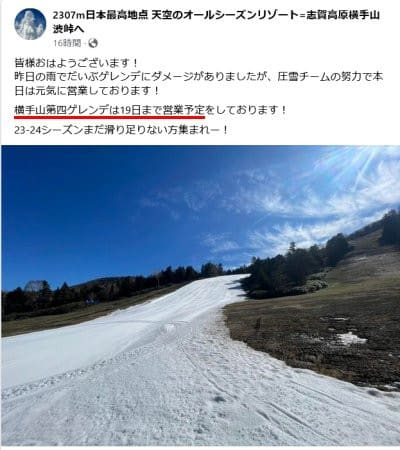
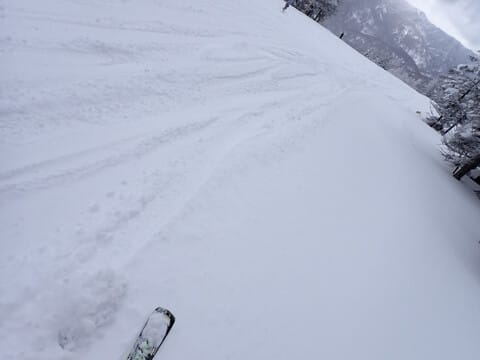
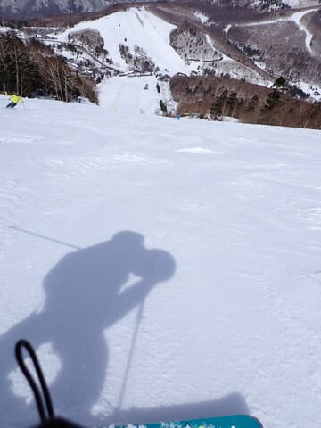
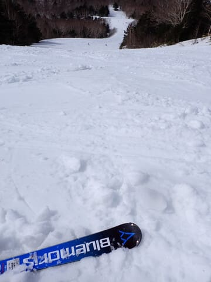

# そろそろ2025シーズンモデルのスキー板の詳細試乗レポート始めます…そして志賀の横手山スキー場は19日(日)まで営業予定

📅 投稿日時: 2024-05-15 01:49:59

えー．

雪がある限り営業する…

というアナウンスをしていた横手山ですが．

どうやら最後に残った海和ゲレンデも，

今週末，5月19日の日曜までの営業予定

ということになったようです…

([横手山スキー場Facebook](https://www.facebook.com/yokoteyama2307/posts/pfbid02fYT3SsaMPnSx3jvtA2Zjy7onLvq5T7X49QSxEHGkPRPE8hesrcVaWg99YJVxkHzhl)より）

やはり月曜の雨で結構ダメージがあったようで．

今週いっぱいが限度か…

まぁ，これから週末までは雨は

降らなさそうだし．

週末まではぎりぎりもってくれるかな～．

あと，残るは月山か…

ってなことで．

そろそろシーズンも終わりに近づいて

来たので，来シーズンのスキー板が

気になってくる人が多いんじゃない

でしょうか．

多いと思います．

多いはずです…（決めつけ）

ということで．

すでに一部の板は，今シーズンの試乗会に

行こうと思っている人に間に合うよう，

GW前までに速報の簡単な試乗レポートを

お送りしていましたが．

そろそろ，いつもの詳細試乗レポートを

連載していこうと思います…！！

今シーズンも，エキップさんの試乗会と

アルペンさんの試乗会の二つの試乗会に

参加しましたが…

両方合わせて35機種．

まぁ，いつもと同じくらいの数の

板を試してきました…

エキップさんの試乗会は3月上旬開催で，

冷え冷えで新雪がそこそこ積もった

2月のトップシーズン並みのいいコンディション．

そして，アルペンさんの試乗会は

4月上旬開催で，朝は硬かったものの．

昼になるとGW並みのザブザブ雪の

コンディションでの試乗でした…

ちなみに，どちらの試乗もブーツは

HEAD Raptor WCR3のフレックス150という，

昨シーズンまでのフレックス140よりさらに

強いブーツで試乗に臨んでいるので．

結構しっかりした強めの板の

評価が高くなっている傾向があるかな～…．

とりあえず，いつもの注意書きを改めて

書いておくと．

このレポートを書いているのは，

指導員もテククラも持ってなければ，

レースをやっていたわけでも無い，

どシロートのレジャースキーヤーです．←ここは繰り返し強く主張しておくところ

レジャースキーヤーが

自分の好き嫌いを言っているだけ

なので，

私がいいと思った板でも，

「なぜこれを誉める？」

と思う方もいっぱいいると思いますし．

逆に，私と合わなかった板でも，

「なぜこの良さが分からない…？」

という方もいっぱいいると思います．

あくまで，いちレジャースキーヤーが，

自分の好き嫌いを述べているだけですので，

そのあたりを心に留めて読んでもらえると

ありがたいです…

そして，今回試乗した板も基礎系の

小回りベースの板が多いです．

だいたいいつも試乗している板を

また今シーズンも履いてみている

感じなので，

「いつもと変わんない，おんなじ板

ばっかり履いてるなぁ…」

と思われてしまうかも…

それでも，去年履いたのとコスメチェンジ

しかしてないような板でも，昨年と

今年で印象が変わったりしているので．

雪面状況で，同じ板で全く違う評価を

してしまっていることに，

自分の試乗インプレッションなんて

あんまりあてにならない

と自分自身でも思っているくらいなので．

そもそもいつも書いてるけど．

プライズも指導員資格も持っていない，

こんなド素人のレポートなんて，

役に立たないと思うんだけどなぁ…

と，思いながらも．

とりあえず．

そんな中でも参考になってくれれば…

という思いを込めて．

2024シーズンスキー板の試乗レポート，

次回から連載開始です！

## 💬 コメント一覧

### 💬 コメント by (aki)
**タイトル**: Unknown
**投稿日**: 2024-05-15 23:20:11

すごく楽しみにしています。

### 💬 コメント by (Skier_S)
**タイトル**: ＞akiさま
**投稿日**: 2024-05-16 02:05:28

楽しみにしていてくれる方がいてうれしいです…

