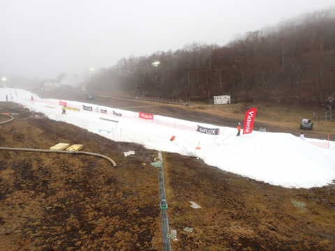
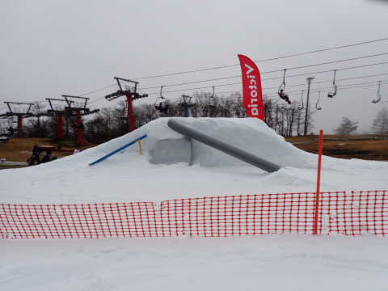
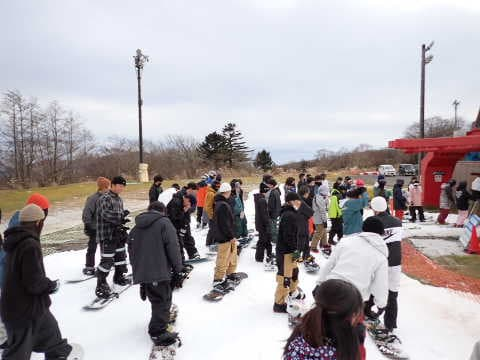

# 2022/11/26(土)のイエティのゲレンデ状況速報レポート＆動画…朝はすごい雨．

📅 投稿日時: 2022-11-27 02:32:06

🏷️ カテゴリ: [2023スキー滑走日記](cd943df30cfcc3d0896469e2ff98720cd.md)

ってなことで．

行ってきましたよ，雨の中，

今日もYetiへ…

普通のシーズンなら，12月末はYeti以外の

スキー場に行っているのですが．

今シーズンは，首都圏からのアクセスエリアは

まだ横手と軽井沢くらいしか空いておらず，

他は軒並みオープン延期という悲しい状態（涙)

多分，横手と軽井沢は激混み必至

だし．

Yetiも晴れると混みそう…

ってなことで．

天気が悪そうな本日，

Yetiへ行ってきました～！！

…だって．

[前回の23日，雨のガラガラYetiで味を占めて](e3248d3dfa028caeb04c082bc1fda220d.md)．

Yetiは天気が悪い方が混まなくていい

と思えるようになっちゃったんだもん…

ちなみに．

本日の横手山は，リフト最大30～40分待ち

というすさまじい状況だったらしく…

それと比べると，Yetiは午前中は

リフト待ちほぼ無し，

午後は最大5分程度（ペアは待ち0）

だったので．

今日は雨のYetiに行くのが正解だったよな

と思っている，Skier_Sだったのでした…

ってなことで．

本日のYetiの速報レポートです～！

まず．

朝9時前にYeti駐車場に着くと，どしゃ降り（涙）．

あまりのザーザーぶりに，車の外で

着替えたりブーツを履いたりするのも

困難な状況だったので，

雨が弱まるのを待つと…

9時20分ごろ，雨が弱まったので

滑走スタート！

…今日は，コース横にミニパークが

できてますね…

こんな感じのアイテムやレールやら

BOXやらが置かれてました．

あさイチのバーンは適度に締まっていて

それでいて雨のおかげで滑走性は高く．

雨でガラガラなので…

気持いいフラットバーンを大回り可能！（緩いけど）

いや，23日よりも幅も広がったし，

今日が今シーズン最高のコンディション

かも？？（緩いけど）

9時半ごろに，雨は弱くなったものの．

10時ごろまだパラパラと降っていたので…

10時過ぎまでは，コースは好きなラインが

取れる，理想的な状況！！

あぁ…これを知ってしまうと．

晴れの激混みYetiには来れなくなってしまう！！

リフト待ちは10時半ごろまではほとんど

なかったのですが…

11時ごろには雨も上がって，

午後は富士山も見え始めたくらいに

天気が回復し始めたので．

昼過ぎには，コース上の人口密度が

増えてきちゃいました…（涙）

雨が降ってる間はガラガラの飛ばしたい

放題天国だったのに．

天気，回復してほしくなかった…←危険な発想

昼過ぎにはリフト待ちも5分程度に伸びて，

午後にはペアリフトも運行しはじめて．

コース上の人口密度とリフト待ちは，

午後にはいつもの土日と変わらない

くらいの感じになっちゃいました（泣）

あぁ…雨，やまなくて良かったのに…

とりあえず．明日の日曜は晴れだから，

もっと混むんだろうなぁ…

まぁ，空いてたのは午前中だけだったとはいえ，

午前はホントにバーン＆混雑状況は

最高に良かったので．

とりあえず，今日はYetiに行った価値は十分

あったかな．

いつも通り，午後2時頃のコース状況動画です！

この時間になると，コース上の混雑は結構なレベルで，

いつもの土日よりちょっとだけマシかな…

という感じです．

また明日，詳細レポートやります～！

## 💬 コメント一覧

### 💬 コメント by (カンタロス)
**タイトル**: Unknown
**投稿日**: 2022-11-27 08:33:33

Sさま、こんにちは。

私は平日休みが多いので、スキーは基本平日です。

平日の高速道路の渋滞の無さ、スキー場のガラガラをあじわうと、土日スキーヤーに戻れません（笑）

リフトが間引き運転してたりしたりしますが、快適大回りバーンの快楽を考えると、問題無しです。

雨が降ったほうがいい、という危険な発想ができる領域にはまだまだ辿り着けそうにありません（笑）

### 💬 コメント by (Skier_S)
**タイトル**: ＞カンタロスさま
**投稿日**: 2022-11-27 23:15:50

平日にスキーができるのは正直うらやましいです…

コロナで平日はクローズのコースやリフトがありますが，それでもがら空きゲレンデで滑れるのはうらやましい！！

土日の激混みばかり滑っていると，「雨が降らないかな～」という危険な発想になっていきますよ…

