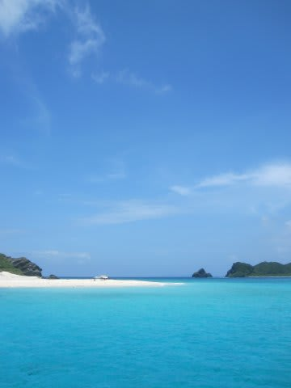
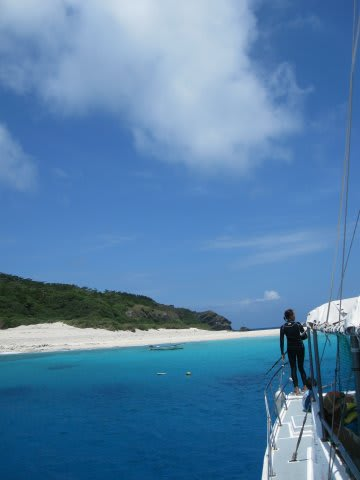

# 子連れで座間味に行ってみた　プロローグ

📅 投稿日時: 2011-08-07 00:33:53

🏷️ カテゴリ: [ダイビング日記](ce3a7a8d424d112fce83ee85c81a0e344.md)

ある日．カレンダーを眺めていて．

7月，海の日が絡んだ休みがあるなぁ．

娘の幼稚園も夏休みに入るなあ．

飛行機のマイレージも，二人で国内線に乗れるほどに

溜まってきてるなぁ…

…

1日くらい，有給休暇くっつければ．

…沖縄に．行けるなぁ…

有給休暇が取れれば…

と，思ったあと．

どうやら数秒間，意識を失っていたようですが．

…気がつくと．

なぜか有給休暇の申請を提出し，マイレージ特典航空券を予約していた

後でした．

なんか，上司に多少嫌味を言われたような気もするんですが．

多分，気のせいだったんでしょう…

で，休みとエアは（強引に）確保した．

問題は，沖縄のどこに行くか，だ．

子連れでダイビングにいく場合．

夫婦のどちらかが残って，交互に子供の面倒を見なくてはいけないので，

・宿とダイビングボートに乗る港がすぐそばで

・1本毎にダイビングボートが港に戻ってくる

という条件が必須になります．

朝にダイビングボートが出航したら，一日ずーーっと戻ってこないようなパターンだと，夫婦どっちかが留守番で，丸一日子供の面倒を見ることになり，ツライ．

せっかくの休日なのに．夫婦が一日中ばらばらで過ごすのは，夫婦不和の原因になりそうなので，回避したいところです．

で．

今回も，その制約のもと，どこに行くかを探していたんですが．

つらつらと探していると，

「子供づれでダイビングボートに乗船OK！」

とホームページに書かれているショップが！

なになに…

親がダイビング中は，スタッフの人が子供を預かって，

海で泳がせたり，子供を遊ばせてくれるって？？？

…どこだ？そんなステキなショップがあるのは？？？

…

座間味，か…

うーん．

那覇から高速船で1時間ほどの離島，慶良間諸島の座間味島．

海はきれいで，宿も安く，すごくいいところです．

いいところだけど．

ここ，去年行ったんだよな～

今度は違う場所に行きたいんだけどなぁ…

しかし．

やはり，港が宿のすぐそばで，1本ごとに港に帰ってこれるパターンで．

かつ，海がすごくきれいで，

宿代がすごく安いところ…

って調べると．

やっぱり，座間味島か，座間味の隣の阿嘉島くらいしか無いなぁ…

なら．

どうせ座間味に行くのなら．

夫婦交代でしか潜れず，昼間は家族が一緒に行動できないより．

家族3人で揃ってダイビングボートに乗って，一日過ごすほうが

いいじゃないか．

…子連れで船に乗せてくれるって言う，そのショップに頼んでみよう…

ということで．

宿は，激安の民宿を探し，

子供をダイビングボートに乗せてくれるという，そのダイビングショップを

予約して．

今回の座間味ツアーと相成ったのでした．

