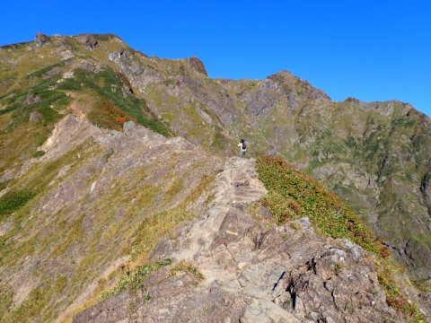
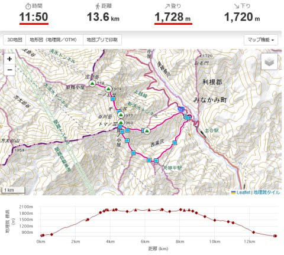
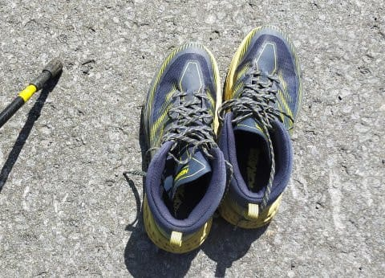
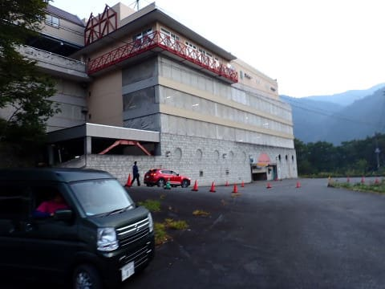
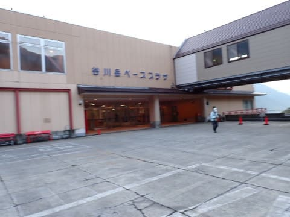

# 2022年10月，谷川岳→茂倉岳に登ってみた…その1

📅 投稿日時: 2023-08-22 09:20:14

🏷️ カテゴリ: [登山・旅行](c1d637a11a25b457ac978d197adbdafc5.md)

えー．

座間味のダイビング旅行から帰ってきた

わけですが．

とりあえず，今回学んだのは．

肋骨にヒビが入っていてもダイビングはできた

ということでした～！

受傷から1週間．

まだ咳をしたり，腹筋や背筋に強い力が

入ったりすると「いてて…」という程度の

痛みはあるものの．

受傷直後の，「痛てー！」と叫ぶほどの

痛みではなく，だんだん痛みは弱まって

きてますし．

普段の動きではほとんど痛みがなくなって

来てるので…

潜っている最中は意外と痛くないんですよね…

エグジット時に船に上がるときとかに

身体をひねったりして，

「あいたた…」

となる程度と．

あと，耳抜きをしようとしてなかなか

抜けず，腹筋に力が入るとちょいと

痛かったくらいですか…

でも．

何が起こるかわからないので．

良い子は骨折してのダイビングは止めましょう←全く説得力がない…

ってなことで．

ダイビング旅行から帰ってきたばかりですが，

まだ写真の整理ができていないので…

今回は，昨年度登ったけどまだ報告を

書いてなかった，昨年10月の山歩き

レポートです～！

…で．

登ってきたのは，かねてから登りたいと

思っていた，谷川岳．

昔，11月に谷川岳天神平スキー場が

オープンしていたころに，よく行って

いたのもあるし．

いろんなスキー場から見える山でもあるので…

一度登ってみたいと思ってたんですよね．

ってなことで．

まずは登山のプランを立てるわけですが…

当然，私の立てるプランなので．

ロープウェーなどという軟弱なものは

使わないわけですね．

ロープウェーは3000円もかかるし．

さらに週末のロープウェーは混みそう…

混雑が嫌な私は，ロープウェーが動く前に

人が少ない山頂に立ちたいというのもあり，

ロープウェーを使わない西黒尾根直登コース一択．

そして，谷川岳から茂倉までピストンして…

谷川岳からの下山は登りとルートを変えて，

天神尾根→ロープウェー真下の田尻尾根

というルート．

ふーん．

ヤマレコでの標準コースタイムは11時間50分．

標高差は1728mですか…

まぁまぁのコースですね．

さて．

日本3大急登と呼ばれる西黒尾根．

果たしてどんなものか？

気にはなるけど．

まぁ，ロープウェー乗り場の駐車場から谷川岳までは，

せいぜい標高差1300m．

果たして．

私が西黒尾根にチャレンジすると，

山頂までどれくらいで着けるのか？？

と．

私が絶大の信頼を寄せているHOKA ONE ONEの

Speedgoat MID GTXを履いて．

朝6時ちょうどに，谷川岳ロープウェー

乗り場の駐車場，谷川岳ベースプラザを

出発！

朝日が差しこむ山々に向かい

歩き始めたのでした…

（[続く](eaa003dd801f3ed295e799bf477ea3afa.md)）
