# 月山に遊びに行くついでに…

📅 投稿日時: 2012-06-21 01:22:52

🏷️ カテゴリ: [登山・旅行](c1d637a11a25b457ac978d197adbdafc5.md)

6月の月山．

それは．

朝から夕方まで終日滑るにはちょいとつらい感じなので．

スキーだけじゃないエンターテイメントを求めるわけですね．

まぁ，あれですね．

午前中は基本的にスキーですが．

滑っている合間に．

娘をリフトに乗せて…

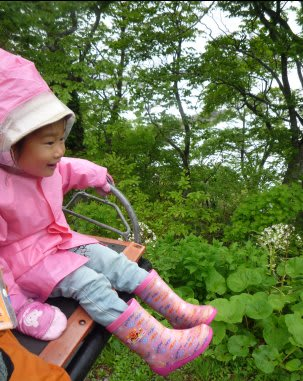

山の上に連れて行ったりしつつ．

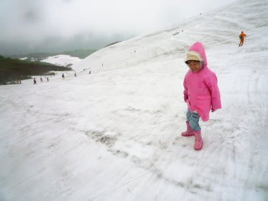

スキーを楽しむわけで．

んで．

まー状況が状況ですから．

午前中いっぱい滑ったくらいには「もういいかな」って感じになるので．

昼過ぎくらいに下山してですね．

下山したら，ふもとにある月山湖にて．

かつては世界一だった噴水を見て…

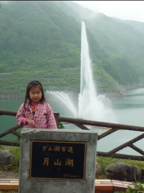

それから，[出羽屋](http://www.dewaya.com/index.html)でおいしい山菜そばを食してですね～

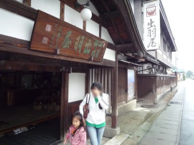

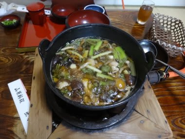

そして…．

そして．

6月の山形といえば．

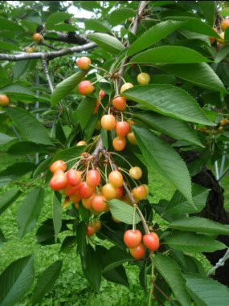

やっぱこれですね．

そーです．

さくらんぼ狩り！

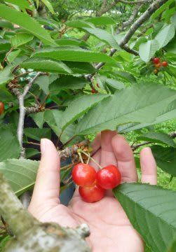

さくらんぼのシーズンですから，

寒河江で，適当なさくらんぼ農園に立ち寄って

さくらんぼ狩りしてみましょう．

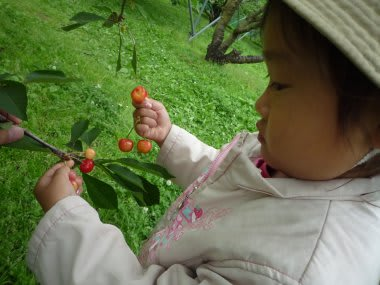

ちょいとお高いですが，安いところを探せば大人1000円～1100円

くらい．幼児は500円くらい．

あー．

さくらんぼ農園は，さくらんぼが雨にぬれないよう

屋根がついているので，雨の日でも心配要りませんよ～．

摘んでは食べ，摘んでは食べ…

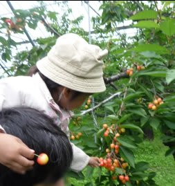

「おいし～」

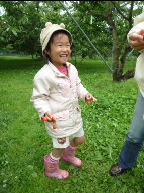

娘も大喜び．

このさくらんぼ農園，いろんな種類のさくらんぼが

あったんですけど．

やっぱり佐藤錦が一番おいしかったですね～

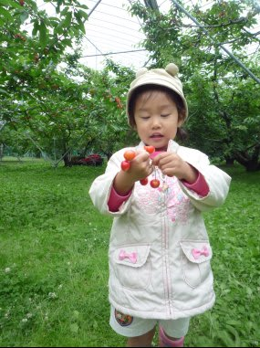

そして，温泉に寄って．

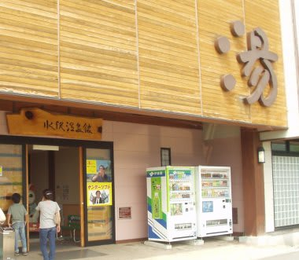

山形の地酒を飲みつつおいしい料理を食べ…

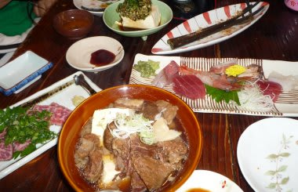

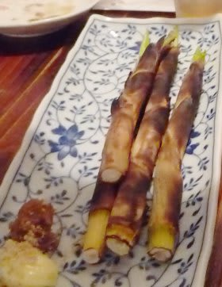

山形市内のビジネスホテルにでも泊まってみる，と．

って感じで．

6月の山形は，月山がなくても十分楽しめるのに．

スキーした上で，これだけ楽しめるんですね～．

…まだ2週間くらいは滑れますよ…．

（悪魔の誘い)
