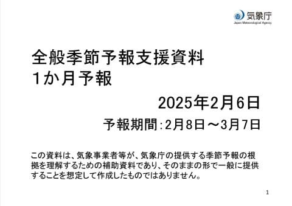
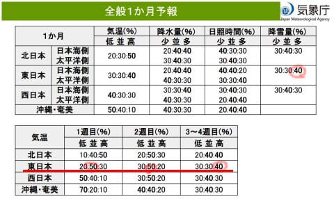
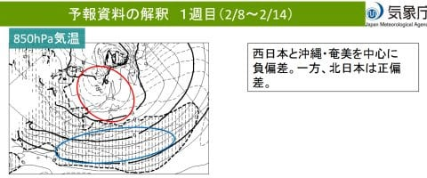
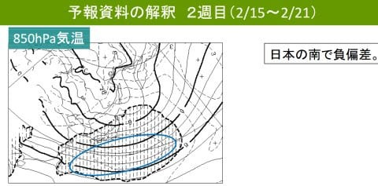
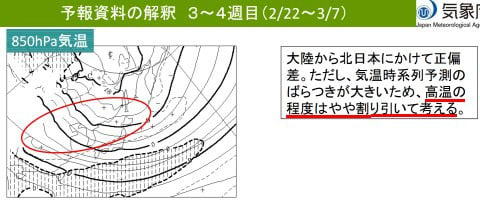
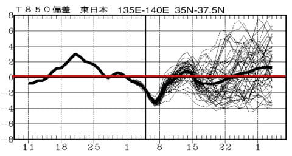
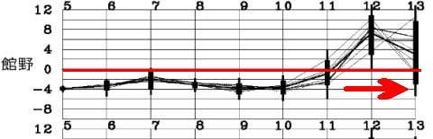
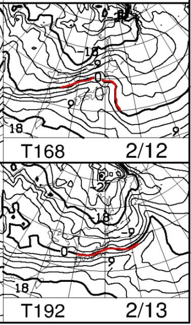
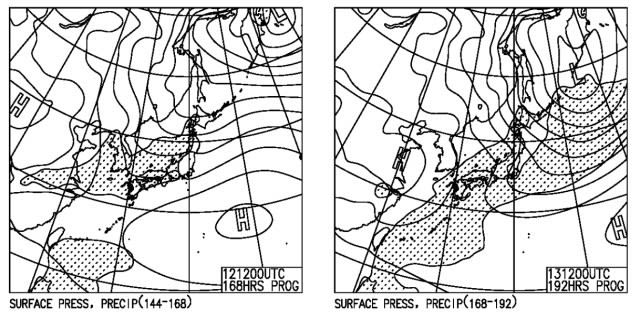

# 木曜定例の気象庁1か月予報が出たよ！…これから1か月のスキー場は大体平年並み．でも，来週12~13日はちょっとヤバい感じ

📅 投稿日時: 2025-02-07 02:54:33

🏷️ カテゴリ: [日記](cc4b5682fb7b8b144980957a978653fb0.md)

ここしばらく，自分のベスト体重を

数kg下回る体重が続いていて．

スキーを滑る筋肉が減らないように

気を付けないと…と思っていたところ，

1月に入って，体重が1kgくらい増えて

くれて．

やった…！これは筋肉が増えてくれた！！

…と喜んでいたら．

体脂肪率が12％強と，1％ほど

上がってました(泣)．

筋肉じゃなく脂肪が増えたのか(泣)

これだけスキーやっても，簡単には

筋肉が増えないんだなぁ…

疲れることなくひたすらスキーを滑り続け

られるように，筋肉を増やしたいんだけどな…

ってな前フリの後は，本題へ．

今日木曜日は，皆さんご存じの気象庁1か月予報の

発表日．

ってなことで，いつも通り1か月予報を見て

みましょう…！

まずは，全般予報を見てみると…

うーん．

1週目，2週目ともにほぼ平年並み．

3から4週目はわずかに平年より高め…

って感じでしょうか．

降雪量は平年より多そうなので．

まぁ，だいたい平年並みになりそうな

1か月って感じでしょうか…

中身の詳細を見ても，特にびっくりする

何かはなく．

850hPa気温を見ても，第1週は志賀高原

付近が平年以下の網掛け部分と

平年より高い白抜き部分のちょうど境目で，

だいたい平年並みになりそうだし…

第2週は，平年以下の網掛け部分の境目より

ちょい内側に入っているので，

平年よりわずかに冷えるか…という程度．

3-4週目は，本州がまるっと網掛けがかかってない

平年より気温が高い領域に入っていて．

だいたい平年より+1℃高いことを示す点線が，

志賀高原にかかっているので…

平年より高くなるかな？

と思うところですが．

ここは気象庁の職人が，「高温の程度は

割り引いて考える」と，このコンピュータ

予想に補正をかけているので．

まぁ，だいたい平年並みでしょうか…

ってな感じなので．

1か月の850hPaの気温推移を見ても，

10日ごろまでは平年より冷えるけど，

あとは15-22日にわずかに平年より低く，

その後はわずかに平年より高い…

という感じで．

だいたい平年並み前後をうろつきそう

な感じです．

ただ…

これから1週間の予想を見ると．

んんんんん！！？？？

12，13日に，めちゃくちゃ気温が

上がりそうなんですけど…！！！！

平年比+6~8℃くらいにいっちゃいそうに

見えるんですが…？？？

12，13日の850hPa気温図を見てみるとてん

うぎゃーーーーーー！！！！

12日，赤く示した0℃線が東北の

北の方まで上がってますよ！！？？

志賀付近は，+3℃線がかかるレベルに

なってて…

これ，降れば個体じゃなく液体

なんですが！？？

この日の地上天気図を見ると…

12日は志賀高原はぎりぎり降水域が

かかってないけど．

13日は網掛けの降水域がかかっていて，

なんだか降りそう…

これ，このままの天気図なら，

12日夜から13日朝にかけて，

志賀高原でも空から液体が降ってくる

危機…！！！

志賀高原の2月に雨は止めてほしい…(泣)

…ただ．

まだ，12，13日の予想ばらつきは大きいので．

運が良ければ，液体は降らず固体になる

可能性もあります…！！！

うーん．

この時期に液体が降るとアイスバーンに

なっちゃうので…

液体は降らないでいてほしいな…

まぁ，13日にちょっと液体になっても，

その後また冷えて結構雪が降ってくれそう

なので，すぐバーンコンディションは回復

すると思うけど．

下地がアイスバーンになっちゃうといろいろ

辛いので，やっぱり液体は降らないで

ほしいところ…

とりあえず．

今週末から11日(火・祝）にかけては雪が

降り続け，12日は晴れて気温が上がり，

夜から何か降ってきそうな感じです…

降ってくるのが液体か固体かは，皆さんの

日頃の行いにかかっていますので．

これからしばらく，鬼のように行いを良くして

過ごしてください…←鬼って行いが良いんだっけ？？
