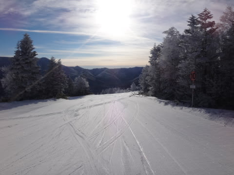
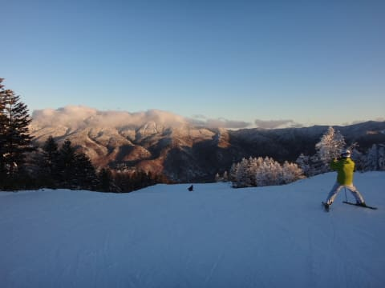

# 12月25日（日），3連休最終日の志賀高原は…冷えた晴天！恵まれたコンディションだったよ！

📅 投稿日時: 2016-12-26 02:47:42

🏷️ カテゴリ: [2017スキー滑走日記](c7d777cecfc91bdf0fa464ad62c6d49ab.md)

えー．

本日も，帰宅が遅く．

その後，スキー板の手入れだなんだを

やっていたら，こんな時間…（涙）．

だもんで．

今日は速報モードにしたいところだけど．

でも，詳細モードで行くのだ！

ということで．

[先週の予想](e8dcb91171034bf8254da2d332d5dc74f.md)で

　朝から晴れ！

　放射冷却で冷えた朝．ゲレンデはしっかり圧雪．

　終日晴れて，気温もそれほど上がらずゲレンデは

　比較的いいコンディション．

…と，予想した．

ベストな日になるはずの今日．

果たして，ゲレンデ状況は…

…

…

ふはははは！！

最高でしたっ！！！！

予想通り，朝の気温は放射冷却で-8度と，

結構冷え込み．

そして．

朝イチのゲレンデは…

誰も滑ってない，最高シマシマッ！！！

それも予想通りの，最高冷え冷え雪が

しっかり圧雪された，

極上プレミアムシマシマバーン！

いや．

もう．

笑うしかない最高バーン！

間違いなく，今シーズンのベスト！

がっつりエッジが食い込む，どこまでも傾ける，

最高フラットバーンを．

人が増えてくるまでの1時間ほど，思う存分

堪能できました～！！

9時半ごろには，ゲレンデの人がちょっと増えてきて．

残念ながら，超快適かっ飛ばしバーンでは

無くなってきたけど．

でも．

晴天の3連休と考えると．

こんなに待ち時間少なくていいの？

というゴンドラ待ち時間だったし．

…第1ゴンドラ，今日は最高でも搬器3-4台しか

待ってない気がする…

第1ゴンドラ側，GSコースは．

ゲレンデの人が多いって言っても，こんな程度だし．

昼近くになっても，雪質は結構良くて．

それで，こんな晴天で滑れるなんて…

いや，今日はかなり恵まれてるなっ！！！

第2ゴンドラ側，パノラマ-サウスコースも．

3連休と考えると人は少な目で…

雪質も良くて，Good！

旧第1高速沿い，白樺コースもフラットで滑り良かったし．

コース脇には，まだプチ新雪が残ってたりして…

それなのに．

第2高速リフトも，今日はガラガラ！

いいの？

こんな天気で，こんな雪も良くて．

リフトもゴンドラも待たないなんて…

12月の雪がいい時は．コースコンディションが

トップシーズン並みなのに，人が少なくて

ベストかもしれないなぁ…

あ，そうそう．

今日は運転の予定がなかった第3高速も．

なぜか予告なしに動いてましたね…

そして．

晴天が一日中続いたのに．

気温が結構低めだったので．

午後になっても雪はいいまま！

ただ，今日は珍しく．

午後になっても，午前中と変わらないくらい

人がいて…

だもんで，午後のゲレンデ．

大勢のスキーヤーに雪が蹴散らされて．

結構凸凹に荒れてきちゃいました…（涙）．

こうなると，ちょっとコブ溝に下地のアイスバーンの

固いところが出てきたりして．

さすがにちと滑りにくくなってきたかな？

で．

やはり，まだ雪が薄いのか．

GSコースのごく一部ですが，ブッシュが

出てきたところも…

でも．

今日は．

夕方まですっきり晴天に恵まれ．

日が暮れるような時間になっても，

凸凹になったとはいえ．

重い雪になることは無く．

最後まで上に乗った雪の雪質は良いままで．

また今日も，しっかり16時のラストゴンドラまで．

たっぷり楽しんできました～！

…

そして．

今日も繰り出す，瞬間移動．

16:40まで営業の，一の瀬へ瞬間移動してみると．

このコースもちょっと凸凹してました…

正面バーン上半分は，ところどころアイスバーンが

でてたようですけど．

下半分は固いところは無くて．

結構気持ちよく滑れましたね～．

ってことで．

きれいなサンセット＆雲海を眺めながら，

最後まで楽しむことができました～！

…いや．

この3連休．

23日はどうなることかと思ったけど．

…もう，ダメかと思ったけど．

24日の雪で状況が改善してくれて．

24，25日と．結構恵まれた2日間だったな～！

が．

明後日，27日…

ふむ？

分かりにくいので，拡大すると…

うぐっ．

き，きわどいが，志賀は赤く印した0℃線より南．

むしろ，水色の+3℃線が近いか？

そして…地上天気図は．

こ，降水域が日本全国を覆っているので…

27日は，午前中まで．

雨！？？？

…ちょっとヤバいかも…

また明日，詳細予想します…

## 💬 コメント一覧

### 💬 コメント by (Goku)
**タイトル**: Unknown
**投稿日**: 2016-12-26 19:46:58

ふ・ふ・ふ、昨日は最高でしたね♪

それにしても瞬間移動の早技、ホントにマッハの速さでした(笑)

それではまた年末に焼額山で！

### 💬 コメント by (れお)
**タイトル**: 昨日はありがとうございました〜
**投稿日**: 2016-12-26 23:52:26

朝イチ最高でしたね!

ちょっとでしたが、一緒に滑れて、Sさんのキレッキレのターンを見られて嬉しかったです〜

ステッカーもありがとうございました〜

28日＆年末年始も、コンディションが良くなると良いな〜!!

### 💬 コメント by (Egu)
**タイトル**: ステッカー、ありがとうございました！
**投稿日**: 2016-12-27 00:01:20

ファミリーでお世話になりました。

ステッカーありがとうございます。子供は喜んで貼ってました。また、Sさんを追いかけてましたが、追いつかず。。。憧れの存在になってます。

また、ゴンドラでご一緒させて頂いた際はよろしくお願いします。

### 💬 コメント by (Skier_S)
**タイトル**: 今日もご無体時間…（涙）
**投稿日**: 2016-12-27 03:57:53

＞Gokuさま

予想通り，最高でしたね～！

でも，ホントに見事に最高の日に

やってきて良かったですね…

また年末，よろしくお願いします．

＞れおさま

いやーーーー．

あの朝イチは，トップシーズンでもそうそうない

最高コンディションでしたね…

強烈なキレキレターンを楽しめました！

27日の雨，心配しましたが．

年末年始は何とかなりそうです．

またゲレンデで！

＞Eguさま

この3連休はいろいろお話しできて

楽しかったです…

ありがとうございます．

またゴンドラでお会いした時は

よろしくお願いします．

そして，また追っかけてみてください（笑）

