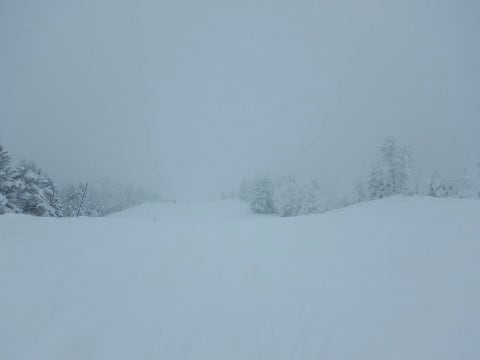
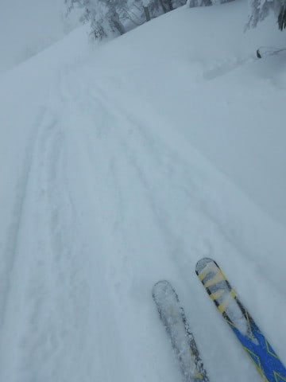
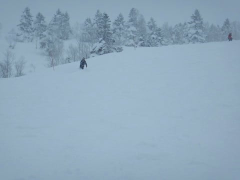
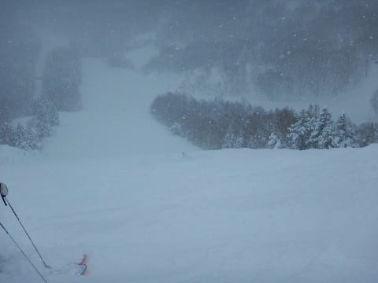
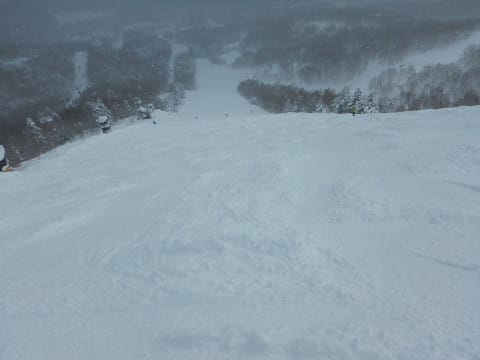
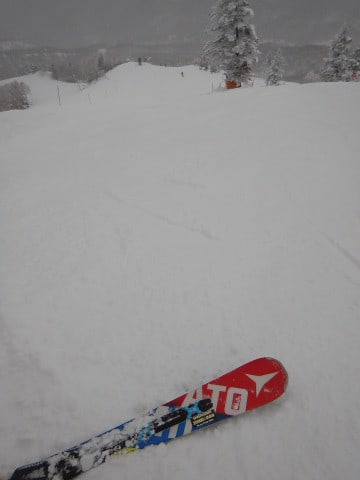
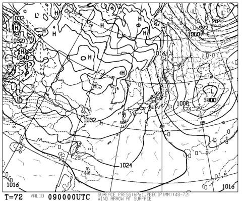
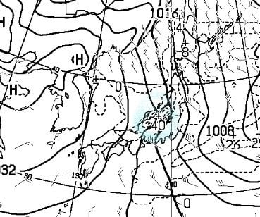

# 2019/1/6(日)の志賀高原・焼額山スキー場，速報モード…今日も雪降り，寒かったけど，ガラガラの一日

📅 投稿日時: 2019-01-07 00:53:52

🏷️ カテゴリ: [2019スキー滑走日記](c3e4496fc0fb7f9c17ff21214a35b1ace.md)

ということで．

中1日を挟んで，9日中8日間志賀高原で

滑るという，かなりの強行日程でしたが．

本日，全日程を終了して，無事帰宅

しました…

ってか．

シアワセな9日間が，あっという間に

終わってしまいました…（涙）

で．

最終日もいつも通りの，ラストリフトまで

滑って，深夜帰宅で．

そして，明日から仕事です（涙）．

…明日，ホントに仕事できるのか？

ってなことなので．

今日もいつも通り，日曜深夜定番の

速報モードにて…

えー．

本日も-10℃を下回る，

雪降りの冷え冷え天気で始まった

わけですが．

コース上は，

圧雪後に軽い新雪が5～10cmほど積もったようで．

圧雪コースでも新雪パフパフ！

…でも．

本格的に積もり始めたのは圧雪後の

明け方近くだったようで．

オリンピックコースの積雪は

ブーツパフと，思ったほど深く

なかったです…（ちょい涙）

天気は，午前中は結構な雪降り．

午後は曇り空ながら，ちょっと

明るくなるタイミングもあったかな～．

午後のコースは全体的に荒れたけど．

でも，人が少なかったので，そんなにひどい

コブコブにはならず．

コースによっては，夕方まで普通に

大回りできましたよ～！

何にしろ，正月休みが9連休だった人も，

本日が最終日になるので．

さすがにこんな日まで滑る人は

少ないのか．

ゲレンデがかなり空いてたのが

良かったかな！

ってなことで．

また明日，詳細レポートやります～！

おまけ

1月9日の地上天気図を見ると…

なに？これ？

すごい縦縞の，強烈な冬型の天気図

なんですが…

拡大してみると…

なんだこりゃ！？？

水色で囲った部分の+40って…

降雪量40cmが予想されてるんですけど！？？

これは…

9日水曜の朝は，腰パフの，

激烈モフモフパウダー天国に

違いない…

（朝は-15℃の強風吹雪で，凍死しかねない天候だけど）

## 💬 コメント一覧

### 💬 コメント by (Seeker.NT)
**タイトル**: 寒かった・・・
**投稿日**: 2019-01-07 01:25:02

昨日、新年のご挨拶ができて良かったです。

本日も奥志賀第３とエキスパは寒行の場でした。

この気候とバーンコンディションはこの時期ならではですね。　が、しかし、寒い分だけもっと雪が積もって欲しいですね。

結果、16連休中11日滑れましたが、明日から社会復帰できるかなと・・・。

### 💬 コメント by (ほっぽ)
**タイトル**: お会い出来ました
**投稿日**: 2019-01-07 07:11:12

Ｓさん

昨日もゴンドラ乗り場でお会い出来てご一緒させて頂きありがとうございました。

あのあと、奥志賀でｍａｅさん、ｙａｍａさんにお会いして何とあり得ないゴンドラ下で休憩もして、

その後少しご一緒しました。

昨日は一般人なので午後早めに上がりました。(^^;

今週末３連休、妻の体調が芳しくなく黄色信号ですが、

もし行けたらよろしくお願いします。

今週末は行けたとしたら、会社の同行者１名とのんびり滑っているはずです。(^^;

### 💬 コメント by (kazu)
**タイトル**: はじめまして
**投稿日**: 2019-01-07 08:08:07

何年も前から毎日楽しみに読ませていただいてます。いつかおみかけできればと思っておりました。

昨日ゴンドラに乗り合わせた老夫婦です。

ご同行の方との会話の最後に「おどり」の一語、そして降車時に板をみてあっと気づきました。

一度すべるお姿を・・と思ったときにはもうどこにもいらっしゃいませんでした・・・。

ウェアは覚えましたので、またいつかお姿をみることができるのを楽しみにしております。

### 💬 コメント by (おおすぎ)
**タイトル**: わたしも滑った気分になりました♪
**投稿日**: 2019-01-07 15:27:55

実は、年始のスキー、S様を発見すべく、志賀へと行くはずが・・・

なんとなんと、子供ではなく私がインフルに遣られてしまいスキー計画が全てパ～、家族からの大ブーイングで、冬休みが終わってしまいました・・・（涙）

S様は、インフルにもかからないんですね！強靭な肉体、羨ましいです。

### 💬 コメント by (Egu)
**タイトル**: スーパージャイアントスラローム
**投稿日**: 2019-01-07 16:30:04

憧れのSさんと一緒に滑って、上手いね と声掛けて頂き、小学四年の息子は鼻高々でした。

本当にありがとうございました！

（私は今日から社会復帰。この5日間パウダーで楽しめたので仕事が手につかない〜）

### 💬 コメント by (hiro)
**タイトル**: 年末年始最終日お疲れさまでした！
**投稿日**: 2019-01-07 17:19:56

お邪魔になりながらも、再びご一緒させていただけてとてもラッキーでした。レクチャーのお陰様で家族皆レベルアップできました。次回は、お父様より速いという娘様とご一緒させていただけることを楽しみにしております！

### 💬 コメント by (かず)
**タイトル**: Unknown
**投稿日**: 2019-01-07 20:08:51

30日から6日まで奥志賀メインでした　雪降りも底付きが多かったですよね　また予報よろしくお願いします

### 💬 コメント by (はなげ親分)
**タイトル**: 疲れた～
**投稿日**: 2019-01-08 01:13:58

８連投＋ナイター４回の修行みたいな８日間を終え、ぐったりしております。

改めてS様の鋼鉄で出来てる体がうらやましいです（笑）

今週末は金曜日からの布教活動になりますが、水曜日恒例のの予報が気がかりです・・・

### 💬 コメント by (Skier_S)
**タイトル**: コメント遅れました…すみません．
**投稿日**: 2019-01-09 03:55:37

＞Seeker.NTさま

いやーー．

お会いした日は，寒かったですね～．

しかし，16連休うらやましすぎます．

無事社会復帰できましたでしょうか…？

＞ほっぽさま

あの日の奥志賀は寒かったですから，休憩しないと

やってられない感じですよね…

しかし，珍しいこともあるものですね(笑)．

今週末，無事スキー場に来られることを祈ってます．

また志賀でお会いしましょう．

＞kazuさま

コメントありがとうございます～！

そうですか．ゴンドラ乗り合わせていたのですね．

私はどうやらゴンドラの乗り降りに慣れている分，人より異常に乗り降りが早いらしくて．

ゴンドラ乗り場や降り場で発見しても，あっという間に

いなくなったという報告を多数受けております(笑)．

ちょくちょく志賀にはいらっしゃるのでしょうか？

また次に志賀にお越しの際は，ぜひ声をかけてください…！

＞おおすぎさま

ええええ！！

インフルですか…

流行っているようですね．

私は冬の間は，インフルエンザや風邪にならないよう

心がけているのですが…

しかし，さすがに今回，風邪をひいてしまいました（涙）

でも，風邪ならまだスキーができるのでマシです←風邪ひいたらスキーしないほうがいいと思う…

＞Eguさま

先日はお世話になりました～！

一緒に滑っていただきありがとうございます．

無事社会復帰できましたでしょうか？

私は新年勤務初日からフルペースで働かされ，

かなりお疲れ気味です（涙）

＞hiroさま

家族スキーにお邪魔してしまった感じですみませんでした…

レクチャーというほどではなかったですが，役にたったので

あれば良かったです．

また志賀高原で，うちの娘ともどもお会いしましょう！

＞かずさま

お久しぶりの再会でしたね…

こちらはずっと焼額張り付きでした．

ほぼ毎日パウダーでしたが，それほど深いパウダーが

無かったのがちょいと残念でしたね…

明日はディープパウダーですが，今週末はパウダーは望み薄です…

