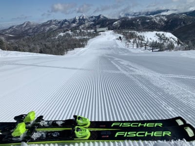
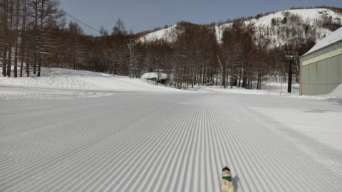
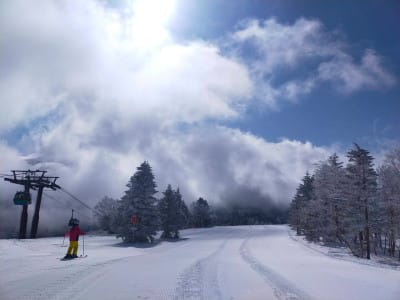
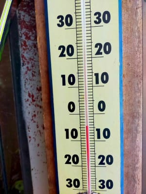
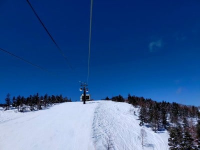
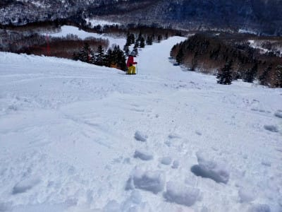
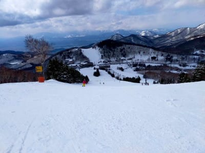
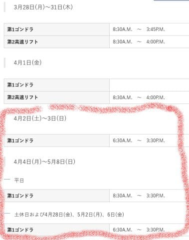

# え？志賀高原焼額山スキー場，第2高速が4月1日で営業終了！？？4月2日からは1ゴンだけなの？？

📅 投稿日時: 2022-03-25 11:19:02

🏷️ カテゴリ: [日記](cc4b5682fb7b8b144980957a978653fb0.md)

えー．

昨日はそんなに遅くなく，日付が変わるころには

仕事から帰宅していたのですが…

しばらく経って気づいたら，着替えずに

寝ている自分を発見しました（涙）

だもんで，昨日書きかけていた記事を

変な時間に更新！

…昨日も志賀高原特派員から写真が

いっぱい送られてきたのですが…

ぐふぅ（死）

…ダメです．

これは，仕事中に見ちゃダメなやつです！

仕事をするモチベーションを著しく

失わせる，危険な写真です！！

あれですね…

著しく失わせるというより．

仕事のやる気を完全にゼロにする，

恐ろしい写真ですね…（涙）

あぁ…

今日も志賀高原，良かったみたいですね…

とりあえず，朝はちょっと雲が出ていたものの，

青空ものぞき…

そして，気温も-5℃と冷え冷え！

これでいてゲレンデがシマシマと来れば…

もう，最高じゃないですか！

ただ，昼間はすっきり晴天の強い日差しが

照りつけたおかげで…

昼ごろから，焼額はかなり緩んだ雪に

なっちゃったようですが．

でも，一の瀬・高天ヶ原方面は終日雪が

良かったようです～！

ってな感じで．

このいいコンディションが週末まで

続いて欲しいのですが…

…ダメですね．

やっぱり土曜は激烈南風の，春の嵐です（泣）

ただ，土曜のリフト営業中はほとんど雨は降らなさそう！

おそらく終日曇り，降ったとしても，

「あれ？今ポツポツきたかな？」という程度．

…でも，風でゴンドラどころかリフトも

動かないのが多そうですが…

日曜も，今の天気図のままなら．

意外と志賀高原ではそれほど強い雨に

ならなさそう！

曇りベース，時折パラパラ降ってくる感じかな…

ただ，まだ日曜は分からない．

ちょっとでも低気圧の位置がずれると

どしゃ降りになる可能性も…

…とりあえず，土日とも，

気温は+10℃を越えそうなので，

雪に期待してはいけません…

で．

あと，焼額の春営業の案内が出てたのですが…

なんと．

4月2日以降，第2高速も営業せず，

第1ゴンドラのみになるようです…（涙）

（[焼額山ホームページ](https://www.princehotels.co.jp/ski/shiga/informations/lift_operation_schedule/)より）

あぁ…

せっかく第1ゴンドラが春営業なので，

あとは第2高速が動けば，焼額ほぼ

全面滑れるのに…

4月2日以降，唐松・白樺コースは

滑れなくなっちゃいます（涙）

ってなことで．

4月1日が第2高速ラスト．

そして今週末が第2ゴンドラの

ラストになります…

あぁ…シーズンが終わっていく…

## 💬 コメント一覧

### 💬 コメント by (ゆあの父)
**タイトル**: Unknown
**投稿日**: 2022-03-25 11:52:04

4月以降の営業予定ですが、先ほど焼額山スキー場に問い合わせたところ、誤って表記されていたそうです。

4/2(土)、3(日)も第一ゴンドラ、第二高速リフト営業するそうです。

4/4(月)以降が第一ゴンドラのみとのことでした。

ホームページもすでに修正されてます。

### 💬 コメント by (レインボー74)
**タイトル**: Unknown
**投稿日**: 2022-03-25 12:01:59

金曜日の志賀高原情報

朝の山頂-3℃、11時の山頂+3.5℃。

昼で終了したけど、昼までは快適を維持しました。

朝イチのオリンピックは硬めで、またまた自己最高速を更新。感慨に浸っていると、仲間がすぐに更新。

「人が感動してるのに、すぐに抜くんじゃねえ！」と、メールを送っておきました。

明日は強風で、何時までゴンドラが動くやら。

ヤケビの天気はエス様が決めるんでしたよね。明日をお願いしますだ！

### 💬 コメント by (ダウンヒル)
**タイトル**: Unknown
**投稿日**: 2022-03-25 20:29:32

いつも通りブログ更新してくださる、S様に感謝申し上げます...

雨具が不要になる天気でありますように...明日を楽しみに、宿でまったり中...

### 💬 コメント by (Skier_S)
**タイトル**: スキーに行かないと死ぬ
**投稿日**: 2022-03-26 00:28:09

＞ゆあの父さま

2，3日，やっぱり2高やりますよね～！

良かった…

でも，そのあとの週も，せめて週末は2高やってほしい…

＞レインボーさま

明日は朝からゴンドラ動かなさそうです…（涙）

＞ダウンヒルさま

土日，雨は降らずに済みそうです！

