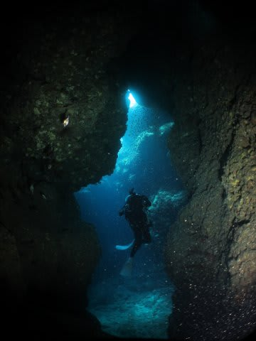

# 2013年7月　子連れ座間味ダイビング旅行記その21…そして座間味のファイナルダイブ

📅 投稿日時: 2013-08-22 01:31:06

ってことで．

座間味旅行記ももう終盤．

あと3回くらいで終わりそうですが…

…次のダイビングの予定は，9月中旬なんですね～．

座間味旅行記が終わっても，まだ9月中旬までは間があるので．

また昔の旅行記を引っ張り出そうかな？？

…で．

9月のダイビングの行き先は．

どこかというと．

…

…

また後日，公開します(笑）．

ということで．本題の旅行記へ，Go!

----

という感じで．

娘と遊んでいると，午後のダイビングの時間です…

…って，もしかするとこれが座間味のファイナルダイブ？？

…は，早すぎる…っ！

嘆いていても始まらないので，最後の一本エントリー．

ポイント名は…「久場の洞窟」

…その名のとおり，地形ポイントで．

しばらく行くと…

こんな感じで，洞窟があります．

光が射してきれいですね～

洞窟の中には，ライトを当てるときらきら光る小魚が群れてたりします．

…ってことで．

洞窟を満喫した後は．

こーゆー岩の割れ目とかを進んで行ったりしますが．

…基本的にこのポイントは，サンゴの無い岩場なので．

地形に変化がないと，単なる岩場で面白みに欠けるかも…

ってことで．

…なんとも，悲しいことに．

座間味の最終ダイブも，終わってしまったのでした…
