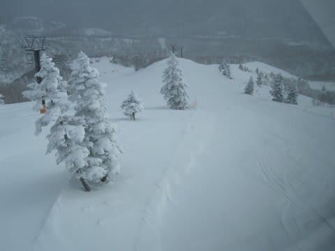
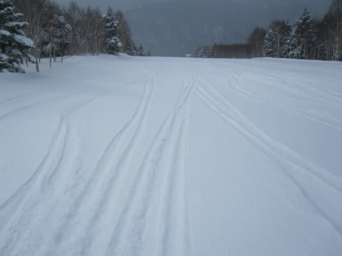
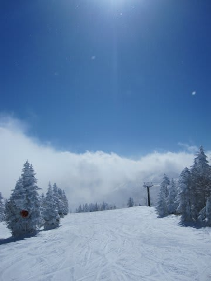
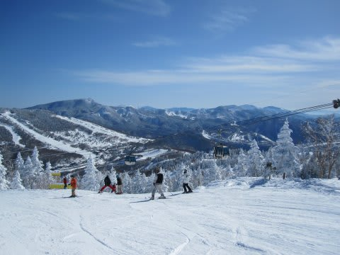
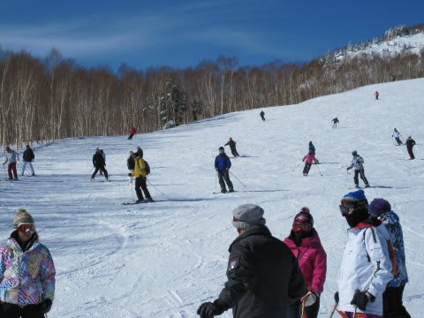
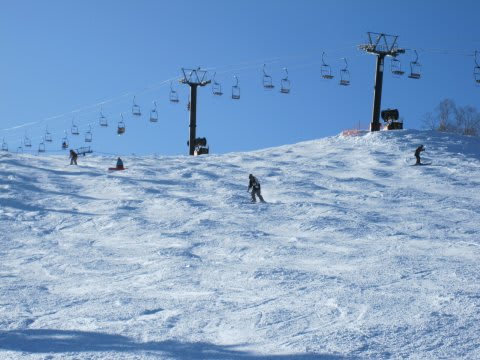
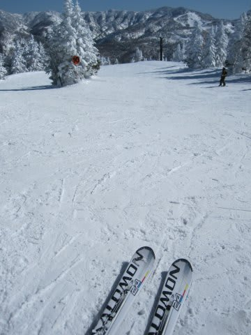
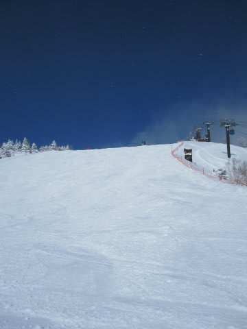
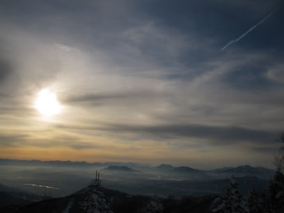

# 3月5日（土）の志賀高原は…

📅 投稿日時: 2011-03-06 01:44:47

土曜も最高っ！！！

パウダーを期待したけど，朝はあんまり積もってなかったです…

一晩の積雪は10cmほどかな？

朝の気温はマイナス13度．

昨日より高いですが，十分な冷え込みですね～

昼間もマイナス5度程度までしか上がらず，雪質はばっちり．

朝方は曇り空でしたが…

人が少ない！

きれいな締まった圧雪！（上に5cm弱新雪が乗ってて，気持ちいい～）

3月に入って，今シーズン最高に近いコンディションが楽しめるとは！

昼近くになると，天気も晴天に！

晴天，最高の雪質…

ちょっと混んできたのが欠点か．

でも，焼額第1ゴンドラはゲートの外まで人が並ぶほど

混むことはなかったので，許容範囲内．

しかし．

雪が柔らかかったからか，

ゲレンデの急斜面部分，結構コブになってきました…

飛ばすには厳しいなぁ…

夕方近くになってくると，急斜面部分ではコブだけじゃなく，

下地のアイスバーンもちょこちょこ顔を出してきちゃいました…

夕方はちょい厳しかったけど．

昼間は日が射したというのに気温があがらず，

雪自体はハイシーズンの雪でした．

天気はずっと良かったので，今晩も雪は降りそうに無いですね…

圧雪を掛けなおした明日の朝は，晴れた超快適な圧雪ゲレンデを

滑れそうですね～．

