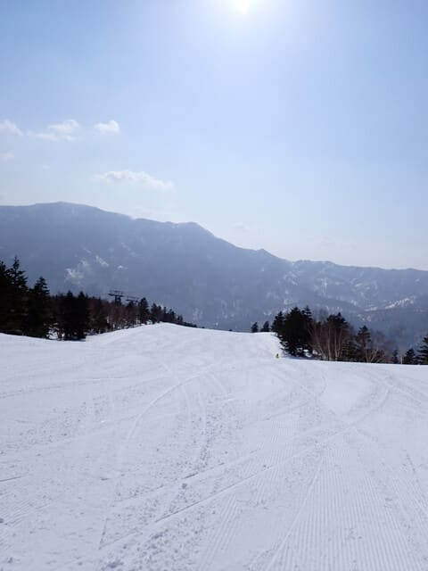

# 2025/3/23(日)の志賀高原焼額山スキー場，速報レポート！…気温が高い晴れの一日．雪は朝から緩く，一部ストップ雪も(泣)

📅 投稿日時: 2025-03-24 02:15:00

🏷️ カテゴリ: [2025スキー滑走日記](cacd3fbf84d4a679ee61a5894c3f95e14.md)

ということで．

本日も営業終了まで志賀高原で滑ってきて．

洗車やらなにやらして帰ると，帰宅は

0時近く…（泣）

木曜志賀高原日帰り後の土日志賀復活

というご無体日程だったのに，

さらに昨日も夜は23時近くまで宿で

飲み会に参加してしまい寝不足なので，

今日は帰宅日恒例の速報モードにて，

志賀高原の情報を手短に報告！！

まず．

昨日に引き続き，一日晴天だった

本日ですが．

朝から晴れてはいるものの，遠くまで

見渡せる晴れではなく，春霞がかかって

遠くの景色がかすんで見える一日で…

あぁ，春が来たねぇ…

という感じ（涙）

気温は残念ながら朝からプラスで．

朝イチからバーンは緩み気味という，

かなり悲しい状況で…

2-3本も滑ると，まだ朝9時過ぎというのに

バーンはかなりネットリとした雪に

なっていっちゃいました（泣）

そして，今日は強風のため，焼額の第2ゴンドラは

朝イチから運休（泣）

ただ，それ以外のリフト・ゴンドラは

通常運転で，泊まっていた第2ゴンドラも

11時には動き始めました！

第2ゴンドラ運休でほかのゴンドラ・リフトが

混むかと思ったけど，

奥志賀始め，他のゴンドラやリフトは

横手・渋を除いて全部動いてたし，

雪があんまりよくない今日は人が少なかった

こともあり，終日ゴンドラ待ちはせいぜい

搬器数台程度でした…

そしてさらに，朝からバーンは緩かったし，

午前中にはブナや唐松，オリンピックコースは

所々ブレーキがかかる雪になってしまった

のもあって…

今日はみんな早めに帰っちゃったのか，

ゴンドラもコースもガラガラでしたね…

そのうえ，昼にはコース全面が4月中旬

くらいの感じのしっとりと重い雪になって

いったので，バーンも荒れ始め…

人が少なかったからそこまでひどい凸凹に

ならなかったけど，GSコースは夕方には

かなりバンピーな感じになってました…（泣）

でも，パノラマ-サウスコースは最後まで

ストップ雪にならず，人も少なかったので．

春の重い雪になったものの，そこまで

ひどく荒れなかったし．

天気も良かったし．

ガラガラだったし．

春の重い雪であろうが雪があれば楽しい

という中毒症状が進んだ人なら，

まぁまぁ楽しめたんじゃないでしょうか…

…少なくとも私は楽しかったんですが．

私は…←ほとんどの人は重くて荒れ気味のバーンで厳しいと感じたと思う

ということで．

なんだか4月下旬並みの感じの雪だった

本日の志賀高原ですが．

これから28日まで，ずっと高温が続き

ます…

そして，28日は高温の雨になりそう（激泣）

あまり贅沢は言わないから，29日の

週末は，ちょっとは冷えてほしい…

でも，28日の雨のあと雪が積もらず

冷えるとガチガチアイスバーンになるから，

アイスバーンが隠れるよう，ちょっと

雪が積もってほしい…

できれば，冷え冷え雪が積もってくれると

ありがたいし．

それも軽いパウダーが50cmほど積もって

くれると嬉しいんだけどな…←すごい贅沢を言ってるんだけど…？？

## 💬 コメント一覧

### 💬 コメント by (ねも)
**タイトル**: Unknown
**投稿日**: 2025-03-24 06:18:07

中毒症状が進んだ人には大笑い、座布団１枚です✌️　志賀高原は日曜もダメでしたか……　お疲れさま(*^-^)ﾉ

ウソ⁉️と言われそうですが、野沢温泉は土曜よりずっとマシで、午前中は中毒症状じゃない人も楽しめました(曇っている時間帯もあって、たぶん最高気温は５℃くらい低め)

私は11時すぎに引き揚げて宿でゆっくりしましたが🍷、同行者は１時すぎまで⛷️　彼らとＳさんのスキー愛に拍手！

### 💬 コメント by (レインボー77)
**タイトル**: Unknown
**投稿日**: 2025-03-24 13:38:11

月曜日の志賀高原情報

朝の蓮池+6℃、どんよりした曇り空。今日も横手の第一スタート。第一、第二、第三と乗り継いで渋峠を滑る。

朝イチはやっぱり硬い。私の腕ではエッジが立てられない。そこで武蔵は考えた。立てようとしてうまく行かないから楽しくないのだ。最初からずらす気持ちで滑れば納得して滑れる。これにて一件落着！硬いけど空いてて気持ちいい。10時頃にはエッジも立てられる雪になったのでもう夢中。11時から移動したのだけれど、横手は食い込むカービングバーンに。思わずお代わりして終了。仲間の誰かが帰ろうってつぶやいたら、その意見が優先されるという鉄の掟があるので。

### 💬 コメント by (アツシ)
**タイトル**: Unknown
**投稿日**: 2025-03-24 23:57:10

いやー、とうとうこの季節に突入しましたね、春雪。今週行けなかったのがすごい残念です。重くてボコボコに荒れたゲレンデを飛ばされながら高速で滑る快感、春ならではの楽しみですね。あれ？中毒患者？？

### 💬 コメント by (Skier_S)
**タイトル**: 今週一週間はひたすら高温
**投稿日**: 2025-03-25 02:59:29

＞ねもさま

日曜も志賀は残念な雪でしたが，私はそれなりに楽しめました…

でも，まさか野沢では土曜よりずっとマシだったとは…！！

＞レインボー77さま

今日も横手・渋だったんですね…

焼額は今日も朝から柔らかい雪だったと思います．

これからまだ28日まで，ずっと気温が高い日が続いて，

28日は雨になりそうです…（涙）

＞アツシさま

この季節が来ちゃいました…

でも，中毒患者だったらこの季節も楽しめますね！！（笑）

