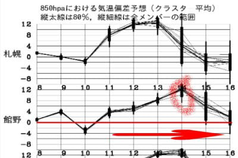
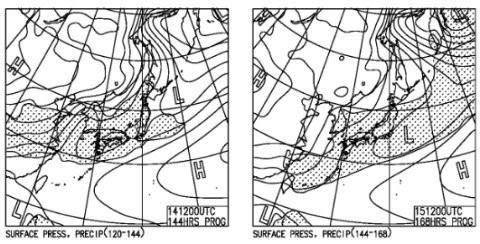
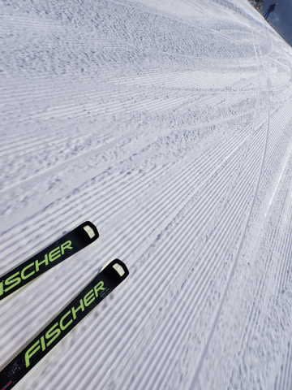
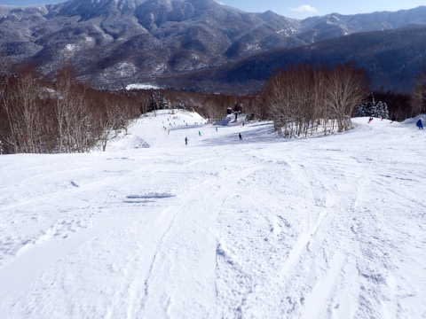
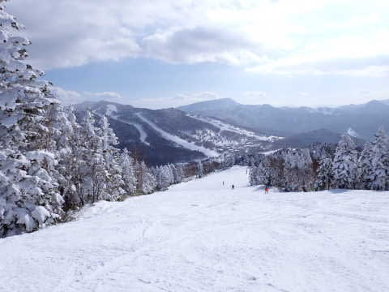

# 2023/1/9(月・祝)，3連休最終日の志賀高原スキー場速報レポート！…朝から晴天！ちょっと気温は上がったけど雪質も良く，それほど混まなくていい日だったよ

📅 投稿日時: 2023-01-10 03:08:07

🏷️ カテゴリ: [2023スキー滑走日記](cd943df30cfcc3d0896469e2ff98720cd.md)

えー．

この3連休，ほとんど雪が積もらず．

今日も午後3時半ごろまでは晴天が続き．

積雪は0だったんですが．

[3連休の初日の記事](e6c3974b85fa48721a894901ffdf574e3.md)に．

　もしかしたら，9日夜から10日にかけて

　ちょっと積もるかも！！！！

　10日は，久しぶりのパウダーデーになるかも？

　10，11日はコンディション良さそうかな？

と書いていました通り…

今晩から明日にかけて，結構雪が

積もりそうです！！

朝までに20cmかそれ以上，

明日は昼間も雪が降り続け，

昼間も10cm以上は積もりそうな

感じです…！！

明日，明後日は冷え冷え新雪が滑れそう…！

…だけど．

やっぱり11日からは平年比でグッと

気温が上がる日が続いて．

13日あたりからは壊滅的な気温に

なり…

赤丸で記した14日は，平年比+12℃という

激烈高温になりそう(激泣)

なんなんだ，これは…

そして．

14，15日の土日を狙ったように，

何かが降りそうですが…

この気温だとやっぱり液体です(泣)

雨のあとは，解けた雪が低温で固まって

ツルツルアイスバーンの下地に

なっちゃうので．

その後積雪がしばらくない場合，

絶叫アイスバーン地獄

が待ってます．

皆さん，ご覚悟のほど…(激烈涙)

ってなことで．

今日もラストまで滑って帰宅した後．

仕事をやっつけていたらこんな時間に

なってしまったので．

今日の志賀高原，速報モードにて…

今日は朝からすっきりブルースカイの

快晴でスタート！！

そして．

あさイチはそこそこ冷えてくれたので…

いい感じで締まった，今シーズン最高

クオリティーのスペシャルグレード雪質

シアワセ満載プレミアムシマシマバーンが

お出迎え！！

雪は最高だったのに，3連休2日目で

帰った人が多かったのか．

今日はリフト・ゴンドラともガラガラ！

第1ゴンドラのピークでもこのくらいで，

ゲートの外にギリギリ列が出るかどうか

という程度だし．

リフトはほぼ待ちゼロ！！

当然，コースも昨日までとは違って

人口密度は低めで，好きなラインで

滑れます！！

GSコースやサウスコースはちょっと

人が多いタイミングもあったけど…

だいたいはこんなくらいの人口密度で．

好きなライン取りたい放題！！

そして，雪もいいし．

コースも荒れず比較的フラットな

状態が夕方まで続き，営業終了時間まで

大回り板で大回り可能でした～！！

天気は午後3時半ごろまで晴れていて．

そのあとはちょっと雪がぱらつき始めましたが…

ほぼ一日晴天で，いい感じの天気でした！！

いやーー．

雪は良いし天気は良いし混まないし．

私にとっては間違いなく，今日が

今シーズン一番良かった…

無理してでも行って良かった…

…しかし．

このシアワセも今週末までで．

来週末はすごい天気になりそうだし．

その後は

雨で解けた後に固まった

アイスバーン地獄

になると考えると．

下地のツルツルアイスバーンが

完全に隠れるほどの積雪になり．

再びこのようなシアワセなバーン状態の

週末がやってくるのは，いつの日か…

と不安になる，Skier_Sだったのでした…
