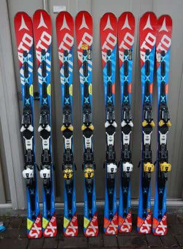

# 2シーズン前からメインの板をロング板にきりかえたわけだけど

📅 投稿日時: 2023-07-09 04:08:20

2022シーズンから，普段使いの

メインの板をロングの板に切り換えた

わけですが．

ロング板をメイン板に切り替えて

2シーズン過ごして，感じたことを

ちょっと書いてみようかと…

まず．

このBlogの昔からの読者はよくご存じかと

思いますが．

ロング板をメインにする前は，私は165㎝の

小回り板，ATOMIC Bluester SXが

めちゃくちゃ気に入っていて，

2013シーズンからひたすらSXを乗り続け…

余りにも気に入りすぎた結果，2018シーズン

には同時に最大4台のSXが並ぶという．

[勝手にSXが増殖してい](e8a53c5e38b2ebcf1a084dc391aaad69d.md)く

という異常な事態を引き起こすくらい，

2013シーズンから2021シーズンまでの

9シーズンの長きにわたってひたすらSXを

履きつづけましたね～．

SXを履く前も，2008年頃からはひたすら

165㎝程度の板をメインとして履き続けていて．

小回り板メイン歴15年以上

という，長きにわたって小回り板ばかり

履いていましたね～…

ただ．

2021シーズンにエキップさんのブーツを

履き始めてから．

板が無茶苦茶踏めるので，

「小回り板だと回りすぎる…！！」

と．

2021シーズンの後半からは，ロング板の

出動頻度が増えてきていたのですが…

ついに，2022シーズンから．

ロング板のFISCHER RC購入を機に，

ロング板をメイン板に切り替えたわけ

ですね…

さらに朝イチの人が少ないときは，

もっと長い189㎝のGS板を履いているので．

この185㎝のRCは，まさに普段履き．

普段履きのメイン板を，

長さ165㎝の小回り板から，一気に20㎝

長い，ロング板としてもわりと長めの

185㎝の板に切り替えたわけです…

で．

…メインの板をショート板から

ロング板に変えてまず思ったのは．

ロング板を履いたほうが，スキーは

上手くなるんじゃないか？

という事実．

何をやっても曲がってしまうショート板より，

ちゃんと踏まないと曲がらないロング板を

正しく使えるほうが，おそらくスキーは

上手くなりそうな気がする…

そして．

慣れてくれば意外と小回りもできるし．

ロング板のほうが，焼額のような人が

少なめのロングクルーズコースは気持ちいいし．

ちゃんと踏めるブーツさえあれば，

ロング板がメインでいいじゃないか

と気づいて．

ここ2シーズンほど，メイン板を完全に

ロング板に切りかえて，一日のほとんどを

ロング板で過ごすようになったわけですが．

そしてロング板をメインにして，2シーズン

経った今シーズン．

さらに気づいたことが一つありました…

それは．

私がショート板を履いていたころ．

私の身体から放射されているらしい，

板をヘタらせる電磁波のおかげで，

大体1シーズンから長くても1.5シーズンで

板がヘタって死んでいき．

特にATOMICのSXは，40日くらいしか

持たない（涙）

という，

グローブとかの消耗品よりも寿命が短く，

スキー道具で一番寿命が短いのがスキー板

という悲しい状態が続いていたわけですが．

ロング板を履いた場合…

ターン数がショート板に比べてずっと少ない

からか．

メインのFISCHER RCは2シーズン履いても

全くヘタって来ている気配がなくて．

ロング板はショート板に比べて

板の寿命がすごく長い

というメリットがありそう…

ということに気づいてきました．

ロングの板はたわませる回数が小回り

板より少ないし，ショートターンほど

深回りをするわけじゃないので，

たわみ量もショート板に比べて

少ないから…

板の負荷は，ロング板のほうがショート

板よりぐっと少ないわけで．

おそらく，板の寿命．

ショート板よりロング板のほうが，圧倒的に

長いです！！

（SXがヘタるのがあまりにも早すぎたという説もありますが）

ということで．

なんと．

今のメインマシンのFISCHERのRC．

私のメインマシンとしては奇跡的に，

3シーズン目に突入です！！！

うん．

ロング板を履いたほうが，

スキーも上手くなるうえに，

寿命も長いとなれば．

一石二鳥じゃないか…！！！

ってなわけで．

スキー板が1シーズン持たないという，

板をヘタらせる特殊な電磁波を発する

私と同じ特殊な体質を持つ人は．

メイン板をロング板に履き替えることを

おススメします～！！←そんな特異体質の人いないから

## 💬 コメント一覧

### 💬 コメント by (なんちゃってレーサー)
**タイトル**: ついに気がついてしまいましたか
**投稿日**: 2023-07-09 15:57:05

スキー場にもよりますが，ある程度谷回りが作れる人であれば，コブに入らなければ，ロング板があれば十分なんですよね．

私はスキー場が混むシーズン終わりとシーズン初め以外はコーチに板を指定されない限り，大体GS板を履いています．

ロング板の試乗レビューも楽しみにしています．

### 💬 コメント by (カンタロス)
**タイトル**: Unknown
**投稿日**: 2023-07-09 21:13:07

Sさま、こんにちは。

私も今シーズンは185のGS板を使い始めました。

結果、スキー仲間の元SAJデモの方に

「それだけできるならS9(赤いやつ)だと、足元不安でしょ?コブ以外ならS9FIS履いたら？」とアドバイス（？）をいただきました。

結果、板を買う可能性も出てかえってお金がかかるかも？！な事態に（笑）

そうなるとブーツもより硬いブーツが欲しくなるという悪のスパイラルに陥りますよね～

…なんかどこかで見たスパイラル（笑）

### 💬 コメント by (Skier_S)
**タイトル**: ロング板は意外と楽しい
**投稿日**: 2023-07-10 03:56:41

＞なんちゃってレーサーさま

人が多いスキー場は危ないですが…

でも，ロング板があればコブ以外は十分というのはその通りだと思いました．

でも，試乗はロング板が少ないので，どうしても小回り板メインに

なっちゃうんですよね…

やっぱり，ロング板は人気がないみたいですね．

＞カンタロスさま

お，185㎝仲間ですね！

ロングでも，185㎝くらい長いのを履いている人は今の時代では珍しいですよね…

ロングに目覚めたところで，ぜひこのまま，強い板→強いブーツ→さらに強い板…

という，悪のスパイラルにはまり込んでみてください（笑）

