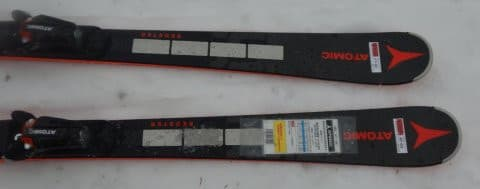

# 2023シーズンモデルのスキー板，試乗レポートその19…ATOMIC REDSTER S9i REVOSHOCK

📅 投稿日時: 2022-06-29 02:38:27

🏷️ カテゴリ: [スキー板試乗](c0bd8048615710cee890e403a36cc9a2b.md)

えー．

そういえば．

昨日の記事で，そこそこのハイペースで

山を歩いているって書きましたが…

なんで私が山を歩くときにかなりの

ハイペースで歩いてるかというと．

これは別に速さを競っているわけでは

無くて．

冬の間にしっかり滑り続けられる

体力＆持久力をつけよう…

というトレーニング目的で，

心拍数130~150をキープするように

スマートウォッチの心拍計を見ながら，

高めの負荷をかけて歩いているから

なんです…

いや．ホントに速さを競うなら，本格的に

トレランやってる人には全く敵わないですから．

陣馬山でも，トレランやってる人に何人も

抜かれたけど…

あの人たちは，私が往復3時間半かかった

距離を，おそらく2時間以下で往復してるん

じゃないかな？

いや．

本格的にトレランやってる人は，おかしい

くらい体力がありますから…

スキーやるにはそこまで鍛えなくても

いいよね？←いや．普通はスキーのトレーニングは速筋の筋力を高めるべきで，

長時間の持久力を鍛える時点ですでに間違ってるから．

スキーに持久力を求めるのは，やはり20000mな方々に毒されてますから…！！

ってなことで，本題へ．

今日も2023シーズンモデルのスキー板の試乗レポート．

前回に引き続き，アトミック編です…

では，どうぞ～！

○ATOMIC REDSTER S9i REVOSHOCK　160cm

基礎小回り用．

ちょうどいい165cmが空いてなかったので，

ちょいと短めながらも160cmを履いてみました…

G9 Rの直後に履いたからか…

しっかりしたVARビンディングが入ったG9Rに

比べると，S9iはかなり柔らかく感じますね！

スピードをそんなに出さなくても，柔らかく

撓む感じで，エッジグリップもそんなに

頑張らない感じで，かなり動かしやすい板です．

柔らかい春の雪では，角づけを付けて

行かなければ容易にずらせます．

というか，明確に角づけをしていかないと

ずれていくので，板を動かして仕上げる

ひねりの小回りが作りやすいです．

160cmという短めの長さってのもあるからか，

履いた感じは極めて軽く，エッジグリップも

そこまで頑張らないってのもあって，

板を楽に自由に振り回せます．

極めて軽快なので，しっかり深く回す

小回りをやるには向いてます．

返りもそんなに早くなく，強くもないので

板から強烈な反動をもらって吹っ飛ぶって

リスクは全く無く，反動をもらって鋭く

左右に板を動かすというより，落ち着いて

しっかり板を深く回し込む小回に向いてる

感じ．

ただ，ある程度のスピードを出すには

160cmだと辛いかな…

当然，この長さだと大回りは難しく，

基本的に小回りスペシャル，引っ張って

中回り程度になります．

ただ，REVOSHOCKのおかげなのか，

スピードを出して行っても板がばたつく…

ってことは無いけど，スピードを出す人には

もう少し長さがあって張りが強い板の方が

いいかな．

逆に，体重が無い・それほど筋力が無い

人でも，ある程度のスキルがあれば軽快に

サイドカーブに乗ったカービングで

滑って行けるし，板を動かして行きやすいし

いい感じかも．

まぁ，160cmってのが私にはちょっと短すぎた

ってのもありますが．

やっぱり，ギンギンにスピードを出して

切っていきたい人はS9i PROの方がいいと

思います…
