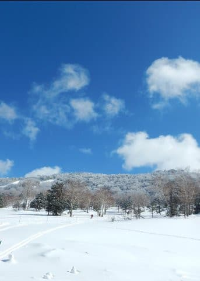
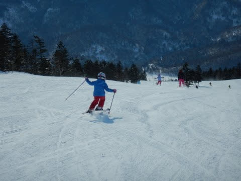
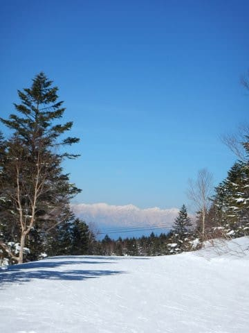
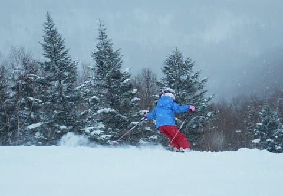

# え？なに？小学校1年生で一日滑走標高差14000m？…志賀高原には恐ろしい子供がいるもんだ

📅 投稿日時: 2019-06-26 03:04:57

🏷️ カテゴリ: [スキー雑談](c1f9d2cb7478308da16419928ea3945e9.md)

ということで．

志賀高原のスキーシーズンが終わったというのに．

先日の土曜日は，20000mクラブ＆焼額朝礼メンバーが

20人も志賀高原に集まるなどと．

皆さん，

志賀高原への忠誠心が異常に高い

のですが．

そんな，志賀高原への忠誠心が高い

焼額朝礼メンバーの中に，

最近は子連れの方も多くて．

…で．

その子供たちが，スーパーな

子供たちが揃っているわけで．

まぁ，小学校4年生・5年生クラスの

子供たちは，もう大人と同じスピード…

というか．

[20000mな皆さんを超えるレベルで滑る](ee24e079db1f9f5b303f5680e29e72b81.md)

のは分かる．

…いや．

やっぱり分からないけど．

でも，まだ納得できる．

最近すごいのは，

小学校1年生の女の子ペア（今はもう2年生になってるけど…）

早朝営業している時期は，

早朝6:30からお昼休みまで

ひたすら滑り続け．

お昼休み後はきっちりリフトストップまで

滑り続けるという…

早くも，正統派20000mクラブの滑りを

引き継ぎつつありますね…（恐）

それも，ただ滑る続けるだけではなく．

…ありえないことに，大人と全く同じ

ペースで滑り続けるのですが？？

さらに．それはタダの大人じゃなく．

焼額朝礼メンバーという，

平均滑走スピードがハンパなく速い

メンバーに丸一日着いてくるんですけど？？（驚愕）

この焼額朝礼メンバー．

そこそこのレベルの大人でも，

1時間同じペースで滑り続けると

かなり大変だと思うんですが…

この小学校1年生ペア．

早朝からリフトストップまで，

このおかしな大人たちのペースに

しっかりついてきます．

全く待つ必要が無く，

大人に混じって同じペースで

滑り降りてきます．

なんてこった…！！

それどころか．

小学校一年生なのに．

一日の標高差，14000m滑っちゃうんですが…！！

早朝営業から滑ると，大体13000～14000m

滑ってますし．

早朝が無くても，10000m以上平気で

滑っちゃうという．

小学校1年生の子供．

ときどきすごい上手い子は見かけるけど．

これだけ量を滑れる子は，

そうそういない気がする…

いや．

このBlogでは，20000mチャレンジの話が

よく出てくるので，

14000mって少なく感じるけど．

14000mって，すごいですから！！

大人でも，一日14000m滑ったことがある人は，

滅多にいないと思います…

みなさんもぜひ一度，

20000mと言わないので，

14000m滑ってみてください…

小学校1年生でこの滑走量を

滑るすごさが分かると思います…

とりあえず．

焼額朝礼メンバー．

大人から子供まで，ちょっと（かなり？）標準から

ずれている人間が揃っているので．

この中にいたら，

自分は極めて平凡な普通の人間に思えてくる

Skier_Sだったのでした…

## 💬 コメント一覧

### 💬 コメント by (Goku)
**タイトル**: 老体には厳しい・・・
**投稿日**: 2019-06-26 20:14:35

あの二人は間違いなくワールドレベルです♪

先シーズンの志賀高原遠足、最後は確実にnaoちゃんに置いてかれましたから(笑)

しかも２人ともしっかりターンしてるんですよね。

飛ばすだけなら誰でも出来ますけど、曲がってのあのスピードは凄すぎです。

膝に爆弾を抱えた私は来シーズンついていけないこと間違いなし(T_T)

### 💬 コメント by (カンタロス)
**タイトル**: Unknown
**投稿日**: 2019-06-26 21:08:53

素晴らしくも末恐ろしい小学生ですね(恐)

19シーズンより１日どのくらい滑っているのかなぁ？

と、思い、スキーアプリを、いれてみましたが滑走標高差10000もいかないですね…

現在20000メートルクラブの公式(？)アプリのようなものはあるのでしょうか？

あれば使ってみたく思いますので、教えて頂ければ幸いです。

### 💬 コメント by (naoちゃんねる)
**タイトル**: Unknown
**投稿日**: 2019-06-26 21:29:04

娘は、仲良くなったキッズ達と滑るのが楽しくて…

そして私は20000㍍な皆さんと滑るのが楽しくて帰れません！

しかし、今シーズン娘を47日スキーに連れてった事や、6時半の早朝～リフトストップまで滑った事を知り合いに話すと、もはやドン引きされます(笑)

…みなさんからすれば、普通ですよねぇ…

＞自分は極めて平凡な普通の人間に思えてくる

Skier_Sだったのでした…

いやー、神奈川から毎週志賀高原にやってきて、プール開きしてるこの時期までスキーシーズン中で、日帰りで月山行ったり…(その他、多数の武勇伝…)

そんな、Sさんは

゛極めて平凡な普通の人間ではございません！！゛から(爆)

### 💬 コメント by (もりや)
**タイトル**: Unknown
**投稿日**: 2019-06-27 02:15:11

小学1年生女の子が、志賀高原のどのコースでも大人と同じペースで滑り降りる子が2人もいるんですよね。

2人揃ってカッ飛んで行く姿は見ものです。来シーズンも更にパワーアップして、私も付いて行けないかも(笑)

### 💬 コメント by (Skier_S)
**タイトル**: とりあえず14000m滑る小学1年生はおかしい
**投稿日**: 2019-06-27 02:19:05

＞Gokuさま

いや，あの2人，すごいですよね…

最後の写真にあるように，こんなにきれいな谷回りを

かましながら14000m滑るのはすごい．

来シーズンはどれだけパワーアップすることか…（恐怖）

＞カンタロスさま

標高差10000m滑ったら，普通の人なら

「むちゃくちゃ滑った」

と思うと思います…

14000mのすごさが分かっていただけるかと．

ちなみに，20000mクラブでは特に公式アプリは

ありませんが，SKI tracksかiSKIでしょうか…

＞naoちゃんねるさま

20000mな皆さんと滑ってると，標準がだんだんずれて

行きますよね(笑)．

早朝からリフトストップは，デフォルトですよね（断言）．

そして，7月の声が聞こえるころまでスキーを滑るのが，

普通だと声を大にして主張してみたい…（そこは20000mなメンバーから見てもずれてるから）

### 💬 コメント by (カンタロス)
**タイトル**: Unknown
**投稿日**: 2019-06-27 13:10:29

情報ありがとうございます！来シーズンのアプリ入れ替えを検討します。今はsnowayというアプリを使用してますが、トータルの滑走標高差がでないので不便に思っておりました。

### 💬 コメント by (NorthFox)
**タイトル**: Unknown
**投稿日**: 2019-06-27 22:52:45

こんばんは。

今年銀のお札を頂き、来年は2000mにチャレンジしようかな♪などと密かに考えていましたが、大変な世界のようですね．．．

素人さんが手を出すと痛い目見そうです。

ところで2000mチャレンジには一の瀬ファミリーが適しているそうですが、西舘はどうなんでしょう？

フーディーでぐるぐる回るのもなかなか効率が良さそうな気がします。

でも、精神的に凄く辛そうですが。

### 💬 コメント by (NorthFox)
**タイトル**: Unknown
**投稿日**: 2019-06-27 22:54:32

2000mではなく20000mの間違いでした。

書き間違えている時点で達成は難しいですね(^^;

### 💬 コメント by (Skier_S)
**タイトル**: 20000mチャレンジ
**投稿日**: 2019-06-28 02:45:19

＞カンタロスさま

ちなみに，私はスマホアプリを使わず，標高ログ機能付きの腕時計を使ってます．

スマホアプリ，かなり電池を食うので…

＞NorthFoxさま

いきなり20000mにチャレンジせず，15000mあたりを

目標に，まず一回練習することをおススメしておきます．

西館は，昔は一日回せばギリギリ20000m行けたのですが，

今は西館フーディーの運転速度が，毎秒4mから毎秒3mに

減速されてしまったので，西館だと厳しいと思います．

### 💬 コメント by (yumi)
**タイトル**: Unknown
**投稿日**: 2019-06-28 19:27:52

Ｓさぁ～ん🚀🎵🎉

早いですよねぇ～～～⛷️💨💨💨

ほんで(そして)、上手に滑りますよねぇ～～～⛷️💨💨💨

たまに 一緒に滑ってもらいますが、

｢わたし、遅いから ゆっくり行ってね｣

って、お願いすると 途中で ２度ほど 待っててくれました💖

なんと 優しい 良い子でしょう✨✨✨

今度は ターンを教えてもらわねば🤔

### 💬 コメント by (NorthFox)
**タイトル**: Unknown
**投稿日**: 2019-06-28 22:06:54

S様、アドバイスありがとうございます。

なるほど、まず15000mにチャレンジするといろいろと分りそうですね。

来シーズンの楽しみ、目標にします。

禁断の世界へ一歩踏み出そうと思います！

### 💬 コメント by (しんちゃん)
**タイトル**: ご教示
**投稿日**: 2019-06-28 22:21:50

ｸﾛｰﾁﾝｸﾞを教えてしまったばかりに、スーパーキッズにはとっとと周回遅れにされてしまいます。

来シーズンは、スーパーキッズに怪我なく安全に早く滑れるＳＫＩを教えてもらわねば(笑)

### 💬 コメント by (Skier_S)
**タイトル**: 子供の成長は早い！
**投稿日**: 2019-06-28 23:45:40

＞yumiさま

遠くの地から，コメントありがとうございます．

もう，子供たちは速すぎます．

ついて行けません(笑)．

子供同士でお互い刺激しあってるので，うまくなるのが

ハンパなく早いです…

そして．

みんな優しくていい子ですよね！

＞NorthFoxさま

普段，10000mも滑ってないようでしたら，

12000m→15000m→17000m，って目標をちょっとづつ上げて

滑る方がいいかもしれません．

無理せず，安全に楽しんでくださいね！

＞しんちゃんさま

私も早朝の2時間のうちにラップされるようになっちゃいましたから…

ハンパないですよね．

とりあえず，安全に早く滑るためには，スキーを履いたままなのに，

タケノコを探しに笹薮に入っていったりしないことでしょうか…

### 💬 コメント by (カンタロス)
**タイトル**: Unknown
**投稿日**: 2019-06-29 12:35:07

10000メートル滑ってない現実をみると、20000とか無理(笑)ですね😅

そして14000も半端ないですね。

私は早朝からナイターまで滑る、なんて事はしないのでスマホで大丈夫そうです。

日帰りの時も帰りの車で充電すれば電池問題ないですからね。来シーズンはまず10000目標で滑ってみます。

### 💬 コメント by (Skier_S)
**タイトル**: カンタロスさま
**投稿日**: 2019-06-29 22:51:33

まずは10000mからスタートすることをお勧めします…

慣れてないと，10000mでもきついと思います．

ムチャクチャ滑った気になると思います．

