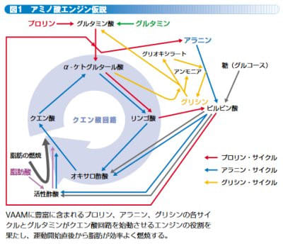

# なぜ登山でVAAMを試してみようと思ったのか？その5…クエン酸回路（TCA回路）の周囲，人体ではどうなってるのか？

📅 投稿日時: 2022-09-28 02:49:41

えー．

あんまりゆっくり記事を書いている暇は

ないんだけど…

書きかけの記事があったので，こいつを

仕上げて投稿！

このVAAMの記事も，かなり長くなりそうな

予感…

そして．

この記事を書くにはものすごい時間が

かかるので．

果たして書きあがるのはいつか？？

今年中に終わるのか？？←その規模の時間感覚なんだ…

とりあえず，今回は第5回です…！

（もう5回も書いたのか…）

ーーー

ってなことで．

[前回](e26fa556a58d7c9a042bfa6398d94baa7.md)，クエン酸回路の基本を振り返りましたが．

今回，これにさらにいろいろ付け加えて行こうと

思います…

この，クエン酸回路にある，

αケトグルタル酸ですが…

他のあらゆるアミノ酸の代謝の仲立ちをする

という，特殊な役割を果たすモノで．

他のアミノ酸の代謝を助けるたびに，

グルタミン酸に変化していくという

宿命を負っています…

例えば，筋肉で代謝されるアミノ酸であるBCAA．

BCAAを代謝する時にも，αケトグルタル酸が

消費されて，グルタミン酸になっていきます…

…これでは，せっかくクエン酸回路が

回り始めても，αケトグルタル酸が抜けていき，

クエン酸回路がまた止まっちゃいます…．

なんと．それを戻すのも．ピルビン酸なんです…！

ピルビン酸とグルタミン酸を反応させると…

ピルビン酸がアラニンになり，

グルタミン酸はαケトグルタル酸に

戻るんです！

で．このアラニンはどこへ行くのかというと．

肝臓へ運ばれて．

肝臓にある尿素回路の助けを得て，

アラニン⇒ピルビン酸⇒グルコースと

全身での反応と逆ルートでグルコースに

戻されて，また全身に配られます…

なんという複雑な仕掛け…！！

これが，人体の「グルコース・アラニン回路」です．

ちなみに．

肝臓での尿素回路を含んだ図を詳しく

書こうと思ったら．

なんだか，すごいことになっちゃいました…

これを説明すると，また読者を振り切って，

誰もいないところで私が一人語る…

という絵になってしまうので，あえて

この図は説明しませんが．

とりあえず，尿素回路では，アルギニン・オルチニン・

シトルリンなどのアミノ酸が活躍してます．

ってなことで．

人体版のクエン酸回路周りの図が

出来上がりましたが…

うん．

ちょっと，もとの文献の図とは違ってますね…

（[RIKEN NEWS No.293 (Nov. 2005)　11月 「スズメバチに学んだスポーツ飲料VAAM」](https://www.riken.jp/medialibrary/riken/pr/publications/news/2005/rn200511.pdf)より）

プロリンは，昆虫では重要なアミノ酸ですが，

人体ではそこまで使われなくて．

あと，昆虫ではアンモニア排出機構に

人体と違ってグリシンが使われてますが…

人体では，アンモニア排出は尿素回路で

行われるので，グリシンは関与してません．

となると．

スズメバチの17種類のアミノ酸ミックス．

この17種類のうち，人体に要らない

アミノ酸もあるんじゃないの…？

と，いろいろ調べたくなるわけですね…

（[続く](e1b7a2cf9cf59ddf5cfc87617909dad46.md)）

…いつになったらVAAMがなんで効くかの

説明に行けるんだろう…

## 💬 コメント一覧

### 💬 コメント by (読者γ)
**タイトル**: Unknown
**投稿日**: 2022-10-02 15:21:56

エネルギーの話になるなら、ビタミンも欠かせませんね。

### 💬 コメント by (Skier_S)
**タイトル**: ＞読者yさま
**投稿日**: 2022-10-03 03:29:52

コメントありがとうございます～

そうなんです．ビタミンの話も欠かせないんですが…

補酵素とかの話はあまりにも奥が深くて，そこまで調べきれないのと，

多分ここでは書ききれないです…

というか，そこまで書いたら読者を完全に振り切ってしまいそう（笑）．

前回，ひそかに図の中にビタミンB（厳密にはビタミンB5かな…？）だけ書いてます

