# 平日スキー！3月29日金曜日の志賀高原焼額のコンディションは…やっぱり春でした．

📅 投稿日時: 2013-03-30 00:16:22

🏷️ カテゴリ: [2013スキー滑走日記](c91dbe557f9a69230b1600e48622fdd61.md)

えー．

昨日のこと．

上司「明日，ちょっと都合で休むから，よろしく！」

私「…ワタシモヤスミタイノデスガ」

上司「…」

私「アシタ，ワタシモヤスミタイノデスガ」(機械的な声で）

上司「…」

私「ワタシモヤスミタイノデスガ」

上司「…」

って感じで．

前日夕方に急遽決まった(強引に取得した？）平日休みで．

志賀高原に行ってきました…

----

さてさて．

朝．志賀高原へ到着した時点で．

まず最初に思ったことが．

「この時期の志賀高原の朝としては，暖かすぎるんだけど…」

で．

朝イチの山頂の温度計を見ると…

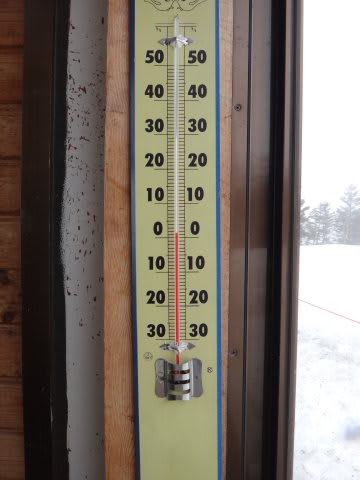

なんとっ！

…この時期にあるまじき，朝イチからプラス気温(涙)．

とりあえず．

朝イチはきれいな圧雪バーンなんですが…

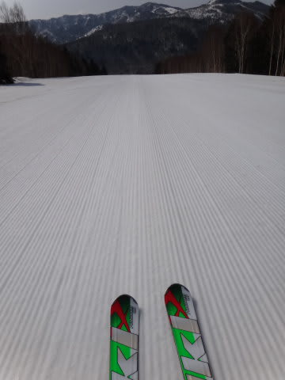

なんだか．

すでに朝イチから，雪はかなりやわらかいんですけど…(涙）．

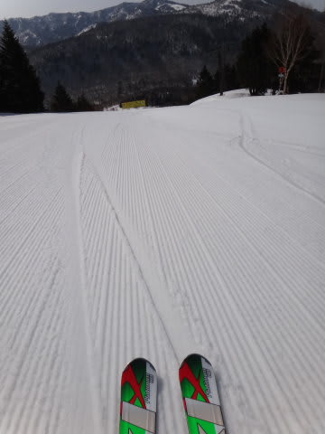

そして，非圧雪部分は茶色い雪だし…

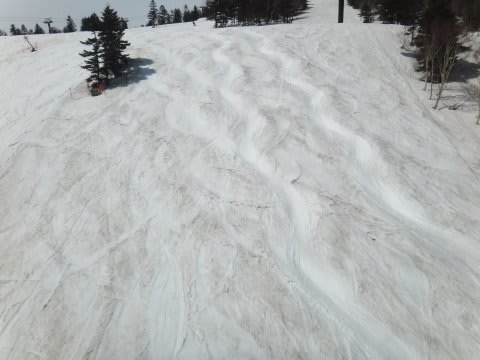

ま，まだ3月なんですけど…(泣）．

…朝イチは山頂にかかっていた雲も，オープンの直後には晴れてくれて．

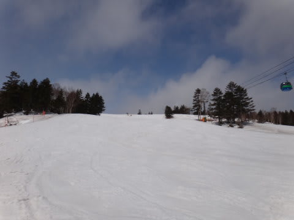

眼下に見事な雲海が見えるという，すばらしいコンディションだったけど…

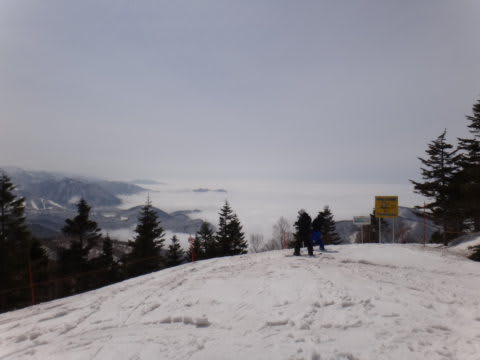

でも．なんだか，雪が茶色いんですが(涙)．

ということで．

朝からプラス気温だったゲレンデは，当然やわらかい雪が掘り返されて…

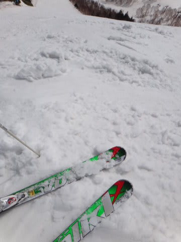

すぐにぼこぼこになって行きます．

…

いうまでもなく．

雪は，かなり重いです．

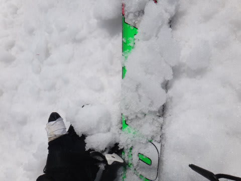

これは，4月並みの雪ですね…

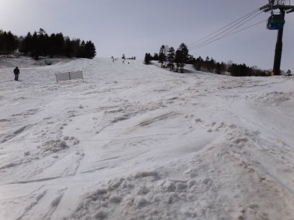

昼間の気温は山頂でも10度近くまで上がり，暑いくらい…

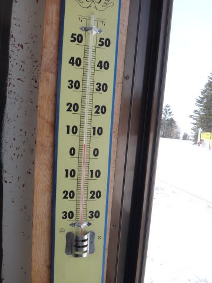

っつーか，滑ってるとホントに暑いです．

せめてもの救いは．

平日だったから人が少なくて．

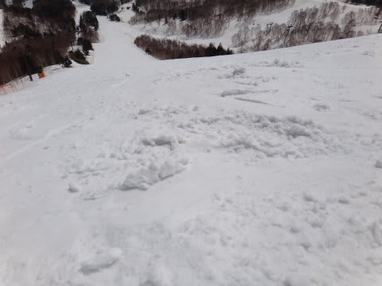

雪がこんなだったにもかかわらず…

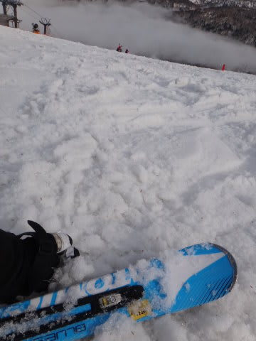

ゲレンデがどうしようもないぼこぼこにまではならず，

比較的フラットだったことでしょうか…

(緩斜面はリフトストップ時でこの程度）

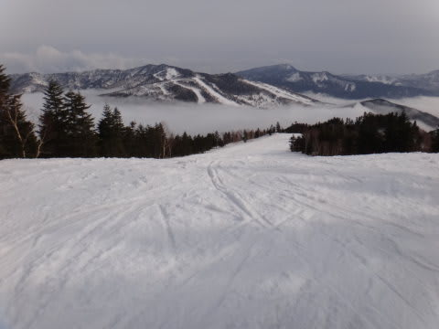

おかげさまで，春の異常に重い雪の割には，体力を消耗しなかったですねー．

うーん．

しかし．

土日は，人が多いだろうからすごい凸凹になっちゃって．

むちゃくちゃ体力を消耗するゲレンデコンディションになりそうな予感…．

さすがまだ3月だから，コース上はたっぷり雪が残ってるけど．

例年より半月くらい雪の減り方が早い気が…

果たして，GWまで雪がもってくれるのかっ？？

PS.道路はもう，完全にドライです…

今日は完全に夏タイヤでも突っ切れるレベルでした．

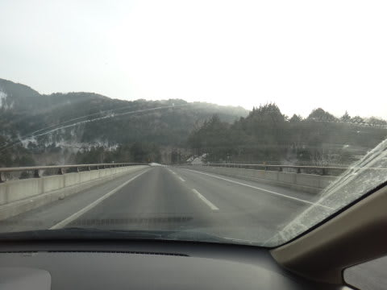

＃何があるか分からないので，夏タイヤで行くことはお勧めしませんが…(汗）．

## 💬 コメント一覧

### 💬 コメント by (ゆうこ)
**タイトル**: 羨ましいです。
**投稿日**: 2013-03-30 09:48:13

平日スキー羨ましいです。

私はコンクリートジャングル東京で、花粉に悩まされてました。

すごい勢いで雪が消えてくようで、GW後半にスキーの予定を入れてる私は心配です。

GWより前のスキーの予定は、未定なんです。

4月は雪が降るよう祈りながら生活します。

### 💬 コメント by (gokuraku　skier)
**タイトル**: Unknown
**投稿日**: 2013-03-30 20:25:22

私も来年はいっぱい平日休んで行っちゃうぞ。

### 💬 コメント by (Skier_S)
**タイトル**: この週末は滑らず…
**投稿日**: 2013-03-31 19:02:35

>ゆうこさま

ゆうこさんはしょっちゅう平日スキーをされていたのでは…(笑）．

私も花粉に悩まされてます(涙）．

うーん．

この4月，冷えひえでGWまで雪がもってくれることを

期待！

>gokuraku skierさま

私も来年はいっぱい休みたいですが…

そこは仕事の都合なので，どうやることやら…

