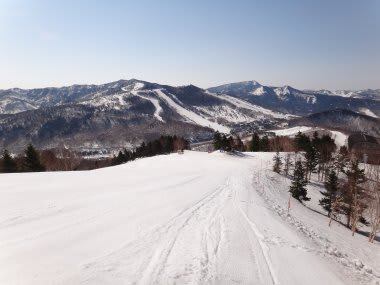
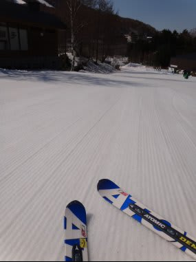
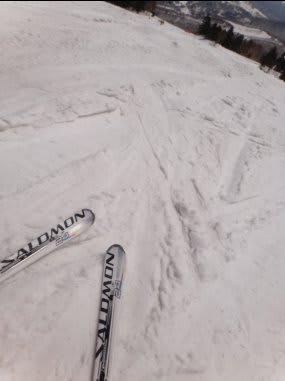
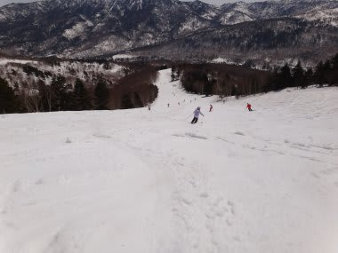
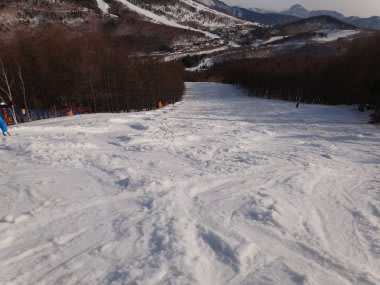

# 4月21日土曜日の志賀高原は…

📅 投稿日時: 2012-04-21 21:45:18

今日，土曜日の志賀高原ですが…

終日快晴！

一日晴天．

最高の春スキー日よりでしたね～．

それでいて，スキーが張り付く雪にならなかったのが

すばらしい．

気温自体は結構高かったんですけど，汚れも浮いてこず，

結構すべる雪でしたね～．

とりあえず．

焼額で朝6時半からやっている早朝スキーはシマシマ！

しっかりと固まった，スピードが出る固いバーンです．

もう，最高．幸せ．

これだけでこの日来たかいがあった…

って感じ．

で．通常営業の8時半からは．

一気に雪が緩み始め．

9時過ぎにはざぶざぶした感じの雪になり，

一気に荒れ始めてきましたが．

それでも板が結構すべる雪で，

この時期に現れる

「妖怪板つかみ」に板をとられることもなく，

気持ちよく太陽の下すべることができました．

気温は比較的高かったですね～．

暑い，ってほどじゃないけど．Tシャツの上にウェアを着るか，

アンダーウェア着た上でミドルウェア着とけば十分．

夕方になると，結構でこぼこした荒れ雪になってくるけど，

まだ雪は白く．

量もたっぷり．

コース上，土はまったく出てきてません．焼額や一の瀬エリアは，

100％コースは雪に覆われています．

GWはぜんぜん余裕です．まだまだ楽しめますね～

志賀高原は．

道路も，もう完全ドライです…

念のため，スタッドレスをはいておくに越したことはないけど．

今日は凍結や積雪はまったくなしでした．

でも．

明日は昼前くらいから雨になりそうだなぁ．

今日は十分満喫できたから，明日は早朝と午前滑れれば

満足かな．
