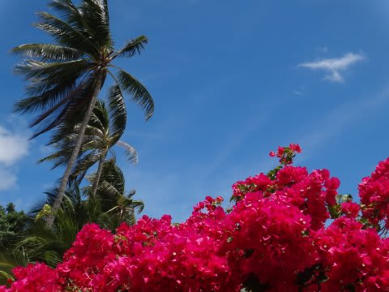
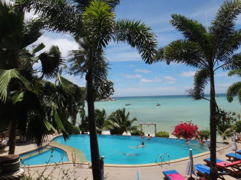
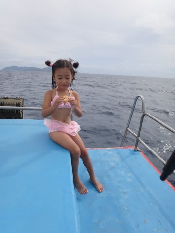
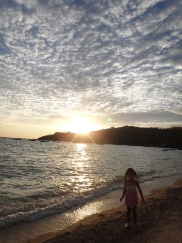
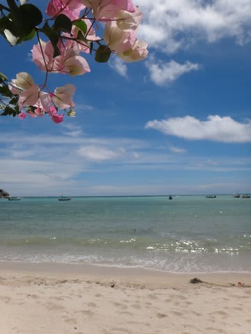
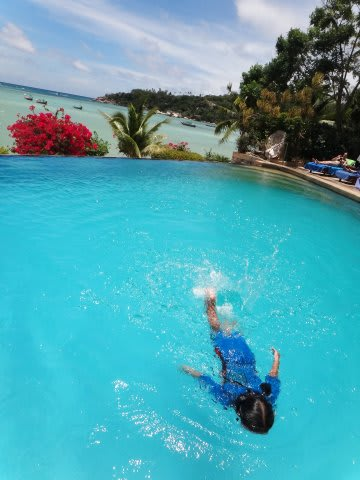
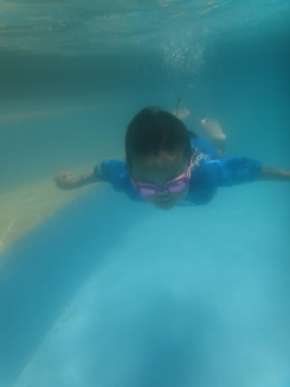
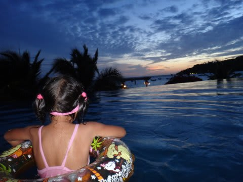

# 2013年9月　子連れタイ・タオ島ダイビング旅行記　エピローグ

📅 投稿日時: 2013-12-20 01:52:54

うむ．

やはり，本日の昼間．

志賀高原でも結構気温が上がったみたいですが．

きわどいところ，雨になることはなかったようで…(一安心)

で．

今晩から，かなりの寒気が入るので．

また，3連休に向かってそこそこの積雪になりそう．

…[前の予想](e4dbc13a60adee9d40fc3822d725ecc29.md)では，雪のピークは20，21日で．

22，23日はそんなに降らないかな～…

って，言っていたけど．

今の天気図では，20，21日もそこそこ降るものの．

22日が雪のピークですな．

22日は，終日ドサドサ積もりそう…

23日朝は，深雪パウダーか？

とりあえず．

この3連休．

毎日そこそこの新雪が積もってくれそうで．

期待大です！

…って，前フリをしたところで．

「え？まだ終わってなかったの？」

って突っ込みたくなる人はいっぱいいると思いますが．

子連れタオ島ダイビング旅行記のエピローグが，続くのだ…

---

というわけで．

今回．

妻の

『突発性ジンベエを見たくてガマンできない病』

の治癒のため．

…わざわざタイくんだりまで行ったわけですが．

海況の悪さのため，20本中わずか3本しか

外洋をもぐることが出来なかった…

という，条件の悪さもあり．

残念ながら，今回はジンベエ様を拝むことができず．

そして，妻の病気は治らずじまい…

帰国後も．

妻の，

「じんべぇ…じんべぇ…」

というつぶやきは，当然治ることもなく．

そうして過ごした，数日後．

妻「11月に，3連休あるね～」

私「…あるねぇ」

妻「…一日休んで4日間休みにすれば…」

私「すれば…？」

妻「…ジンベエ，見にいけるんだけど…」

私「ぶふぉ！」

妻「…いいでしょ，誕生日プレゼントにっ！！

　ジンベエ，ジンベエ見たいっ！！！！！

　（病気発症中)」

私「数日前，タイから帰ってきたばかりでしょ！

　いったい何を…」

妻(うつろな目で）「じんべぇ…じんべぇ…」

私　(こ．これは…

　　この病気を早く治癒しないと，

　　我が家の家庭が崩壊しかねない…）

ということで．

家庭崩壊の危機を避けるため．

私にとっては本来，スキーシーズンである11月に．

再びジンベエにチャレンジすることが決まったのだった…

→そして11月のダイビング旅行記へ…続く．

## 💬 コメント一覧

### 💬 コメント by (KENKEN)
**タイトル**: ジンベエ残念でしたね
**投稿日**: 2013-12-21 00:13:03

自然相手のレジャーなので

こればかりは仕方ないのですが、

わざわざタオまで行っての結果だと忸怩たるものがありますね。

過去パラオで同じような目にあった記憶がります。(ほとんど内海ばかりでした。）

そうですか、この流れでリロアンだったのですか。

リロアンレポートも長く(忘れられて)掛りそうですが、ジンベエ報告楽しみにしています。

しかし娘さんウェットを着ているとは言え泳力は凄いですね。

我が家も明日今シーズン初スキーです。

自分の板で滑るのは数年振りです。

楽しみですが、今日は西日本の山陰側も結構雪らしいので

車(2WD FF+格安スタットレス)の運転が不安です。

無事帰ってこれるよう安全第一で行ってきます。

### 💬 コメント by (Skier_S)
**タイトル**: やっぱり自然相手ですから…
**投稿日**: 2013-12-21 21:37:58

モルジブクルーズでも，3日間探し続けて

ジンベエを外したことがありますし，

こればかりはホントに自然相手ですからね～．

…ってことで．

また，フィリピンダイビングレポートをお楽しみに！

(連載終了に，いつごろまでかかるだろうか…)

志賀高原は，すさまじい雪が降っています．

気をつけて雪道運転してきてくださいね！

