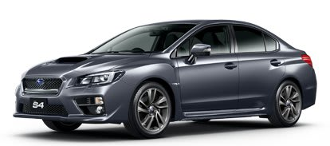

# スバル WRX S4に乗ってみた…試乗インプレッション

📅 投稿日時: 2014-09-05 00:23:03

ってことで．

先日予告したように，スバルの新型車，

WRX S4に試乗してきましたので．

本日は，その試乗レポートをば…

今回のWRX.

エンジンが最新の2L DITのFAで，リニアトロニックCVTのWRX S4と，

エンジンが旧型2LのEJで，6速マニュアルのWRX STIの，

2種類あるわけですが．

…さすがにSTIの試乗車は出ず，

今回はS4の試乗となりました．

で，今回試乗したグレードは，2.0GT Eyesight．

ビルシュタインダンバーのGT-Sの試乗車が

無かったのが残念…

（スバルHPより）

まず，運転席に乗ってみたところ．

内装も，一部カーボン調パネルなど使ってみたものの，

ほぼLEVORGそのままです…

スピードメータが280kmまであるのが，せめてもの違いか？

うーむ．

350万越えの車とすると，内装はもう少し頑張れ！

といった感じか．

シートは，GTグレードでもLEVORGのGT-Sと

ほぼ同じ，サポートの強い形状になってますね～．

で．

とりあえず，走ってみましょうか～．

ということで，アクセルを踏んでみますが…

「うむ！？？」

動き出すタイヤのひと転がりから，

LEVORGとの違いが分かる！！

かなり滑らかに動き出します．

コンポーネンツはLEVORGと共通じゃないのかっ！？

…これは，かなりよくできてる…．

ステアフィールは，レガシィと比べると

1-2次元違う感じ．

かなりステアリング系の剛性アップ，

ラック周りの取り付け剛性アップが

なされているのか？

ストラットのアッパーマウントベアリングなど，

各所のフリクションをかなり減らしたのか？

LEVORGよりずっといいステアフィール．

余計なガタやフリクション感がなくて，

いろんなところがたわんでからフロントタイヤが

切れ始めるのではなく，

わずかなステアリング量も

切っただけただちに正確にフロントが動く感じ．

…で．スポーツ車なら，ステアリングギア比を

過剰にクイックにして，クイックさを演出したくなるところ．

…そこは過剰なクイック感をもたせず，

直進を保持するのに疲れてしまうようなこともなく．

＃昔は，異常にステアリングギア比がクイックだけど，

＃操作に対する時間遅れが大きく，過剰操作に陥る

＃ダメな車もあったものだ…

素直に愚直に，ステアリングに対する

フロントタイヤのレスポンスの早さで

勝負している感じ…

そして，足回りは…

GT-Sではない，普通のGTグレードだけど．

絶賛．

トヨタ車よりは，路面の継ぎ目やうねりを

伝えるけど．

突き上げのカドは取れてるし．

ロードノイズも低め．

驚いたのは，コーナーを攻めた時の

ロールの少なさ．

フロントタイヤのコーナリングフォースが立ち上がってから，

ロールが始まる…！

と，身構えても．

全くロールせず，そのままコーナーを抜けていきます．

サスペンションは比較的しっかり気味といえども．

ガンガンに締め上げたサスでもなく．

ばねレートもそこまで高いと思わないのに．

全くロールしてないんじゃないか？と思うほどの

ロールの少なさ．

普通，ロールを抑え気味のサスセッティングをすると，

外輪だけで車を支える形になるので，

突っ張った外側のタイヤに一気に荷重が移ってしまい，

簡単にブレークする車になっちゃうけど．

＃ロールセンターを異常に高くセッティングした車が陥る現象

この車，フラットライドなのに．

アウト側のグリップにすごい余裕を感じる…

右，左の切り返しをしても，レガシィのように，

ゆっさりゆっさりとしたロールの戻りの遅れ感による

グリップ立ち上がりのディレイも感じず．

全くロールしないまままっすぐ抜けていくように

感じる…

それなのに，外足の妙なツッパリ感がない！

乗り心地から感じるばねレートで想定される

ロール量より，ずーーーっとロールが少ない…

うーむ．

でも，LEVORGだと，ここまでロールの抑えられ感はなかったけど…

セダンボディ，重心が低いから？

それとも，LEVORGよりも極太のスタビでガッツリ抑えている？

で．リアのトーインが強いのか？

＃横Gに対するコンプライアンスでのトーイン感ではなかったので，

＃バンプトーインを大きくしている？

リアタイヤのCF(コーナリングフォース）が大きい感じで，

リアスタビリティが高く感じます．

あるいは，ワゴンボディじゃなく，リアの軽いセダン

ボディってのが効いてるのかな？

…車重はLEVORGとほとんど変わらないはずなんだけどなぁ…？？

何にしろ，妙に締め上げて，ガタガタゆすられるような

スパルタンな足回りでもないのに．

コーナーを抜けると，かっちりした感じを受ける車．

おそらく，最初にWRXに乗った人は，足の柔らかさに

「あれ？こんな街乗り車になっちゃったの？」

って期待外れに思うかもしれないけど．

これだけ低いばねレートでは想定つかないロールの

少なさ．

うーむ．

普通のGTでこれだけよくできた足って…

GT-S，要らんのでは？

…でも，足回りは，基本的にLEVORGと同じはず

なんだけどなぁ…

LEVORGと全く違う走り．

エンジンも．

微小アクセル領域でドカンと出ることもなく．

普通に街乗りしていると，

アクセルに対してリニアにパワーが出ます．

アクセルと出力のリニアリティが高くなった感じ．

アクセルを踏み込んで→踏み込みすぎたので戻す，

とか，踏み足りなくて踏み足す，ということがなく．

街乗り領域では，一発で狙った加速度が出せます．

＃微小アクセル領域での，アクセルと加速度の

＃リニアリティが低いところがBRレガシィの

＃欠点だったりする…

初めてリニアトロニックを使ったレガシィに比べて，

CVTとのマッチングがさらに熟成されてきたか？

で．

アクセルを一旦踏み込むと．

ははははは．

良く走るわ．

これは，免許がいくつあっても足りんな．

ブレーキフィールは…

これは，まぁ軽い山道を走った程度では，

LEVORGとそれほど差は感じなかったかな．

エンジンノイズもロードノイズもかなり

抑えられてて．

BRレガシィより，ずっといい仕上がり．

ってことで．

サスの硬さもスパルタンではなく，

エンジン音もすごく穏やかなので．

「あれ？普通の車だ…」

とおもうのに．

そこそこのスピードでコーナーを曲がると，

「なんだ？これはっ！！？」

と思わせる，WRX S4．

これは…

コーナーが続く道を，いつまでも走り続けたくなる

車だわ…

家族でスキーに行くために，ワゴンじゃないといけない

縛りが無かったら…

LEVORGより，WRXだな～！！！

＃だんだんスバルにはまっていっている…
