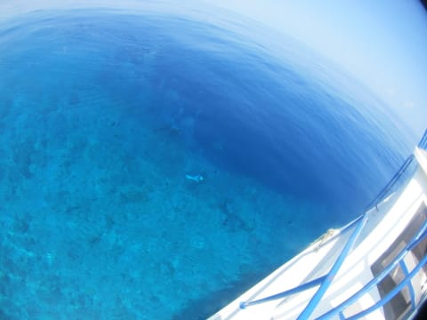

# 2014年10月，小学生の子連れでパラオへダイビングに行ってみた，その13…ブルーコーナーでお留守番

📅 投稿日時: 2015-08-14 01:34:15

🏷️ カテゴリ: [ダイビング日記](ce3a7a8d424d112fce83ee85c81a0e344.md)

という感じで．

泳ぎたい未練たっぷりで，海を眺め続けていた娘だけど．

いや，それにしても．

さすがブルーコーナー．

魚も多いし．

透明度も良くて，潜ってるダイバーが船の上から

見えてるんですけど…

船の上からでも，魚がいっぱい泳いでるのが見えるし．

…と，思っていたところ．

娘「あ，サメ！」

ふーむ．

いつもコーナーの先端でぐるぐるしている，グレイリーフシャーク．

船の上からも，見えるんだなぁ…

まぁ，サメも出るような，こんな海だし．

泳ぐのは無理だよ，娘…

ってことだけど．

まだ，泳ぐのを諦めきれないらしい娘．

ちょっとは泳いだ気分っぽくなるよう，

ラダーから海に足をつけていましたが．

私も水に足をつけてみたところ．

私「うおおお！なんだ！これは！

　流れてるっ！すごい流れてるよっ！」

ラダーから水中におろした足に，結構な水圧を感じるほどの

流れが…

いや，死ぬ．

ここで泳いだら，かなりの確率で死ねる．

＃ブルーコーナーでのシュノーケリングツアーがあるらしいけど…

＃潮止まりをねらうのかな？？そうじゃないと，絶対死ぬ．

…そうこうしているうちに，ダイバーが戻ってきました…

久しぶりに，子供が生まれてから初めて，

念願のブルーコーナーに潜れた妻は，かなり嬉しそう．

妻「良かったよ～！ブルーコーナー！久しぶりに潜ったけど，

　　やっぱりいいねっ！！」

私「…そうですか…」

　（ブルーコーナー潜れて，いいなぁ…）←ここは心の中で叫んでおくけど，ぐっと飲み込み声に出さないところ

って感じで．

船の上からきれいなブルーコーナーの水面を眺めるだけで，

今日はまだ泳いでない娘にとっては「泳ぎたい～っ！！」

ブルーコーナー大好きな私にとっては「潜りたい～っ！！」

という感じの．

娘も私も欲求不満がたまる，一本目のお留守番だったのでした．
