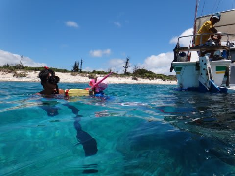
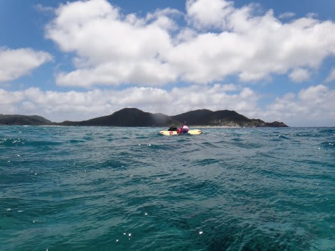
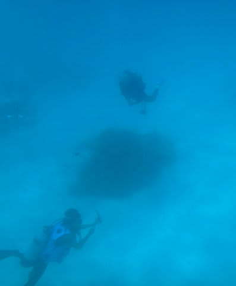
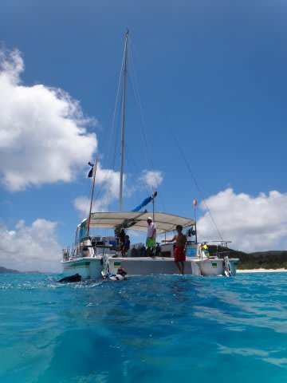
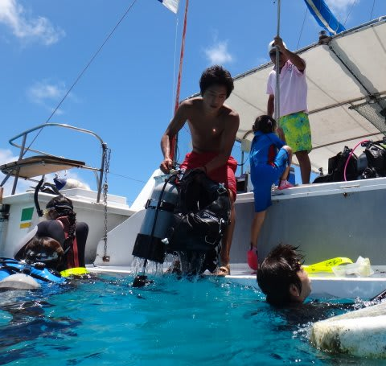
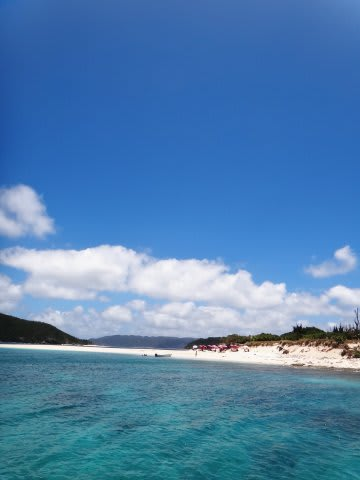
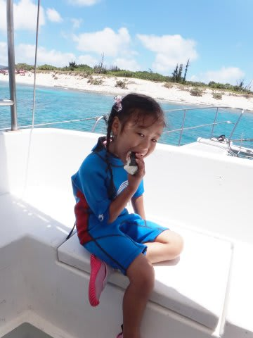
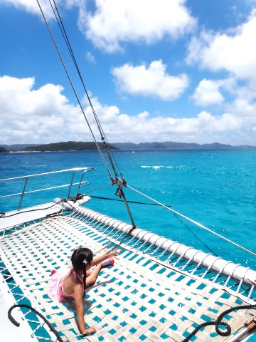

# 2013年7月　子連れ座間味ダイビング旅行記その5…娘とシュノーケリング

📅 投稿日時: 2013-07-26 00:14:22

ということで．

娘はシーズン初のシュノーケリングへチャレンジ！

最初は恐る恐るフロートにつかまって，

様子見していた娘ですが…

まず最初は，フロートから2m離れたところまで泳がせて．

次は3m，

そして4m…

と，徐々に離れたところまで泳がせてみると．

最初はちょっと恐かったのか，あまりフロートから

離れなかった娘ですが．

20分も経ったころには．

だんだんと泳ぎを思い出してきたのか．

シュノーケルで浮かんだまま波間に漂ったり，

ぼちぼち自由に泳ぎまわるようになって来ました…

こーんな感じで．そこそこ波があったんですけどね～．

まぁ，ライフジャケットをつけてますし，

娘にとっては余裕かな．

…って感じで．

娘が初シュノーケリングの感覚を思い出している間に，

ダイビングに行っていた妻がボートの下まで戻ってきて…

ダイビングを終えて，ボートに戻ってきました．

ってことで，娘も船に上がり，一旦水泳終了です．

って感じで．

午前のダイビング＆水泳タイムが終わったので．

お昼ごはんタイム！

船を景色のいい，波の穏やかなところに動かして…

我が家族で貸切のボートで，お昼ごはんです．

いい景色を見ながらのご飯．なんてゼイタクなんでしょう…

そして．

ご飯の後は，お昼寝タイム…

…うむ．

ゼイタクなことよのう…．
