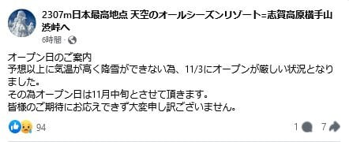
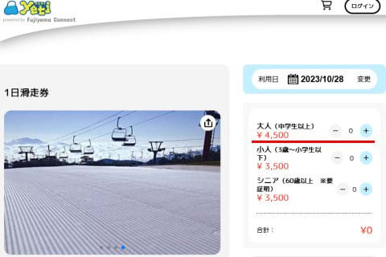
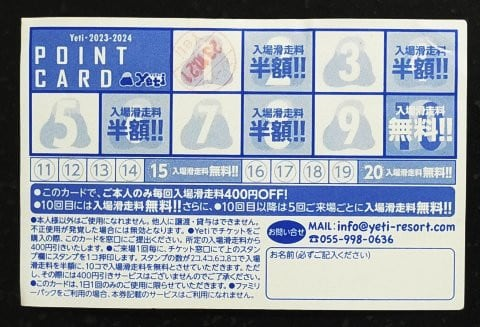
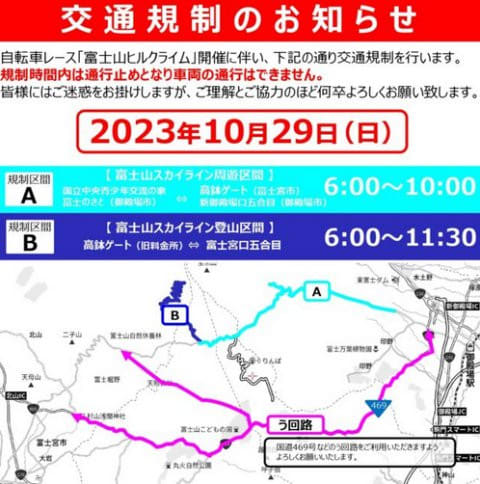

# イエティのリフト券，事前購入が500円引きだけど2回以上行くならメルマガ会員がお得！

📅 投稿日時: 2023-10-28 01:46:48

ってなことで．

睡眠不足ながらも，明日もイエティに行く

予定ですが…

眠い…本当に眠い．

そして週末に宿題があるので，

ホントに明日イエティに滑りに行って

大丈夫なのか？？？

…と，心配になりながらも．

滑りに行かないのと死ぬので…

とりあえず．

滑っても死ぬし，滑らなくても死ぬなら

滑りに行こう

と思った，

Skier_Sです．

いや…でもこの状態で滑りに行ったら

ホントに死ぬかも…

…と，昨シーズンも何度も思ったけど．

スキー場に行くと，疲れてるの忘れるん

ですよね～←それ，ヤバいから

で．

[昨日の記事](e92573cd7350c246b95367f71dd3db947.md)で．

横手山の11月3日オープンは無理では？

と書きましたが．

本日．

横手山のFacebookを見てみると…

11月3日のオープン予定は延期となり，

11月中旬オープンとなってました…

（[横手山Facebook](https://www.facebook.com/yokoteyama2307/)より）

やっぱりな…という感じですが．

11月上旬すらあきらめて，中旬ですか…

11月10日以降に延びたということですね…

ってなことで，本題へ．

えー．

イエティの土日のリフト券，

5000円に値上がりしましたが…

今年から始まったWebの事前購入では，

500円割引の4500円で買えるようになり

ました～！

（[Yeti1日滑走券事前購入ページ](https://www.fujiyamaconnect.jp/tenant/32/product/yeti-001/)より）

で．

前売りWebチケットの500円引きに対し，

メルマガ会員が400円引きなので，

一見前売りWebチケットがお得に見えますが…

メルマガ会員では，2，4，6，8回目が半額，

10回目が無料になるので…

実は2回以上Yetiに行くなら，メルマガ会員が

圧倒的にお得です！

（メルマガ会員がもらえるポイントカード）

2回以上イエティに行こうと思う人は，

前売りWebチケットではなく，イエティの

ホームページからメルマガ会員登録をしましょう．

メルマガ会員になれば，Webページで

表示できるメルマガ会員QRコードを

シーズン最初にリフト券を買うときに

見せれば，このポイントカードがもらえます～！

ってなことで．

明日もイエティに滑りに行くわけですが．

この週末のイエティの天気は…

28日（土）：曇り～晴れ，運が悪いと

　午後ぱらぱらと雨が降るタイミングも．

　気温はこの時期としては平均的．

　昼間は日が差すと暖かく感じるが，

　日がかげるとちょっと寒さを感じる．

29日（日）：晴れ時々曇り．この日も運が悪いと

　一瞬雨がぱらつくかも…

　気温は土曜よりわずかに低め．

ってな感じでしょうか．

ちなみに，日曜にイエティに行く方は，

御殿場からイエティの有料道路の上側に

抜ける富士山スカイラインが

日曜朝6時から10時まで通行止め

なので，ご注意を！

（[富士山ヒルクライム交通規制情報](https://www.tour-de-nippon.jp/series/fujisanhc/kisei/)ページより）

ってなことで．

これから睡眠時間4時間でイエティへ出発

です～！！（4時間も寝られる！と思う自分はヤバい）

## 💬 コメント一覧

### 💬 コメント by (カンタロス)
**タイトル**: Unknown
**投稿日**: 2023-10-28 08:16:06

Ｓさま、こんにちは。

相変わらずな詳細情報ありがとうございます!

2回目で半額、知りませんでした。

リフト券定価値上げはしたものの、ある意味実質値下げなんじゃ…？

とか思ってしまいます。

他のスキー場が値上げラッシュなので、リピーターへの還元を全面に押し出してリピート率、集客アップをはかる経営戦略なのかな?

ポイントカードも偶数回行こう!と思わせる作りですし、経営努力がすごいですね。

ゲレンデレポートもお待ちしております。

### 💬 コメント by (Skier_S)
**タイトル**: ＞カンタロスさま
**投稿日**: 2023-10-29 01:37:13

偶数回で半額になること，ホームページとかでもっと宣伝すればいい気がするんですが…

そうすると，もっと来る人が増えるんじゃないかな？？

Yetiは結構営業努力してますね…

某志賀高原中央エリアは見習ってほしいなぁ…（全然「某」になってない）

