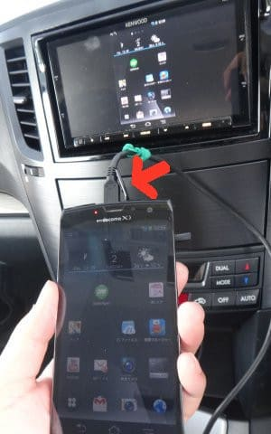

# なんと！BRレガシィ君のナビのMHLケーブルが断線？？…とりあえず交換してみましょうか

📅 投稿日時: 2017-07-25 01:03:12

🏷️ カテゴリ: [車](cba0e8330b3f2ded7c1addfacc75d4547.md)

どうやら．

[20万円ちょっとの価値しかないらしい，我がBRレガシィ君](ebbdfac4fe15e7e06f42e85ab22c73028.md)．

SALOMON X-RACE SWとATOMIC S9iの2セットの方が，

私のBRレガシィ君より高いということを知って，

ショックを受けている今日この頃ですが．

今のところ，無故障で気持ちよく走ってくれているし．

[スタッドレスももう1シーズンもちそう](e055b5b744b654941d93c40de1fad1b0b.md)なので．

あと1年，次の車検までは元気に走ってもらいましょう…

と，思っていた先日．

いつも通り，ナビにつながっているMHLケーブルを

スマホに差して，スマホの音楽を聴こうと思ったところ…

ナビにMHLケーブルをつないでも，ナビがスマホを認識

しないのですがっ！？？

いや，このナビ．

MHL対応のスマホを繋ぐと，スマホ画像がそのまま見れるとか，

対応アプリを入れれば，一部アプリで

ナビからスマホを操作できるとか．

[そういう便利な機能](e77372286f63d3c7349bdd76792726f78.md)があったので，

重宝して使っていたのですが…

まぁ，MHLに対応するスマホが絶滅してしまった今となっては．

こんな機能を使ってる人は，ほとんどいないんでしょうけど…

4年物という，ほぼ化石化しつつある

スマホを愛用している私としては，

充電しながらスマホの動画を見ることが

できるってのは結構便利なので．

この機能が使えなくなるのは痛い…っ！！

しかし…

一体何が壊れているのかな？

…と，いろいろ触ってみたところ．

このコネクタの付け根部分のケーブルを触ると，

接続が回復したり切れたり…を

繰り返すので．

どうも，4年間抜き差しを繰り返した

このコネクタの付け根部分が接触不良を起こして

いるようですね～．

…修理に出すとかなりお金をとられそうなので．

とりあえず，自力でMHLケーブルを交換して

みましょうか…

と，思ったけど．

このケーブル．

ナビ本体に直差しなので，

このケーブルを交換しようと思ったら．

ナビを取り出して，ナビ本体後ろ側のコネクタから

このケーブルを抜いて，そこに新しいケーブルを

差し替えないと交換できないじゃないですか…！？

うーむ．

ナビ本体の取り外しか…

めんどくさそうだけど．

ナビのケーブル類は全部外さなくても，

ナビ後ろ側にアクセスできりゃいいんだから．

何とかなるだろう…

ということで．

ナビ本体後ろ側にアクセスしての，

MHLケーブル繋ぎ替え作業に取り掛かることにしました～！

で．

MHLケーブルなんですが．

秋葉原の安売り店を探してみたけど．

さすがにMHL対応スマホが絶滅した現在．

商品回転が早い秋葉原の激安店では，

怪しげな安いケーブルは売ってませんね…（残念）．

＃売ってるのは，マイクロHDMIケーブルばっかり…

だもんで．

泣く泣く量販店にて，かなり高いMHLケーブルを

購入してきました…

とりあえず．

1mじゃ短いので．

1.5mあれば足りるかな…

ということで，1.5mのケーブルを買ってきましたが．

うーむ．

秋葉原で500円くらいで買えないかな…と思っていたのに．

こんなケーブルに1500円近く払うことになろうとは（涙）

…これでケーブル断線が原因じゃなかったら，

ちょっと痛い…

とりあえず．

ケーブルが準備できたので．

さっそく，ナビの取り外しにかかりましょうか…

（続く）

## 💬 コメント一覧

### 💬 コメント by (しんちゃん)
**タイトル**: マメですねぇ
**投稿日**: 2017-07-25 22:00:27

自力で修理するなんて、マメですねぇ。

車に何かあったら、すぐにディーラーに頼んでしまいます。(泣)

### 💬 コメント by (Skier_S)
**タイトル**: しんちゃんさま
**投稿日**: 2017-07-26 02:13:42

いや…マメというより．

貧乏なので，余計な修理費を

かけたくないだけです(笑)．

