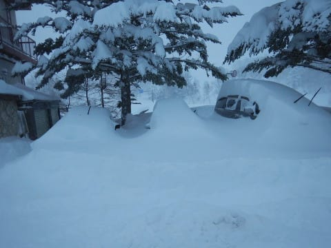
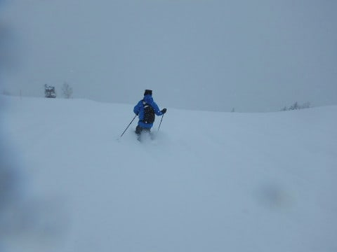
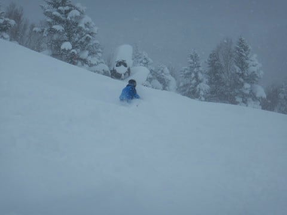
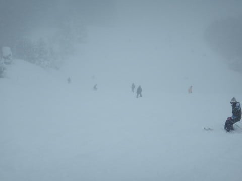
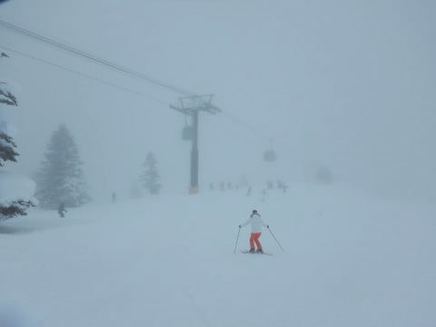
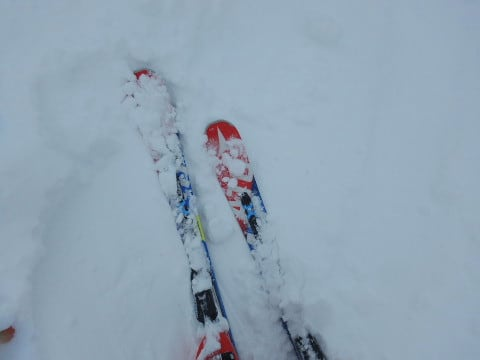
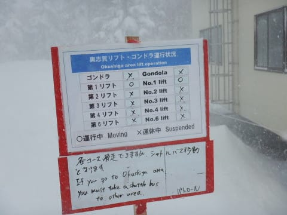
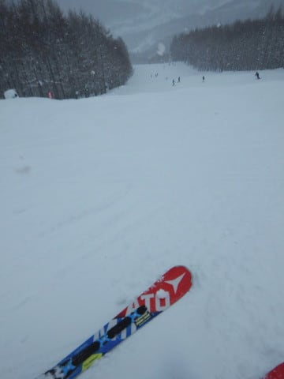
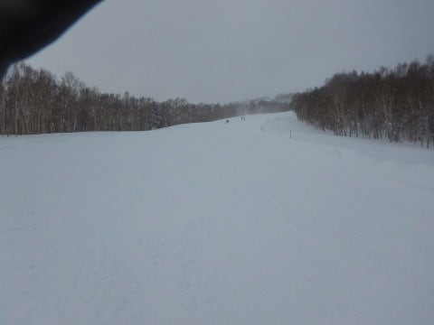
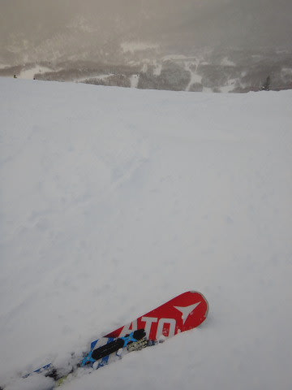

# 2019/1/27(日)の志賀高原スキー場の速報モード…むちゃくちゃ積もったよ！朝は太ももパフ！午前は吹雪気味だったけど，午後は回復傾向

📅 投稿日時: 2019-01-28 01:43:44

ということで．

本日も最終リフトまで滑ってしまい．

その後の帰路に，温泉に寄って．

さらに中野のスーパーとホームセンターで

買い物して（我が家の買い物は，家の近辺より

中野で買い物すませていることが多い気がする…)，

そして夕食…と過ごしたので．

信州中野インターに乗ったのが8時過ぎ（涙）

そして，いつも通り帰宅時に洗車したり，

スキー道具を片付けたり…

としていると．

もうこんな時間じゃないか（泣）．

だもんで．

今日も，日曜深夜恒例．

速報モードにて…

とりあえず．

土曜日は，

お祓いを受けなくてはならないレベルの

不幸にみまわれた一日だったわけですが．．

さて．今日はどんな感じかな…

と．

宿を出ると．

…車，埋まってますね（涙）

積雪は60cm以上あるな，こりゃ…

車を必死に発掘して，あさイチパウダーを

目指すべく．急ぎ焼額に向かうけど．

焼額は，かなりの積雪の影響で．

営業開始は20分遅れの8:50ごろでした…

でも．

それだけの積雪があったということで．

今日のオリンピックは，

太ももパフ！

結構軽い，志賀高原らしいパウダー！

今シーズン初の，完全浮遊感のパウダーだ！

…けれども．

人が多くて．

あっという間に踏み荒らされて

しまいましたが…（涙）

で．

今日の午前中は，かなりの雪で視界も良くなく．

午前中はガンガン雪が降ったので．

圧雪コースも新雪っぽい感じで．

そして．

風もちょっと強めだったので…

奥志賀は第1ペア以外全滅だったようです．

そのほか，高天ヶ原クワッド，西館クワッド，

寺子屋も運休だったようです．

…焼額は，問題なく全リフト動いていたん

ですけどね～．

午後になると，雪は止んで，

まぁまぁ視界も良くなってきて．

そして．

3時を過ぎるころには．

ゲレンデの人も少なくなり…

さらには，うっすらと日もさして，

ゲレンデが見やすくなってきました！

ってな感じで．

夕方近くは結構いい感じのコンディション

だったんですが．

…どうせなら，営業終了間際じゃなく．

もっと早くから良くなってほしかった…

と，強く思ったSkier_Sだったのでした．

とりあえず．

また明日，詳細レポートします～！

## 💬 コメント一覧

### 💬 コメント by (さち)
**タイトル**: Unknown
**投稿日**: 2019-01-28 11:50:00

追い討ちをかけますが、

今日はめちゃめちゃいい天気です(笑)

行ってきます(´▽｀)/

### 💬 コメント by (tomorrow)
**タイトル**: Unknown
**投稿日**: 2019-01-28 18:53:06

はじめまして

26日27日と志賀高原に出没していました。

丸池から東舘で楽しんでいました。

27日は丸池Aコースも膝までの新雪で楽しかったです。

東舘のゴンドラも動いたため、上部の新雪急斜面で新雪に戯れました。

### 💬 コメント by (Skier_S)
**タイトル**: すごいパウダーでした
**投稿日**: 2019-01-29 06:22:13

＞さちさま

うがーーーー！！！

うらやましい…！

ってか．日ごろのおこないが悪いのは，わたしだったなかな（涙）

本気で志賀に移住しようかな…

＞tomorrowさま

はじめまして~！

コメントありがとうございます．

志賀には良くいらっしゃるのですか？？

土日はかなりの新雪でしたね…

次回はぜひ焼額にもお越しください！！

