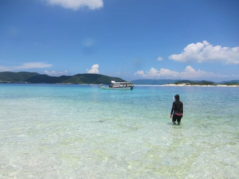
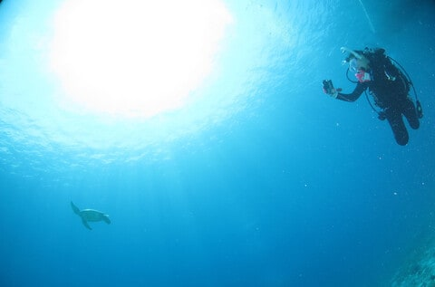
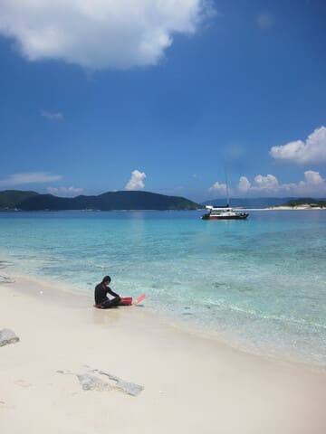
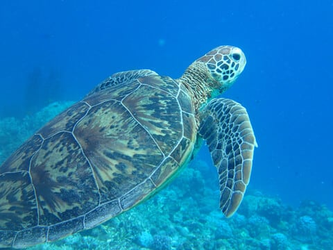

# 2024年8月，今年も座間味で親子ダイビング！…プロローグ

📅 投稿日時: 2024-08-15 06:00:33

ということで．

この8月，山の日がらみの3連休が

あったわけですが…

一応，制度上は「なつやすみ」というものが

あるらしい，私の勤め先．

夏休み時期は飛行機も宿も早めに

埋まってしまうので，いつもGW前には

予約するんだけど…

いつも通り，

「休めるはずだよね…大丈夫だよね…」

と，心配しながらGWごろには宿と飛行機を

抑えたわけですが．

昨年同様，この夏休みも座間味に

行っちゃったら，里帰りしてる暇はないよな…

今年もダイビング旅行に両親を一緒に連れて

行けばいいよね？？

ということで．

なんと．

2年連続，3世代で座間味ダイビング

ということに相成ったのでした…

というか．昨年，

うちの家族のことを良く知っている

ザマミセーリングさんで潜って．

泊まるのもいつもの星砂さんで，

リビング＆ダイニング＆2ベッドルームに

トイレとバス付きの3階を貸切り…

という快適さが，うちの両親から

かなり好評だったこともあり．

今年も座間味に行きたいかという問いに，

速攻でYesという回答が返ってきたので，

今年もうちの両親を含む3世代の5人で

座間味へ繰り出すことにしたのでした…

とりあえず．

娘は今年で高校2年生．

来年は受験生だし，

うちの両親も歳のわりに元気とはいえ，

娘の受験が終わる再来年以降，無事に

ダイビングできるかどうかわからないし．

もしかすると，こうやって3世代で

潜れるのも今回で最後かもしれない…

それどころか．

来年受験が終わっても，娘が大学生に

なっちゃったら，さすがにもうあんまり

父親とは遊びに行ってくれないだろうから，

娘と潜りに行くのも，ヘタをすれば今年が

最後になる可能性が高い！！

…しかし．

昨年の旅行記でも同じようなことを書いたけど．

小学校5年生でCカードとらせたというのに，

コロナのおかげで3年間潜りに行けず．

Cカード取得後に潜りに行けたのは

小6と高1の夏休みの2回のみ．

そして来年はもう受験生で潜りに行けない

というのが残念過ぎる…

という，すごい悔しい思いがあったので．

今年は何があっても，仕事より

家族を優先して絶対仕事を休む

という強い信念で，

座間味旅行へ臨んだのでした…

（実際はやっぱり座間味に行ってるどころじゃ

なくて帰ってきてから泣くことになるのは

また後の話…）

↓おまけ…娘が撮影したカメさん

## 💬 コメント一覧

### 💬 コメント by (ねも)
**タイトル**: Unknown
**投稿日**: 2024-08-31 06:26:00

Ｓさん　お久しぶり！　私も社会復帰しました(と思ったら、のろのろ台風が、苦笑)

ご家族皆さんで南の島に、充実の夏だったことと思います。

書かれていることはほぼそのとおりと思いますが、１点だけ。

親子関係が一番難しいのは、中高生ではないでしょうか？　その時期に仲良しのＳさんちは、これからますます楽しい父娘の間柄になるかと👍

わが家の長女は世間一般どおり(笑)、中高生では家族旅行拒否性でしたが、今はそんなことなく✌️　最近は函館旅行、９年前にはクロアチア旅行しました🛩

### 💬 コメント by (Skier_S)
**タイトル**: >ねもさま
**投稿日**: 2024-09-01 01:56:10

確かに…

普通は娘も高校生になると，早くも親とは疎遠になっちゃうところが多いですね．

でも，私も平日やスキーシーズンの週末はほぼ娘と会話することが無いので，

どこかに遊びに行くか娘に勉強を教える時くらいしか会話しませんが，

まだ一緒に遊びに行ってくれるだけでマシかもしれませんね…

普通はむしろ大人になってからの方が一緒に遊びに行ってくれるのかもしれませんね．

しかし，クロアチア旅行ですか！いいなぁ…

