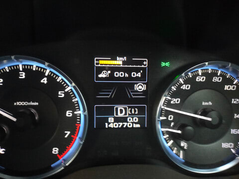

# VMG LEVORG君，6年目突破！…走行距離14万km，まだまだ元気

📅 投稿日時: 2024-07-04 04:09:37

ってなことで．

LAYBACK試乗時にもちらっと書きましたが．

…我がVMG LEVORG君が，この7月で納車

から6年目になるので，12か月点検に

出してきたのですが…

あぁ…[あの日々](edd57949b5ae86a0a208960256cb06e91.md)から早くも6年が経った

わけか…

と，感慨深い思いをしているわけで．

前のBRレガシィ君が，5年で16万km

走って買い替えたのから考えると．

VMG LEVORG君はコロナ禍のせいで，

それより1年長い6年走ったにも関わらず

走行距離は2万km少ない14万km．

まだ走行距離も少ないので，まだまだ

走ってもらわないと…と，

12か月点検に持っていくことにしたの

わけですが．

まぁ，12か月点検なら自分でやっても

良いんですけど，走行14万kmを越えてきて

いるので，まぁ点検ついでにディーラーで

見てもらおうというのと．

Laybackに乗ってみたかったというのと．

オイル交換はディーラーでやるのが一番

安いというのと．

Eyesight周りはディーラーじゃないと

点検できない…

という，いくつかの理由で．

真面目にスバルディーラーに12か月

点検に出してきたのでした…

ってなことで．

まずはディーラーに到着して，担当者に

車を渡した後．

担当さんと，点検内容の確認に入るわけ

ですが…

開口一番，

「14万kmですか！！！走ってますね～！！」

そこで早くも驚かれるのか…

私の周りはもっと走っている人ばっかり

なので，あんまり走っていると思って

ないんですけど…

「6年で14万kmは，うちのディーラーでは

　いませんよ．かなりすごいですよ」

…これは，早く車を買い替えろという

暗にプレッシャーをかけている？？

とりあえず，12か月点検の内容確認に

入るわけですが．

いつも通りの対決が始まるのか…？

と思いきや．

さすがにそろそろ私のことをわかってきた

担当さん．

「Sさんは添加剤もコーティングも

　下回りクリーニングもエアコン洗浄も

　全部要らないって言いますよね…」

…よくわかってらっしゃるじゃないですか．

「いつものエンジンオイル交換以外に

　何かリクエストありますか？」

12万kmでF/RデフオイルもCVTオイルも

換えたし．

エアクリーナーエレメントもまだ交換

推奨距離まで走ってないし，自分で

汚れは取ってるし．

エアコンフィルタも換えてまだ半年だし．

燃料フィルタもまだあと2万kmは換え

なくて大丈夫なはずだし…

…今回はエンジンオイルとオイルフィルター，

あとはクーラントがLレベルに近くなって

たので，それだけ足しておいてください．

ということだけお願いして．

早速点検開始！

その間，私は試乗車のレイバックをしばし

乗り回して．

点検が終わるころに戻ると…

やってきた担当さん．

「すごいですね…とても14万kmには

見えないですね…」

…きれいに乗ってますから．

「エンジンルームも足回りも，

とても14万kmには見えないと，

メカニックが驚いてました」

…そりゃそうでしょう…ムチャクチャ

メンテしてピカピカに磨いてますから．

特に毎週スキー場に行って凍結防止剤を

浴びまくってるので，下回りは特に徹底的に

気を使ってますから…

「14万kmも走ると，ゴムとか劣化する

　部分もあるので注意して見ましたが，

　まだまだ全然大丈夫そうとのことです…」

（買い替えを勧める理由が見当たらなくて，

　ちょっと残念そうだな…）

「バッテリーも元気で，ブレーキなども

　問題なしです．走行距離を考えると

　考えられないいい状態です！

　ブレーキパッドもフロントは6.5mmほど

　残ってました．普通なら2-3万kmの

　走行距離分くらいしか減ってないんですが…

　やっぱりまだ新車から無交換のままですか？」

やっぱりそこが気になるんですね…

いつも通り，新車から無交換です…

「そうですか…6年14万km乗って，

　ここまでブレーキ減らない人は

　見たことないです…」

でしょうね…私も滅多にいないと思います．

「デフオイルもCVTオイルも定期的に

　換えてくださっているので，車の心配は

　全くないです．内装もきれいだし，

　とても14万kmとは思えない

　コンディションですね…」

ってな感じで．

14万kmとしては，どうやら驚きのコンディション

だったらしい我がVMG LEVORG君．

ディーラーの担当の方は，買い替えを勧める

理由が見つからず，残念そうだったけど…

Laybackに乗ってみたものの．

2LのLEVORGの走りも悪くないので，

そこまで急いで買い替えたいという

物欲は刺激されなかったし…

我がVMG LEVORG君．

パワー感も十分で．

E形で熟成された足回りも悪くないし．

私にとっては，アイサイトもツーリング

アシストがあれば十分だし．

それでいて，14万kmの生涯燃費は

リッター13.3㎞と，良くもないけど

300馬力の4WDとすればそこまで

ひどくなくて，無給油で月山往復

950㎞走ってくれるし．

うん．

もうしばらくはVMG LEVORG君を

買い替えなくてもよさそうだな…

うん．

買わないぞ．

LaybackとかLEVORGとか，

まだしばらく買わなくていいはずだな…

と思った，Skier_Sだったのでした．

## 💬 コメント一覧

### 💬 コメント by (1kamakura)
**タイトル**: Unknown
**投稿日**: 2024-07-04 14:17:07

江戸の秋

Sさん、えらい👏

道具を大切に扱っていらっしゃる。

あんなにめちゃくちゃ働いていらっしゃるのに、よくメンテナンスの時間が取れるなーという意味でもすごいと思います。

スバルのレイバック、他人様のブログで見て、いいなーと思いました。

我が家の車はトヨタノア、21歳です😆

車を買い替えるほどの経済的余裕は無いし、問題無く走ってくれるので、まだこのままいきます。

ここまで乗ると、愛着もわいて

ノアちゃん

と、ちゃん付けで呼んでおります🥰

### 💬 コメント by (Skier_S)
**タイトル**: ＞江戸の秋さま
**投稿日**: 2024-07-05 02:54:46

をを！21歳ですか！

大事に乗ってらっしゃいますね…

私はこれまで最長でも7年で車が死んでいたので（大体7年20万km越え），このLEVORGが

最長記録になるかも？

ノアちゃん，これからも大事に乗ってください！

### 💬 コメント by (かめすけ)
**タイトル**: Unknown
**投稿日**: 2024-07-05 05:30:26

はじめまして。

自分は先日、愛車レヴォ爺（VM4）「10万キロ」に達しました。

で、やっとガナドールマフラー（中古）を買いました。

お気持ち良く分かります（笑）

### 💬 コメント by (Skier_S)
**タイトル**: ＞かめすけさま
**投稿日**: 2024-07-06 03:20:58

コメントありがとうございます～！

10万km越えて，まだパーツを換えてもらえるなんて，レヴォ爺さま，大事にされてますね～！！

私も大事に乗っていきますので，引き続きかわいがり続けてやってください…

