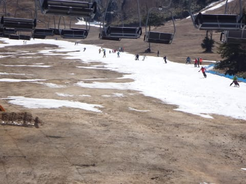

# 4月30日，熊の湯営業最終日一日前のゲレンデは…廊下ゲレンデだけと，先週より良かった気がする

📅 投稿日時: 2016-05-01 01:28:33

🏷️ カテゴリ: [2016スキー滑走日記](c70c67ed5248e9432b899dcd5747048bb.md)

ということで．

明日で，志賀高原のすべての営業が終了となるわけで．

その一日前の本日．

私にとっての，今シーズンラストとなる志賀高原へ

行ってきました…

で．

今日もちと夜が遅いので．

取り急ぎ，写真たっぷり速報モードで…

まず．

昨晩からの冷え込みによる凍結のため，

今朝は，草津越えは通行止めでした

ところどころ，道路が凍結してたので注意…っ！！

そして．

朝は，熊の湯も真っ白っ！

すっきり晴天で，真っ白なんて…

…雪不足の今シーズン，ほとんど

こんな景色は見てない気が…

なぜ，4月になってから…（遅いよ（涙））

で．

ゲレンデは廊下状態ですが…

朝イチはかなり冷え込んで，

下地はカチカチツルツルの氷！

でも．

先週の一の瀬に比べたら…

板も走るし，かなり攻められるし．

天国かも(笑)

午前9時ごろには，周りの薄く積もった雪も融け始め，

人も少なく，ゲレンデもちょうどいい感じで

緩んできましたが…

でも．

9時半を回ってくると…

あらら？

ひとが…

人が増えてきたんですけど（泣）．

そして．

9時半から11時過ぎくらいまでは．

最大5分弱の待ち時間が発生…（涙）

そして．

昼近くまでは，コース真ん中は固い状態が続き，

両脇がちょっと荒れた感じで，

人が多くても結構まともなコンディションで．

いや．

コース幅は狭いけど，写真で見た目より広く感じるし．

先週の一の瀬や高天ヶ原よりマシなのでは？？

…と，思っていたら．

さすがに午後になってくると…

ありゃ．

ありゃりゃ…

でも．

こんなのはコース一部だけで．

基本的に気温がかなり低めだった今日一日．

午後2時すぎくらいには結構凸凹になってきたけど．

その凸凹も，しっかり締まった雪が踏み固められた

感じの凸凹で．

終日，雪はザブザブになることはなく．

意外と板が滑ってくれる，この時期としては

締まり気味の雪が滑れましたね～．

…ってか，完全ストップスノーになってしまった，

今年の3月の焼額よりマシな雪質だったかも？？？

ってことで．

私にとっては今シーズンラストの志賀でしたが．

…廊下とはいえ，コース幅もそこそこキープされ．

気温も低く，ザブザブドボドボになることなく

一日滑ることができ．

…先週に比べればずっとまともなコンディションで，

今シーズンラスト志賀を終えることができたのでした…

そして．

帰りは無事，草津越えが開通してましたよ～！！！

しかし，やっぱり今年は雪が少ないなぁ…

## 💬 コメント一覧

### 💬 コメント by (山さん)
**タイトル**: Unknown
**投稿日**: 2016-05-01 06:04:00

ご一緒していただきありがとうございました。こちらも、無事到着しました。オフ会の話blogでお願いします。倶楽部の人は、見ていると、思います。

### 💬 コメント by (Goku)
**タイトル**: 20000ｍステッカー
**投稿日**: 2016-05-01 13:54:33

今日、２００００ｍステッカーを貼って五竜に行ったら、

『このステッカー、昨日も熊の湯で見ましたよ！』とリフトに乗り合わせた人に声を掛けられました。

どうやら、昨日はゴールドステッカーだったようですが、どなたと乗り合わせたんでしょうかね？

凄い偶然です。

### 💬 コメント by (いか)
**タイトル**: Unknown
**投稿日**: 2016-05-01 21:28:03

今年はどこのスキー場も営業努力がすばらしいですね！

私は滑るのは今日だけの予定だったのですが、八方の強風運休であえなく撃沈でシーズンが終了しました(笑）

そろそろ海に通うシーズンです＾-＾

### 💬 コメント by (Skier_S)
**タイトル**: 明日はかぐら
**投稿日**: 2016-05-01 23:04:08

＞山さん

ご一緒ありがとうございました！

先週の状況から比べれば，かなりマシな

状況で楽しめました～．

また，オフシーズンに20000mクラブメンバー

飲み会やりましょう！

＃でも，どこならみんな集まれるのか…

＞Gokuさま

3セットの板にシールを貼っている私ですら，

まだ一度もステッカーの件で声をかけられた

ことがないというのに…

すごいですね～．

しかし，「それ，なんですか？」

的に声をかけられたんでしょうか？

＞いかさま

今シーズンは，今滑れるのは

「すごい努力をしているスキー場」

のみだから，今滑ると「どこもすごい努力してる…」

って感じですよね～．

八方は，まだ滑れるんじゃないんでしょうか？

でも，これでシーズン終了なんですね…

オフシーズンも，引き続き当ブログをご愛読のほど(笑)

### 💬 コメント by (Goku)
**タイトル**: Unknown
**投稿日**: 2016-05-02 18:46:28

＞しかし，「それ，なんですか？」

おそらくですね、熊の湯で見たときには

『２００００ｍ倶楽部？何だかわからないけどそんなクラブがあるのか？』

と思って、五竜に来たらまたまたステッカーを見つけ

『あれ？また２００００ｍ倶楽部だ！コレはきっと志賀では超有名な、会員数も１００人位いるクラブなのでは？』

と、思って恐る恐る声を掛けてみた。

というのが私的予想。

熊の湯で見かけたステッカーが何の板に貼ってあったのかを聞くのを忘れたため、どなただったのか確認できず残念！

もしかしたらＳさんだったりして(笑)

### 💬 コメント by (Skier_S)
**タイトル**: Gokuさま
**投稿日**: 2016-05-02 23:01:53

でも，私の知ってる範囲では，まだ

このシールを板に貼っている人は

10人いないはず…

うち，今も滑っている人というと…

それで，2回連続で見かけたというのは

すごい確率ですね(笑)

「20000mクラブの始まりは，そもそも

とあるブログで…」

みたいな，成り立ちから説明されたんでしょうか(笑)

