# 今週の志賀高原スキー場は，30日夜から31日にかけて積もる！1日土曜朝は新雪か？そして2日日曜は晴れそう！

📅 投稿日時: 2020-01-29 02:43:24

🏷️ カテゴリ: [スキー天気予想](c6554f5c3c106093b511a8daae23757e8.md)

えー．

いつもなら，水曜深夜が恒例の天気予想なのですが．

雪が異常に少ない今年．

スキーヤーの皆様におかれましては，

普段のこの時期なら全く気にならない，

今週末までに雪が積もるのか

ということが，異常に気になるものと思われます．

だもんで．

天気予想ばかりやっている今シーズン．

今日も懲りずに，天気予想！！

果たして，今週週末までに雪が降るのか？

ゲレンデ状況は良くなるのか…？

というところを，予想してみましょう…

まず．

本日27日（火）の朝の志賀高原ですが．

関東に降雪があったのに．

志賀高原は，積雪が全く無かった

ようです…（泣）

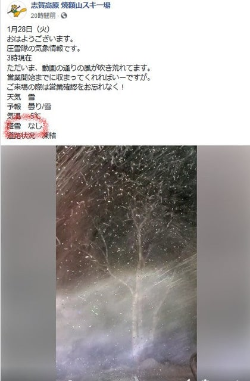

それどころか．強風大荒れの天気で，

ゴンドラどころか，リフトも軒並み

運休だったみたいですね…（涙）

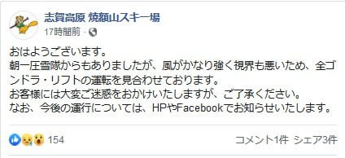

（[焼額山FB](https://www.facebook.com/yakebitaiyama/?hc_ref=ARSqZDIGhcA7crtGlmiL95OxBu4nMSb-3iNvBwwj_CYuo5ViORWDmHlztsCskfgwvMI&fref=nf&__xts__[0]=68.ARCiCaOFuTlJ08R5eo_lqPVJxjh4FjfRgF2tFAZTxXjSrurvwgJLEgYjOwh3I9XHY3-kbw5S-bf3yQvk13s11WxmuSJ8fNJUTnmhlhIHBGrh0vPFls3I8PWjAHVdV5_Y6_9h8h3V8foFG-X65g-XD5FbWuZ2ct9bwhPHIbCS2zIIk4V7mXBvgABtuP_tuQK5Vghl7UpKWGBkh9yaLkCTqOjBtbEX1LHv3rO_fvLR-nNt1Es-Ve9ulSr17wBwpvih3lifW-i0cGow8KMXLXuN0Qq9CO-qTttLBtsuHLMGyNdCkrh8zenGxsaOoEWY8AIOwoFZ0yBzh5_Pfm7XqDNy05ZpOUZY-jtOUYg-BQ&__tn__=kC-R)より）

そんなひどい天気の本日．

昼間はちょっとは雪になったようですが．

…夜は，予想通り雨っぽい感じに

なってました…（涙）

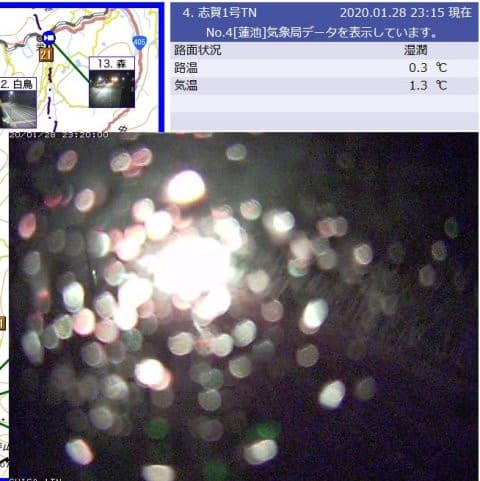

ただ，夜中の1時現在．

蓮池程度の標高だと，気温は1.4℃と

比較的高いものの．

雪が積もり始めているようです…！！

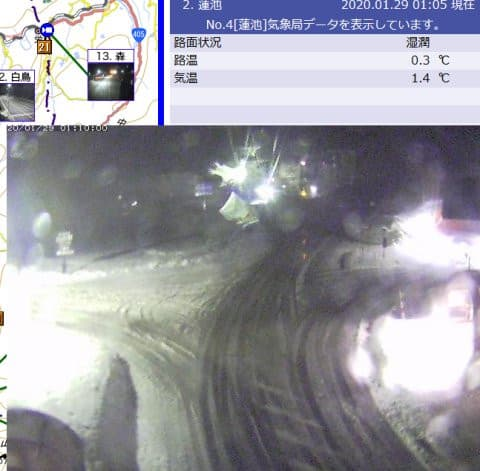

この雪は，今後も降り続くのか？？

それとも，今回もほとんど降らずに

終わるのか？？

そのあたりを，また天気図で予想してみましょう…

まず，29日朝9時の850hpa気温図ですが．

うーむ．

朝9時でも，まだ赤い0℃線は志賀高原より北に

上がってしまっており．

むしろ水色の+3℃線が近づいているので．

ちょいとヤバい気温…

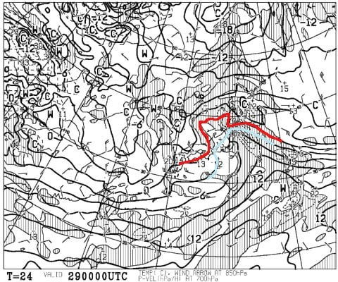

そして．

水色の降水域が志賀高原にかかっているので…

29日の朝は，標高が低いところは雨っぽい

です（涙）

ただ，志賀の焼額くらいの標高だと，朝は

重めの雪で何とかこらえてくれるか…

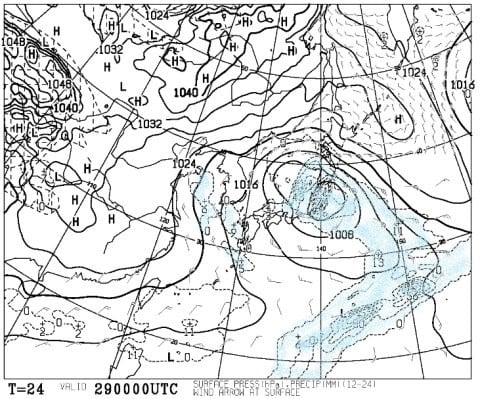

29日は，昼ごろには雪（標高が低いところは液体？）は

止みそうです．

そして．30日（木）の850hpa気温を見ると．

うむ．

この日は，水色の-3℃線が志賀に近づいている

ので．

降れば雪！

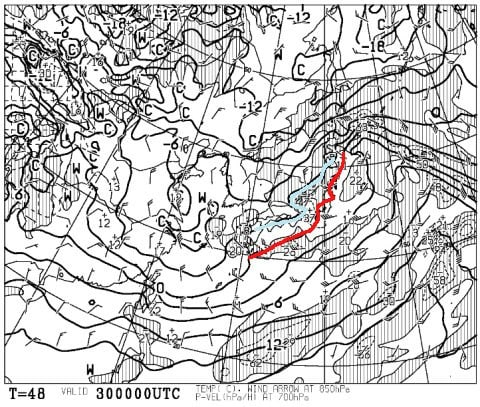

そして，この日の降水域を見ると…

志賀に降水域がかかってません（涙）

完全パーフェクトな西風なので，

30日は，残念ながら志賀高原には

雪は降らなさそう（泣）

なぜ，冷えると降らないのか…

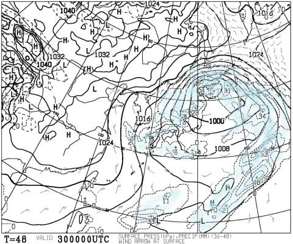

そして．

31日の金曜の850hpa図を見ると…

ををををを！！

この日は，水色の-9℃線が近づいてます！

冷えます！

激冷えです！

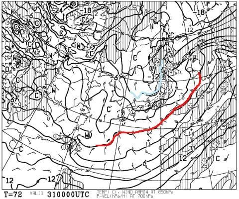

そして，地上天気図は…

うおおお！

日本海側に，見事に降水域が！

志賀高原にも，降水域がかかってそう…！

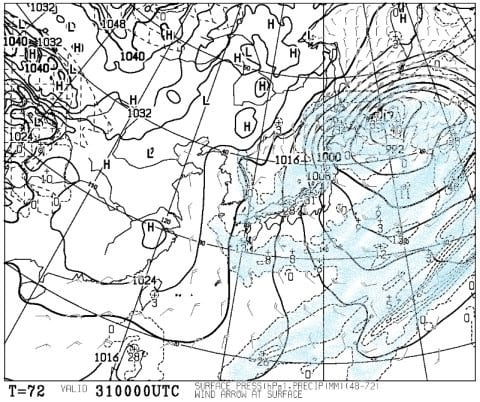

拡大してみると．

赤く囲った部分，31という数字が見えます．

これは，降水量31mm．

積雪量にして，31cm！

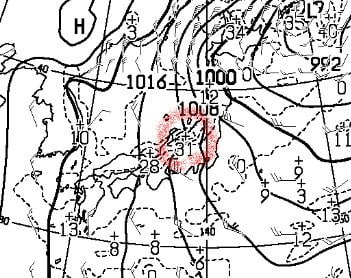

…これは．

31日の志賀高原．

そこそこの，冷え冷え雪が

積もりそうですっ！！

やっと，冷えた日に雪が降って

くれそうです…！

そして．週末の2月1日土曜は．

850hpa図を見ると，この日も水色の-6℃線が

志賀に近づいているので．

結構冷えてくれます…

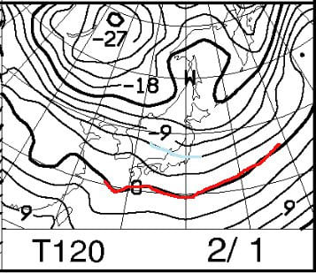

そして，地上天気図を見ると．

うーむ．

網掛けの降水域がかかってないので，

この日は降らなさそうに見えますが…

でも，縦縞の冬型気圧配置なので．

志賀高原の山の上は，朝まで雪が

残るかも？

そして，午前中は雪雲が志賀に

かかって，曇り空かな．

で，2日の日曜ですが．

この日も赤い0℃線はしっかり南まで

下がっていて．

志賀高原はそこそこ冷えた一日になりそうで…

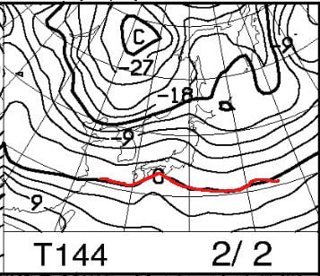

そして，地上天気図を見ると

この日は，冬型ではなく．

降水域が日本にかかってないので．

晴れそう！

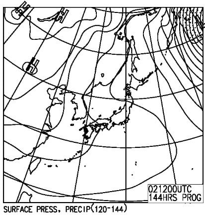

前日まで雪が降って，

そして冷え冷えの晴れなので…

この日曜は，絶好のスキー日和に

なるかも！？？

ってなことで．

まとめると．

29日（水）：朝は標高の低いところは雨になるかも…

　焼額はギリギリ雪．でも，朝のうちはかなり湿り気味の

　重い雪．ヘタすると，午前中一瞬雨っぽくなるかも…

　積雪はそれほどなく，5~10cmほど．

　昼ごろには止むかな．

　午後に向かって冷えていく．

30日（木）：朝は-5℃程度．曇り~晴れ．

　リフト営業中は全く降らず．

　時折雲が流れてくるが，完全西風なので，

　志賀は晴れそう．

　気温は終日マイナスをキープ．

　夜遅くになって雪が降り始める．

31日（金）：朝は-10℃以下．降る．久しぶりに

　積もる．朝まではそこそこ雪が降り，

　この日は終日冷え冷えで雪が降り続ける．

1日（土）：朝は-8~9℃程度で，かなり冷える．

　朝のうちは雪がパラつくか．午前中は曇り空．

　午後に向かって晴れ間も…

2日（日）：朝は-7℃程度，昼間も-3℃程度．

　晴れる．おそらくかなりGoodコンディション！

という感じで．

週末の直前，31日に雪が降ってくれそうで．

1，2日も冷えるので．

この週末は冷え冷え雪のいいコンディションに

なりそうな予感…！！

また明日に，週末の詳細天気予想を

やりますが．

今度こそ，雪が降る予想が当たりますように…！！

## 💬 コメント一覧

### 💬 コメント by (副院長)
**タイトル**: Unknown
**投稿日**: 2020-01-29 15:56:19

Sさま

19日は楽しく今シーズンの開幕し、毎週志賀高原ともくろんでりましたが、20日どこかで（逆行性健忘におちいった）転倒し、右母指骨折（ピンニング手術）。硬膜下出血（回転性のせん断力で出血したのではとのこと）で、スキーは中止。安静となってしましました。今年は雪も少ないしいいかと、自分に言い聞かせておりますが、反面完治しても雪がないかもと思っております。

iskiのログみても他人のログのようで、覚えていませんが、ちゃんと戻って、気が付けばホテルの部屋にいました。

また、来年にでもよろしくお願いいたします。

なお、次回はMIPSヘルメット購入しようと思います。S様も毎日ハードスケジュールのようでお気を付けください。

### 💬 コメント by (西館)
**タイトル**: 一心不乱に踊りますよ踊ります
**投稿日**: 2020-01-29 23:18:47

Skier_S様、そうなんです仕事の合間にも天気予報(ウェザーとtenki.jpとＳ様の)とライブカメラ映像、銀嶺様のブログをついつい見てしまっております。

私、今週末は金曜日昼～土曜日(調子にのって日曜午前も滑っちゃうかも)予定なのです。

今夜の天気予報、楽しみにしています、どうぞどうぞよろしくお願い致します！

そして、踊っていますよ一心不乱に祈祷中です。

＞副院長様（横レス失礼致します。）

お慰めする良い言葉が思いつきませんで、語彙の少なさを恥じ入るばかりです。

命があって本当に良かった。

20日もですが翌週25日も26日も27日も、救急車を数台見ましたし、パトロールさんに搬送される方々を多数見ました。

雪が少なすぎるんですよ。

がちがちアイスバーンの上に氷の塊や小石がごろごろで手強すぎます。

どうぞお大事になさって下さいませ。

そして来シーズンの復活を心より願っております。

### 💬 コメント by (Northfox)
**タイトル**: Unknown
**投稿日**: 2020-01-29 23:19:24

ついに積雪の予報が！

待ってました。ありがとうございます。

これで志賀高原のブッシュが完全に雪に隠れてくれると良いのですが。

1月3連休の滑走でスキーの滑走面はかなり傷ついてしまいまいました（涙）。

ブッシュや石ころの心配をしないで滑りたいです。

これ以上スキーが痛むと私の物欲選手権が勃発しそうなので。

雪よもっと降れ。

### 💬 コメント by (Skier_S)
**タイトル**: 今週末は…ようやくトップシーズンらしい志賀高原になりそう！
**投稿日**: 2020-01-30 00:14:36

＞副院長さま

えええ！

お怪我，大丈夫だったのでしょうか…

硬膜下出血は手術なしで済んだのでしょうか…

大変だったと思いますが，後遺症が残るレベルでなく，完治して

スキーができるのであれば，不幸中の幸いだったのかと．

出来れば今シーズン中に復活されることを願っています…

お大事にお過ごしください！！！

＞西館さま

今週の金曜昼からですか！いいタイミングでの志賀入りですね．

雪が積もって，ゲレンデ状況が良くなってきているタイミングなので，

絶妙な日程かと思います．

とりあえず，今週末までにドサドサ積もるよう，ひたすら祈って踊り続けていてください！！

＞Northfoxさま

今週末は，ようやっと来ますよ…

でも．脛パフとか腰パフレベルではないですが（涙）

しかし，板がかなり傷つきましたか…

それはぜひ，物欲選手権を開催してください（悪魔の誘い）

