# 2009年　初の海外子連れダイビング旅行記　29　Musee Gauguin

📅 投稿日時: 2012-09-29 00:02:31

って感じで．

タヒチ島を1時間ちょい運転して，ほぼ島を半周したあたり．

非常に入り口が見つけにくく，結構行ったり来たりして探しましたが．

ゴーギャン博物館の入り口の看板を発見！

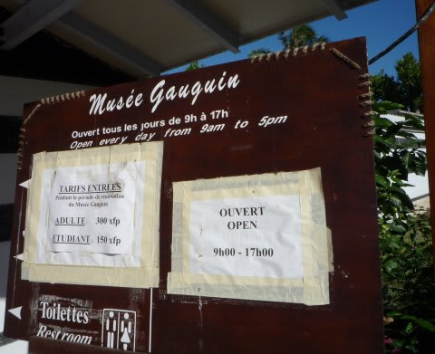

で．このゴーギャンミュージアム．

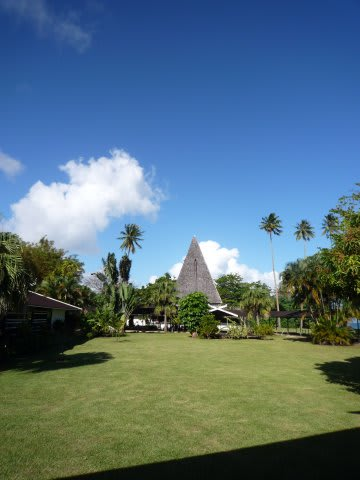

決して美術館じゃなんです．

あくまで博物館．

ゴーギャンが愛し，暮らしたタヒチに，ゴーギャンの作品が1点も無いのは有名な事実．

ゴーギャンの足跡と，作品の写真と解説が書いてあるだけの博物館です．

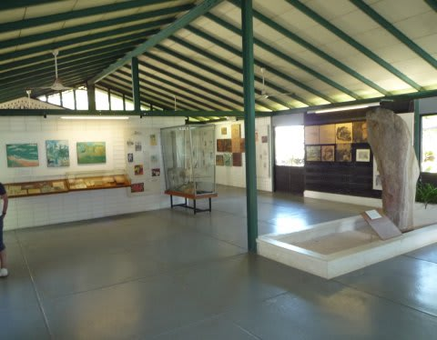

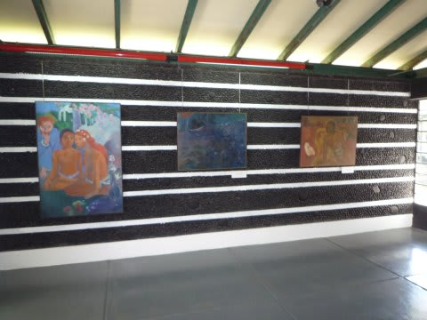

一応絵もあるけど，すべて複製…（涙）

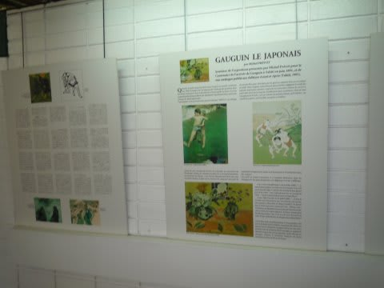

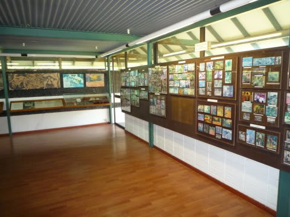

でも．

でも…一度来てみたかったんです．

印象派が好きなんで．

…だけど，一度来れば，まぁ2度来なくていいかな．

というわけで，後はひたすらもと来た道を戻って1時間半．

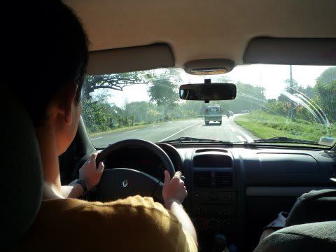

レンタカー返却時間ぎりぎりに返すことができました．

んで，まだ5時だからいろいろ街中の観光を…

と思ったら．

あちゃーーー．街中の市場やらお土産屋やら店は全て5時で閉まっちゃってる！

まだ，外は明るいのに～

なんと寂しい…

ということで，お土産屋めぐりはあきらめ，教会の横を通って…

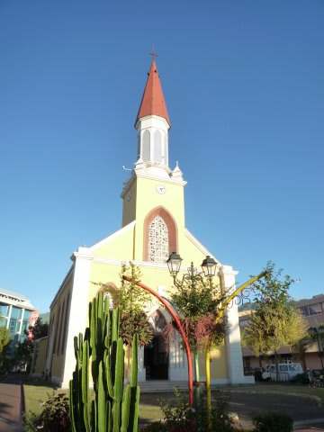

海沿いの公園の広場へ．

ここでは，夕方になると「ルロット」と呼ばれる屋台が集まり，

人々がそれを目指して集まってきます．

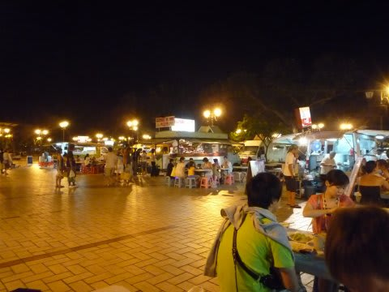

前回おいしかった思い出があったので，今回も夕食はルロット．

んで，前回と同じ端っこにある中華屋さんに．

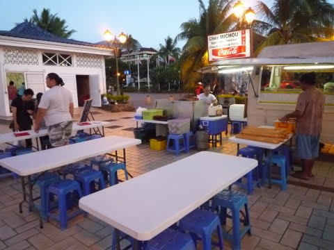

結構品数が豊富です．しっかりとしたメニューもありますね～．

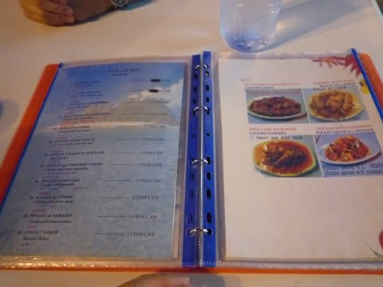

こんなメニューで10ページくらい料理がびっしり並んでます．

んで，リコメンドのチャオメンスペシャルを頼むと…

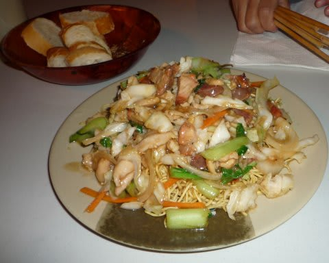

なんじゃこりゃ．

…すげーボリューム．

んで…美味いよ！

美味い．

屋台なのに，メインの食事を頼むと，ちゃんとお皿に盛った

バゲット（フランスパン）を持ってきてくれるのがフランス風…

中国系の人がやっているらしく，かなり本格的な中華の味．

屋台レベルは大きく超えてますね～．

なんか，料理しているところが，とても屋台とは思えないんですが…

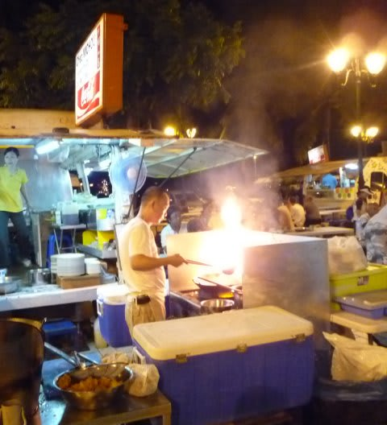

…見ての通り一皿の料理がすごく多いので，あまり頼みすぎない

ことをお勧めします…

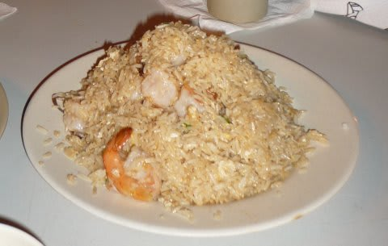

一皿1500～2000円くらいで，一見高そうに感じるけど，量と味を考えれば，

日本よりは安いかも．

いやー．タヒチの食事，全体的にきわめてレベルが高いですね～．

今日も満足，満足．
