# 2024シーズンのスキー場の天気と積雪量を振り返ってみた，その1…11月から12月初めまで冷えたけど，12月中旬から年末のゲレンデはかなり悲惨だった

📅 投稿日時: 2024-06-03 02:40:07

えー．

今シーズンは月山の雪も少なく，

今年はリフト架け替え期間も

6/10～27日までと長いため．

今週末の月山が，事実上リフトを滑れる

ラストの週末になりそうですね…

まだ，今週末に月山に行くかどうかは

天気やら仕事の状況次第なので，

決めてはいませんが．

もうおおむねシーズンも終了となって

来たので．

今回は，今シーズンがどんな感じの

天気＆積雪量だったかを振り返って

みましょうか…

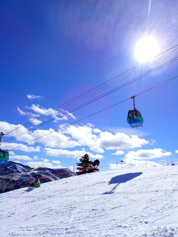

全体的に言うと．

雪が少なめだった今シーズンですが，

3月の奇跡の積雪で，まさかのGWラスト

までギリギリ焼額が営業できたという，

いろいろ際どいシーズンでした…

とりあえず，10/21，イエティスタートの

週は，大体いつもと同じくらいの積雪で

無事スタート！！

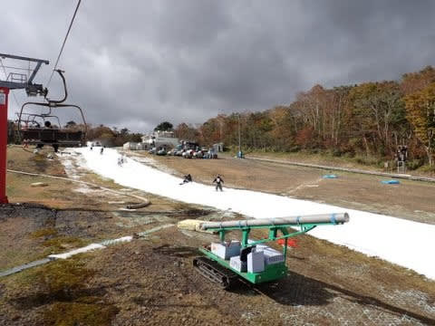

11月上旬までは雨も降らず，コンスタントに

コース幅が広がっていたけど…

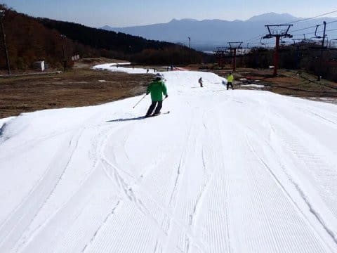

11月7日に，東京で27℃を記録するという

異常高温で雪が融けて一旦クローズ（激涙）

11月上旬は，イエティでも20℃を越える

異常高温でしたね（泣）

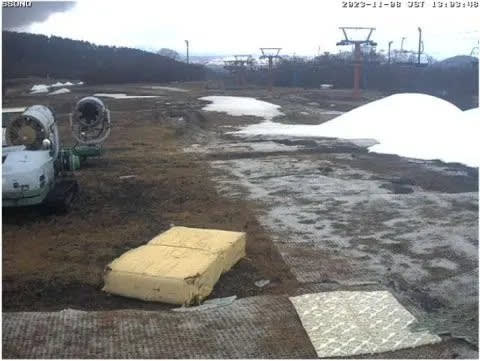

（[イエティライブカメラ](http://webcam.wni.co.jp/KAC24326/loop.html)より）

なんとか造雪機フル稼働で11月11日に

再度オープンしましたが．

再オープン直後は，10月オープン日より

幅が狭かったという，ちょっと悲惨な

感じでした…

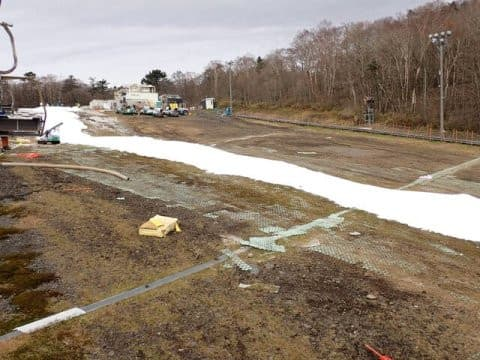

ただ，11月13日前後にイエティでも雪が

降るくらいガッツリ冷え込み，

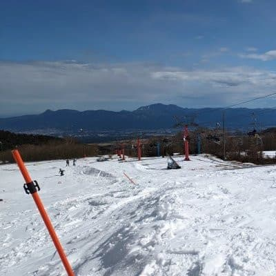

このおかげで，横手山が11月17日に

プレオープン！！

…本来，11月3日オープンとかなり気合を

入れた日程をアナウンスしてましたが，

とりあえずアイスクラッシュ以外の

ゲレンデの発オープンとなりました．

さらに11月下旬はまぁまぁ冷え込み．

11月20日にも積雪があったので…

11月23日に，横手・熊の湯がそろって

正式オープンとなり．

熊の湯は18日オープン予定より遅れた

ものの，まぁ，平年よりわずかに遅いか…

という程度のオープンを迎えられたのでした．

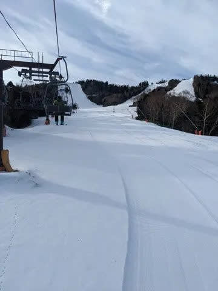

ちなみに，かぐらは11月26日オープンと，

予定の11月23日より3日遅れのオープン．

まぁ，多少計画よりは遅れたものの．

いきなりみつまたまでオープンという，

比較的恵まれた11月のスタートを

切ったのでした…

（[かぐらスキー場ホームページ](https://www.princehotels.co.jp/ski/kagura/summer/)より）

その後，

野沢温泉スキー場が11月29日に，

白馬五竜も11月30日，

丸沼も12月1日．

志賀高原も，高天ヶ原トリプルと

一ノ瀬のペアが12月1日オープン．

我がホームゲレンデの焼額スキー場も，

予定通り12月2日にオープンと．

11月下旬は積雪量はそれほどでもなかった

ものの，まぁまぁの冷え込みで．

12月頭にオープン予定＆人工降雪がある

スキー場は，人工降雪のあるバーンは

予定通りオープンしましたね～！！

我がホームゲレンデの焼額も，

予定通りの12月2日に，4ロマ1本のみですが

無事オープン！

天然雪も積もり，リフト1本ながら

いい状況で滑れましたね…

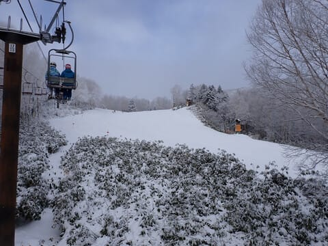

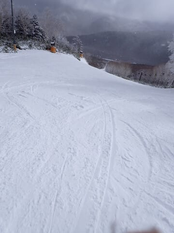

そして，翌週の12月9日には，

第2高速と唐松コースがオープン

したものの…

この日から異常高温が続き，

せっかくオープンした唐松コースも

雪は春スキーみたいなザブザブで

石だらけ（泣）

残念ながら，第2高速は11日から

また運休になったのでした（涙）

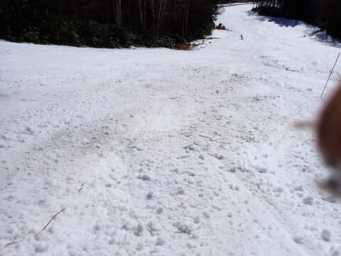

で，翌16日の週まで高温が続き…

12月3週目で4ロマのみという，

数年間で最悪レベルの雪の少なさの年

となり．

その翌週，12月22～23日に何とか

積雪があったものの，

クリスマスになって，高天ヶ原は

NHKバーンがぎりぎり，

一ノ瀬も何とか正面バーンがオープン

したくらいで．

タンネも寺子屋もオープンせず．

焼額もゴンドラが動く気配なし…

という，恐ろしい年末を迎えたのでした（泣）

（23日にこれだけ積雪があったけど，

　ゴンドラはまだまだ無理）

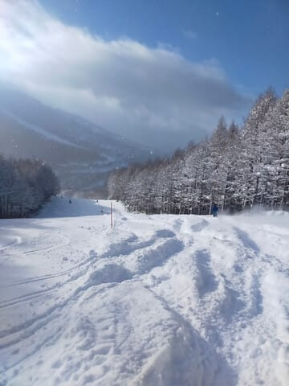

そして．

年末は．

29日に焼額は第1・第2のゴンドラを

動かすものの，GSコースは滑れず

パノラマコースのみ．

それも，かなり土が出てるヤバい感じだけど，

年末だから何とか2本のゴンドラを

動かしている感じ（泣）

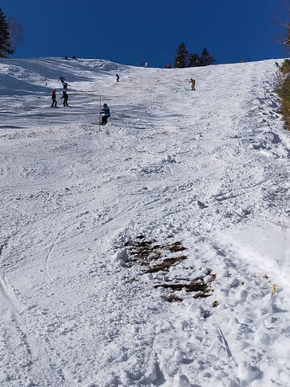

いつもなら，クリスマス寒波で，

少なくとも年末年始休みまでには

ほぼ全面オープンになる焼額．

年末の大みそかになっても，滑れるのは

パノラマ・サウス・唐松の3コースのみ．

それもスタッフの人海戦術で

雪を着けて何とか維持する状態で…

そのほか，奥志賀もダウンヒルは滑れず．

エキスパートはまだ土だらけ，

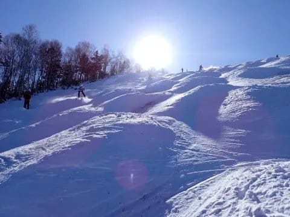

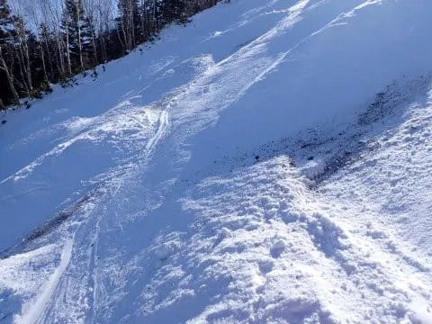

さらに31日の大みそかは雨も降りだし．

大みそかになっても，ほとんどのゲレンデが

滑れない志賀高原．

もう，2024シーズンはダメか…

と，早くも諦めの境地に入ろうと

していたのでした…

（続く）

## 💬 コメント一覧

### 💬 コメント by (ねも)
**タイトル**: Unknown
**投稿日**: 2024-06-05 06:00:32

Ｓさん

今季は、私個人も全体もかなりドツボなシーズンだったような💧　雪不足は、コロナ騒動が始まった2020シーズンと同じくらい？

私は2005シーズン以来、久しぶりに滑走日数が20日を切りました(>_<)　おまけに４月には骨折するし(苦笑)

ところでＳさんも、前に骨折を経験されたんですか⁉️

### 💬 コメント by (Skier_S)
**タイトル**: ＞ねもさま
**投稿日**: 2024-06-06 04:16:30

今シーズンはあんまり滑らなかったんですね…

最近，志賀高原にはいらっしゃらないんですか？

ちなみに私は手を骨折したことがありますが，足じゃないので

退院した翌週から滑ってました~！

