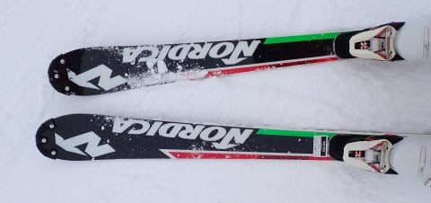

# そういや今シーズン，古めのモデルながらもガチのSL選手用スキー板を履かせてもらった

📅 投稿日時: 2024-08-01 04:04:02

えー．

いろいろ切羽詰まっていて，

ここ数日また睡眠不足気味のSkier_Sです．

ってなことで．

今日は短めの更新で…

そういえば，今シーズン．

とある人から，ちょっと古いモデルながら，

ガチの選手用のSL競技板を履かせて

もらったんですよね…

一般市販していない，ホントの選手向け．

かなり強いプレートが入っていて，

ビンディングもすごい開放値のやつが

ついてるし…

そして．

小回り用板と思えないほど重くて，

しっかり硬くて，履いた瞬間に

「これは手ごわい…！」

と感じる板でした…

「その板…ブーツしっかり締めて履いたほうがいいよ」

というアドバイス通り．

フレックス150のブーツでしっかりバックルを

締めこんで滑ってみると．

小回りの板なのに，ベースビベルも0.3か

0.5度くらいしかとってなくて．

それでいて，エッジもギンギンなので…

回せない…動かせない！

ガッツリエッジが食いついて，そっちの方に

まっすぐ進んでいく…っ！

そして．

その状態でスピードが出ていくと．

サイドカーブに乗って回っていき…

そしてターンの仕上げの最後まで

しっかりエッジが食いついたまま外れず．

ターンの最後が仕上がった！

と思ったら，スポーンと板が飛んでいき，

…そして，わずかにでも谷回り側に

エッジが食い込むと，身体がどうあれ

板がそっちの方向に進み始めるという，

かなり過激な板でした…（汗）

…これは危ない…

いや．危ない．

この板でしばらく滑ってたら．

ケガする．

間違いなく，ケガする…（ちょいと恐怖）

ブーツのバックルをしっかり締めて，

板が勝手に好きな方向に行かないように

しっかり板をシビアに動かしてやらないと

危ない感じの，恐ろしい板だよ…これ．

とりあえず．

普通の市販のSLモデルじゃなくて．

メーカーが選手用に作っている板で，

ガンガンに選手用にチューンしてある

やつは，普通の人が履くと危ない

ということを知った，今回の試し履き

だったのでした…

いやー．

あれを履いて硬い斜面をガシガシ切って

滑っていけるって．

やっぱり，トップレベルの選手はすごいんだ

なぁ…
