# 3月29，30日の週末の志賀高原スキー場の天気は…土曜は運がよければ雪になるかも！…運が悪ければ雨だけど．日曜は雨にはならずに済みそうな感じ

📅 投稿日時: 2020-03-26 01:52:17

🏷️ カテゴリ: [スキー天気予想](c6554f5c3c106093b511a8daae23757e8.md)

えー．

昨日，

　25日(水）の朝は，今日積もったこの雪が圧雪されて，

　太陽のもと，柔らかトップシーズンの

　最高シマシマ圧雪が楽しめそうです…！！！

と予想した通り．

本日25日の朝は，

晴天の柔らかトップシーズン雪で，

スゲー最高だったようですね…

[こんなレポート](https://red.ap.teacup.com/gokurakuskier/1207.html)を見せられて，

悶絶してしまっているのですが…

朝の雪は最高，昼も最高，午後もそれほどひどく

緩まなかったとあれば…

うがーーー！！

仕事休んで滑りに行きたかった…！

でも．

こんな感じで最高なのも，

どうやら今日までのようです（涙）

まず．

26日（木）の850hpa気温図を見ると．

なんですか？これは…？？

0℃線は東に去り，志賀高原は水色の

+3℃線より高温なエリアに入っている

ようなんですけど…（涙）

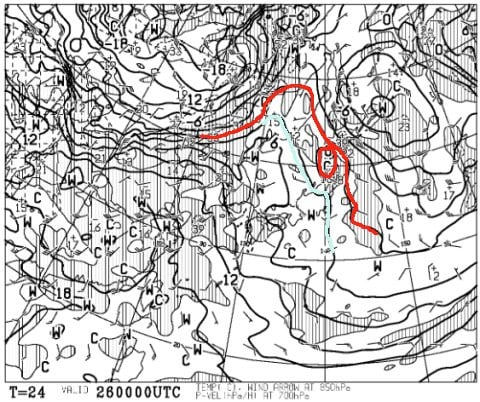

…これ．

朝イチは放射冷却でギリギリ0℃を下回るか

もしれないけど．

午前早くからプラス気温ですね…（涙）

そして，この日の地上天気図を見ると．

見事に高気圧に覆われて，すっきり

晴れそうです…

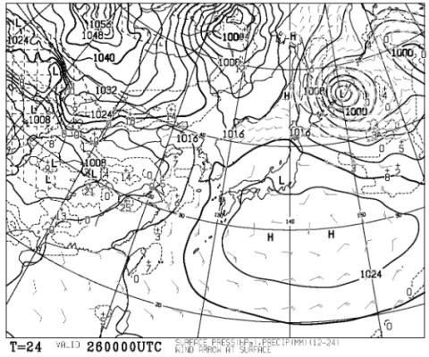

いや，普通なら晴れは嬉しいんだけど．

こんな気温が上がりそうな日は，

日が当たらない方が雪が解けなくて

いいんですけど…（涙）

とりあえず．

26日は高温＆強烈な日差しで，

雪は一気に緩んじゃいそうです…（激泣）

次は，27日（金）の850hpa気温図ですが．

ふぎゃーーーーーーっ！！

水色の+9℃線が志賀高原にかかってますよ！！

…これは，志賀高原でも昼間は+10℃を

突破する恐ろしい気温になります…（激涙）

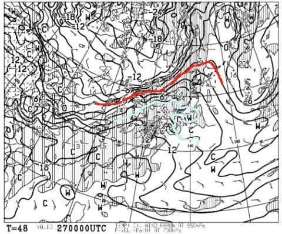

ただ，27日朝9時の地上天気図を見ると．

降水域はギリギリ志賀高原に

かかってないので…

昼ごろまでは降らないでいてくれそう．

ただ，午後のどこかの段階で降ります．

遅ければリフト営業終了後．

早かったら，昼過ぎか…

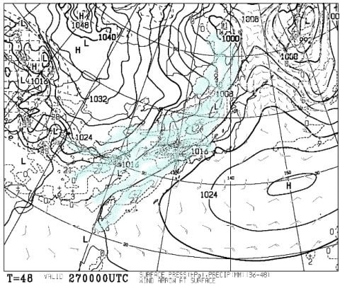

あー．

言うまでもないですが．

この気温で降れば，1億7000％の確率で雨です．

雪が降るわけがありませんので，

覚悟のほどを…

続いて，肝心の週末．

28日(土)の850hpa気温図ですが．

…

…うーん．微妙…

赤い0℃線が，志賀高原のすぐ

そばにあるように見えます…

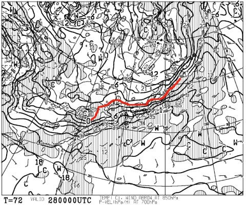

志賀高原のそばを拡大すると．

…等温線が何本も志賀高原のそばを

通過してます．

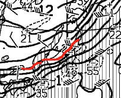

…つまり．

南北の温度の違いが非常に大きいので．

この予想図からわずかでも低気圧が

北にずれると，ものすごい温度が上がりますし．

わずかでも南にずれると，ものすごい

温度が下がります…

これは，わずかな予想ずれで

雨になるか雪になるか変わってしまう，

ギリギリの気温ということ．

そして，この日の地上天気図は．

どーん．

日本列島は完全に降水域に覆われてます（涙）

ほぼ一日，パラパラと何かが

降り続けそうです．

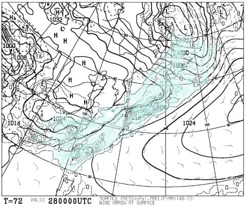

うーん．

運がよければ，午後には止んでくるかな…

とりあえず．

絶対雨が避けられない超高温で

無いところに，まだ救いを

見出したいところですが．

わずかなズレで雨になるか

雪になるか微妙な状態なので．

…これから皆さんの必死の踊りの

効果を見せるところです…！！←違うから

で．

29日（日）の850hpa気温図を見ると．

…この日も，赤い0℃線は志賀高原より

北にありますね…（泣）

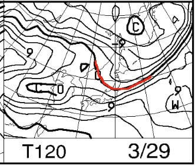

そして，地上天気図も，

網掛けの降水域が東日本にかかってますが．

これは，28日夜9時～29日夜9時までの

24時間での降水を意味するので．

おそらくこれは，28日夜に降る分かな…

高気圧が本州をすっぽり覆ってるので．

29日の朝9時ごろ，リフト営業開始までには，

止んでるんじゃないかな…

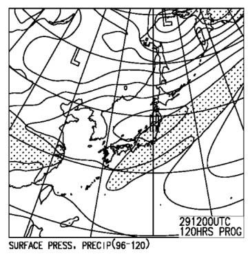

ってな感じで．

まとめると．

26日(木)：朝からすっきり晴れ！

　あさイチは放射冷却で気温が0℃を

　下回るかもしれないけど，すぐプラス気温になり，

　最高気温は+6～7℃まで上がりそう．

　そして，強い日差しで，雪は午前中から

　緩み始め，午後にはかなりのザブザブ雪．

　一部滑りが悪い雪になるかも…（涙）

　まぁ，終日晴れってのが救い．

27日(金)：朝からプラス5℃近い高温の

　曇り空でスタート．

　朝から緩んだ雪で，昼間は+10℃を

　超える高温に．

　ゴンドラが止まるほどではないにしろ

　風も強めで，昼ごろ～夕方にかけて，

　雨がパラパラ降り始める．

　運がよければ降り始めはリフト営業終了後．

　午後の雪は水を含んだずっしりとした

　シャーベット雪に…

28日(土)：微妙…朝は雪がぱらついているか？

　運が悪ければ朝から雨．

　ザーザーぶりになることは無いけど，

　時折パラパラと強く降り，

　降ったりやんだり．

　午後は降りが弱くなるか…

　運がよければ，終日雪で済むかも．

　でも，雪だったとしても，かなり

　湿ったびしょ濡れになる雪．

　ゲレンデはあさイチのみちょっと

　締まっているかもしれないけど，

　すぐに緩み終日重い春の雪になる．

29日(日)：夜中～明け方まで，何かが降る．

　運がよければ重い雪が数cm積もってるけど，

　運が悪ければ雨．

　あさイチは山頂は0℃前後で締まってるかも

　しれないけど，麓の雪は緩んだままかも…

　午前中は雲が残るかもしれないけど，

　午後は日も射してくる．

　気温は+3℃くらいまで上がり，

　ゲレンデ全面しっとりした，

　重い春の雪に．

ってことで．

土曜は運がよければ雪になる可能性も

わずかに残ってるし（でも，ほとんど雨と

変わらないびしょ濡れ雪だけど…），

日曜は雨にならずに済みそうだし．

とりあえず，私の祈りが効いてきたかな？？←なぜいい方向に行った時だけ，あなたのおかげになるの？

で．

ついでに，来週月曜以降を見てみると…

うむ．月～水曜まで．

0℃線が志賀より南に下がることは

無いですね（涙）

志賀はずっと+6℃線がかかるレベルなので．

この3日間，昼間は+10℃近くまで

上がりそう…（泣）

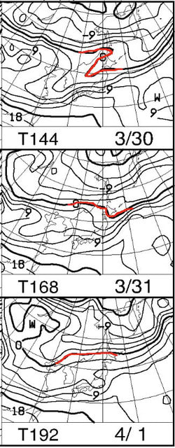

そして，地上天気図を見ると．

30日月曜のみ，降水域が志賀に

かかってませんが．

31日，4月1日と，降水域が

志賀にかかってます（激泣）

ってか．ホントに梅雨みたいな

天気図ですね（涙）

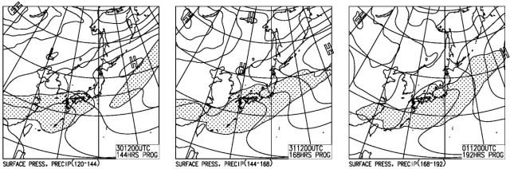

だもんで．

30日(月）：晴れ⇒曇り．気温が高い，春の雪．

31日，1日（火，水）：曇り～雨．気温は+7～8℃まで上がり，

　水を吸った重いダメダメ雪．

という感じで．

この3日間で，かなり雪はやられそうです（激涙）

あぁ…

今日が今シーズンラストの冷え冷え雪だったのか？？

もうこれで，冷え冷え雪を滑れないのか…

いや．

まだ，奇跡はある．

昨シーズンも，奇跡の4月で．

[4月なのに2月並みの冷え冷え最高
コンディションの日](e733299a65cf7fb152e574c395331c2e9.md)もあった！

…これから奇跡の4月がやってくるように．

全員で休まず止まらず，

4月が3月より冷えて，激烈冷え冷えパウダーが

毎日降る踊りを踊り続けるのです…っ！！←なんじゃそりゃ

## 💬 コメント一覧

### 💬 コメント by (なるなる)
**タイトル**: Unknown
**投稿日**: 2020-03-26 13:16:35

本日の記事を期待していたのですが、やはり微妙ですか…

もう残り少ないので行きたいのですが、行ってしまったら、雨が降っていても

滑るしかないわけで、悩ましいです

### 💬 コメント by (レインボー)
**タイトル**: Unknown
**投稿日**: 2020-03-26 15:48:39

木曜日の志賀高原情報(妖怪退治)

エス様の予報がピタリ!　それはそれは良い日でございました。たった２つのことを除いては。

その１　エキスパートは前日よりはるかに締まって快適なんですが、第二リフトを降りて下を眺めると、なんと、いつもマイゲレンデ。閉店がらがら状態の幸せに、汗水流して働いておられる人々への申し訳なさに、心さいなまれる可哀想な私でした。

その２　今日こそ妖怪板つかみを退治しようと乗り込んだわけですが、チウホテルのビーフシチュー&一番搾り250円のあとのやけびで、格闘が始まりました。さらばと用意したワックスを、ガラガラのゴンドラの中で塗布。よし滑る、と快感に酔いしめるのもつかの間、やっぱりゴンドラ一本は保ちません。あえなく退治された、情けない私でした。

### 💬 コメント by (Skier_S)
**タイトル**: 今週末は，日曜は意外といいかも…？
**投稿日**: 2020-03-26 23:57:03

＞なるなるさま

土曜はちょっと微妙な感じですが，もしかすると昼間は

ほとんど降らずに終わってくれるかも…

日曜は，雪は多少重くなるかもしれないけど，春スキーと

割り切れば天気も良くなっていい感じになりそうです！

＞レインボーさま

エキスパート，ずっと貸し切りだったみたいですね．うらやましいです…

でも，午後はやっぱり板の滑りが悪くなりましたか．

必殺ワックスも効かなかったんですね…

